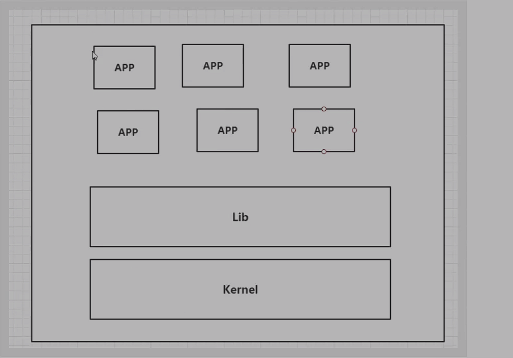
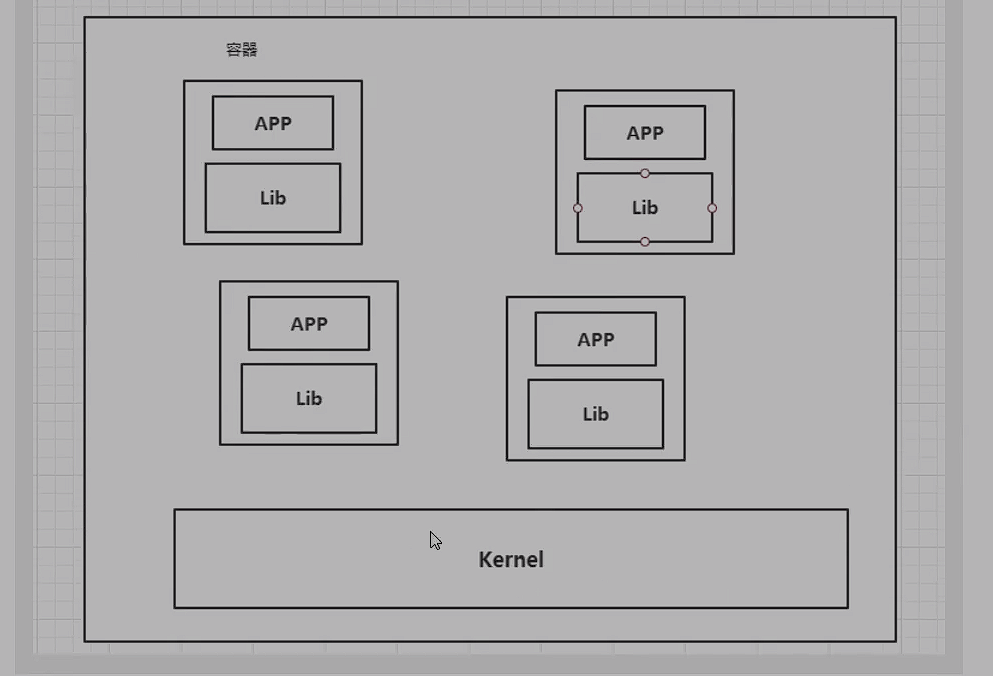
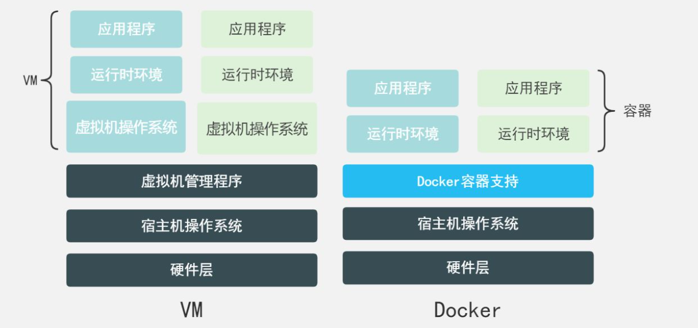

### Docker的作用

简化应用的发布，屏蔽开发环境和生成环境的差异。

传统应用上线：

1. 开发人员开发一个jar包给运维人员
2. 运维人员需要在服务器上配置响应的环境然后运行，而这一步往往非常容易出错，平台的差异，环境版本的差异。

（经典语句：在我的电脑上可以运行）

Docker下的应用上线

1. 开发人员将jar+开发环境一起打包成为一个Docker镜像
2. 将镜像发布到Docker仓库（类似于app应用商店）
3. 测试人员或运维人员直接下载Docker镜像在Docker环境下运行即可，不需要考虑底层的平台差异，应用依赖环境的版本等问题。

### Docker特点

不同应用之间互相隔离互不影响，是操作系统级别的隔离性

容器化技术，每个镜像会创建最核心的依赖，其余依赖手动安装，大小十分小，一般为几KB、MB。

容器化技术也是几种虚拟化技术，不同的是传统虚拟化技术往往是虚拟化一整个完整的系统，体积大笨重

高效的系统资源利用

虚拟机架构图

容器技术架构图

### Docker为什么比VM快

1. Docker具有更少的抽象层

### DevOps

开发-运维