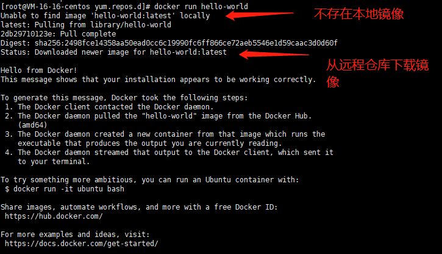

### Docker3个基本概念

镜像：是一个应用模板，用来创建应用，如一个nginx镜像就能构建多个nginx容器

容器：根据镜像创建出来的运行时实例，可以启动，停止，删除等基本命令

仓库：用来保存镜像，类似APP应用商店，有私有仓库和共有仓库之分，共有仓库可以被所有人访问。（国内的docker仓库访问速度快）


### 镜像分层

- 镜像分层，每个镜像都由一个或多个镜像层组成；
- 可通过在某个镜像加上一定的镜像层得到新镜像（此过程可通过编写dockerfile或基于容器Commit实现）；
- 每个镜像层拥有唯一镜像ID；
- 镜像在存储和使用时共享相同的镜像层（根据ID），所以在pull镜像时，已有的镜像层会自动跳过下载；
- 每个镜像层都是只读，即使启动成容器，也无法对其真正的修改，修改只会作用于最上层的容器层；


### 镜像与容器的关系

当启动一个新的容器时，Docker会加载只读镜像，并在其之上添加一个读写层，即容器层。

docker 容器=镜像+可读层


### 镜像存储核心技术：联合文件系统

镜像的高效存储：引入联合文件系统，将镜像多层文件联合挂载到容器文件系统。


Docker容器，可以理解为一个或多个运行进程，而这些运行进程将占有相应的内存，相应的CPU计算资源，相应的虚拟网络设备以及相应的文件系统资源。`而Docker容器所占用的文件系统资源，则通过Docker镜像的镜像层文件来提供。`


### 写时复制(COW)

引入写时复制（copy-on-write），需要修改文件操作时，会先从镜像里把要写的文件复制到自己的文件系统（容器的读写层）中进行修改。源镜像层中的文件不会发生变化。


### Docker架构

Docker是一个C/S架构软件，与Nginx类似，它在服务器内部创建了一个个小的linux容器这些容器之间不采用系统内部的通信方式，而是使用网络Socket进行通信。


### 小结

容器与镜像就好比模板与产品，产品根据模板制作出基本模样，并可以进行特定的修改，但模板不会因此改变。


nginx镜像=》run命令=》nginx服务（容器）：一个镜像可以run出多个容器，每个容器数据隔离，只在各自的读写层进行数据操作


在Linux上使用Docker时可以类比在Windows上使用VM，Docker中安装的`不仅仅是`操作系统还能是一个个应用程序，并且Docker中安装的应用程序体积非常小，这源于它优秀的设计架构。

所以Linux上的应用要访问Docker中的应用时就需要通过内部网络访问的方式进行通信，


### Docker安装

#### 1、centos系统内核版本3.0以上

```
[root@VM-16-16-centos ~]# uname -r
4.18.0-193.28.1.el8_2.x86_64
```

#### 2、查看系统版本（centOS7及以上）

```
[root@VM-16-16-centos ~]# cat /etc/os-release 
NAME="CentOS Linux"
VERSION="8 (Core)"
ID="centos"
ID_LIKE="rhel fedora"
VERSION_ID="8"
PLATFORM_ID="platform:el8"
PRETTY_NAME="CentOS Linux 8 (Core)"
ANSI_COLOR="0;31"
CPE_NAME="cpe:/o:centos:centos:8"
HOME_URL="https://www.centos.org/"
BUG_REPORT_URL="https://bugs.centos.org/"

CENTOS_MANTISBT_PROJECT="CentOS-8"
CENTOS_MANTISBT_PROJECT_VERSION="8"
REDHAT_SUPPORT_PRODUCT="centos"
REDHAT_SUPPORT_PRODUCT_VERSION="8"

```

#### 3、卸载旧版本

centOS下

```
 sudo yum remove docker \
                  docker-client \
                  docker-client-latest \
                  docker-common \
                  docker-latest \
                  docker-latest-logrotate \
                  docker-logrotate \
                  docker-engine
```

#### 4、安装Docker

可以通过三种方式安装Docker

1. 通过仓库安装
2. 通过其他用户下载的RPM包安装
3. 通过脚本安装

下面演示通过仓库安装

1. 安装依赖环境

```
sudo yum install -y yum-utils
```

2. 设置国内yum源

```
 sudo yum-config-manager \
    --add-repo \
    http://mirrors.cloud.tencent.com/repo/centos7_base.repo 	#腾讯源
```

3、安装docker引擎

```
# ce是社区版、ee是企业版
sudo yum install docker-ce docker-ce-cli containerd.io

# 选择版本安装
 sudo yum install docker-ce-<VERSION_STRING> docker-ce-cli-<VERSION_STRING> containerd.io
```

4、启动docker

```
 sudo systemctl start docker
```

5、测试docker

```
#查看docker版本
docker version
```

6、使用第一个docker镜像Hello World

```
sudo docker run hello-world
```



7、Docker远程仓库配置

在/etc/docker目录下的daemon.json文件中配置


8、查看本地Docker仓库中的镜像

```
[root@VM-16-16-centos docker]# docker images
REPOSITORY    TAG       IMAGE ID       CREATED        SIZE
hello-world   latest    feb5d9fea6a5   3 months ago   13.3kB
```


### 卸载Docker

```
// 卸载软件
sudo yum remove docker-ce docker-ce-cli containerd.io

// 删除资源目录
sudo rm -rf /var/lib/docker
sudo rm -rf /var/lib/containerd
```

