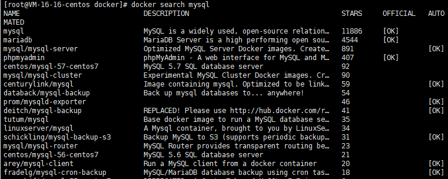
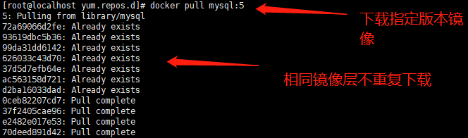
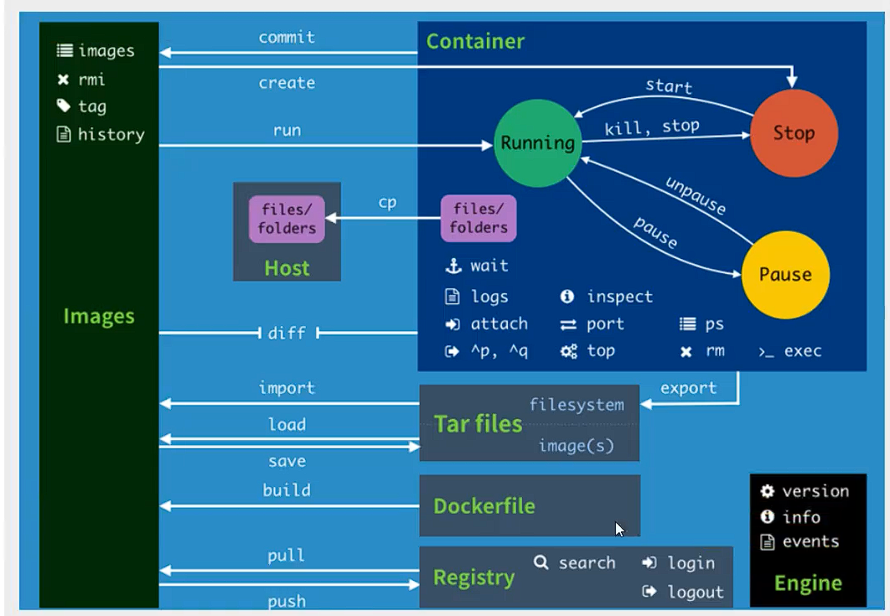

### 镜像命令

官方文档：https://docs.docker.com/engine/reference/commandline/images/

#### Docker Images

作用：列出所有本地镜像

```shell
[root@VM-16-16-centos docker]# docker images
REPOSITORY    TAG       IMAGE ID       CREATED        SIZE
hello-world   latest    feb5d9fea6a5   3 months ago   13.3kB
```

> REPOSITORY：镜像的仓库源
>
> TAG：镜像的标签
>
> IMAGE ID：镜像的id
>
> CREATED：镜像的创建时间
>
> SIZE：镜像的大小


#### Docker search

作用：在Docker hub中搜索镜像资源




#### Docker Pull

作用：下载镜像

```shell
[root@localhost yum.repos.d]# docker pull mysql
Using default tag: latest	# 默认下载最新标签的镜像
latest: Pulling from library/mysql
72a69066d2fe: Pull complete 	# 由于Docker镜像的分层结构
93619dbc5b36: Pull complete 	# 下载一个镜像需要下载多个镜像层
99da31dd6142: Pull complete 
626033c43d70: Pull complete 
37d5d7efb64e: Pull complete 
ac563158d721: Pull complete 
d2ba16033dad: Pull complete 
688ba7d5c01a: Pull complete 
00e060b6d11d: Pull complete 
1c04857f594f: Pull complete 
4d7cfa90e6ea: Pull complete 
e0431212d27d: Pull complete 		# 数字签名
Digest: sha256:e9027fe4d91c0153429607251656806cc784e914937271037f7738bd5b8e7709
Status: Downloaded newer image for mysql:latest
docker.io/library/mysql:latest		# 真实地址
```

> docker pull mysql
> docker pull docker.io/library/mysql:latest
>
> 这两个命令等价

镜像分层与模块化设计有异曲同工之妙，不同版本的镜像之间可能就几个镜像层发生了改变，不需要全部重新下载，只需要下载不同的镜像层，相同镜像层可以共用

> 


#### Docker rmi

作用：删除本地镜像

```shell
[root@localhost yum.repos.d] docker rmi c20987f18b13 # 可以根据id、名称等进行删除
Untagged: mysql:5
Untagged: mysql@sha256:f2ad209efe9c67104167fc609cca6973c8422939491c9345270175a300419f94
Deleted: sha256:c20987f18b130f9d144c9828df630417e2a9523148930dc3963e9d0dab302a76
Deleted: sha256:6567396b065ee734fb2dbb80c8923324a778426dfd01969f091f1ab2d52c7989
Deleted: sha256:0910f12649d514b471f1583a16f672ab67e3d29d9833a15dc2df50dd5536e40f
Deleted: sha256:6682af2fb40555c448b84711c7302d0f86fc716bbe9c7dc7dbd739ef9d757150
Deleted: sha256:5c062c3ac20f576d24454e74781511a5f96739f289edaadf2de934d06e910b92

[root@localhost yum.repos.d]# docker rmi -f $(docker images -aq)
$()括号中命令执行的结果作为参数，这里是查找出所有镜像id
# 该命令表示删除所有本地镜像
```


### 容器命令

#### 创建并运行容器

指令格式：docker run [OPTIONS] IMAGE [COMMAND] [ARG...]

```shell
# 常用参数
--name：命名容器名
-d：后台方式运行
-it：使用交互方式运行，进入容器查看内容
-p：指定容器端口和主机端口的映射
	-p 8080:8080

-P：随机指定端口映射
--rm：停止容器即删除容器
```


作用：选择镜像创建一个容器


指令工作流程

1. 在本地寻找对应的镜像
2. 若本地存在则使用这个镜像
3. 若本地不存在则去远程镜像仓库下载（部署在Internet上的共有Docker仓库）
4. 若远程仓库中存在镜像则下载到本地
5. 使用镜像


Run命令相当于在VM中创建一个一个虚拟机，所以run命令中也会配置和VM中类型的选项，如cpu个数，内存大小，硬盘大小等


示例

```shell
# 交互方式启动容器，交互界面选择bash
[root@localhost yum.repos.d]# docker run -it centos /bin/bash 
# 进入容器交互
[root@c7d71ad42f22 /]#  
# exit退出容器
[root@c7d71ad42f22 /]# exit
exit
[root@localhost yum.repos.d]# 

```

#### 查看容器

docker ps：列出所有正在运行的容器

```shell
-a：列出所有运行过的容器信息
-q：只显示容器id
```


#### 退出容器

交互模式下退出容器

- exit：退出容器，容器停止运行
- Ctrl + P + Q：退出容器，容器不停止运行


#### 删除容器

docker rm 容器id

docker rm -f $(docker ps -aq)：删除所有容器

docker ps -aq | xargs docker rm：删除所有容器，管道写法


#### 启动和停止容器

```shell
docker start 容器id	# 启动容器
docker restart 容器id	# 重启容器
docker stop	容器id	# 停止容器
docker kill 容器id	# 强制停止容器
```

#### 进入容器

方式一：

格式：docker exec -it 容器id /bin/bash

作用：以交互模式进入容器


方式二

格式：aocker attach 容器id 

作用：以交互模式进入容器


两种的区别：第一个会打开一个新的窗口，第二个进入容器正在执行的字段


#### 从容器中拷贝文件到主机

格式：docker cp 容器id:容器内路径	主机目标地址


#### 从主机拷贝文件到容器

格式：docker mount


### 其他常用命令

docker version：查看docker版本

docker info：查看docker信息

docker xxx --help：查看命令帮助

docker stats：查看容器的CPU，内存占用情况

docker run -d 镜像名：后台启动容器

> 一个坑：若容器启动后发现没有提供服务，就会立刻停止

docker logs 容器id：查看日志

> -tf：查看所有日志信息
>
> --tail 10：只显示最后10条

docker top 容器id：查看容器内部的进程信息

docker inspect 容器id

