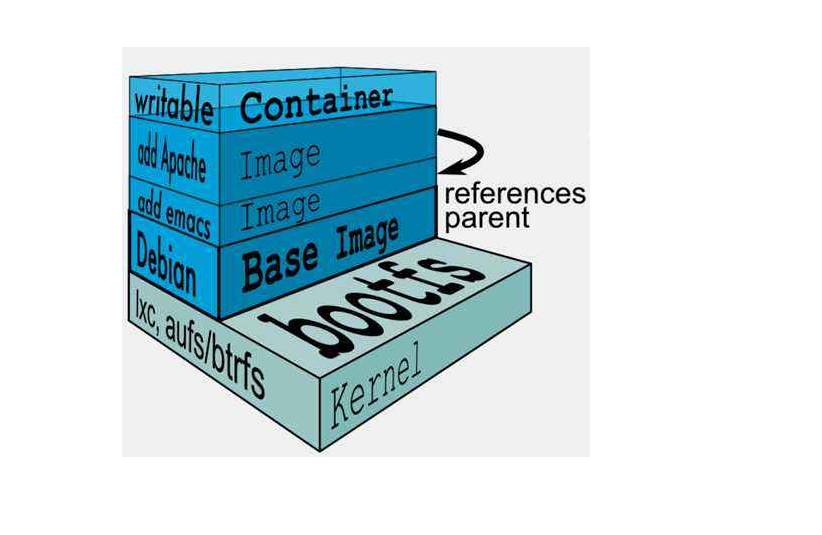
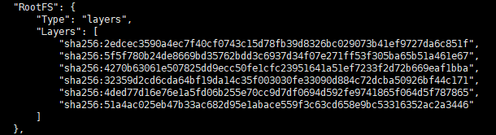

### 镜像的获取

1. 从远程仓库下载
2. 其他用户分享
3. 自己制作镜像


### 联合文件系统

Union文件系统是一种分层设计的文件系统，越底层镜像共用性越高，一个标准的centos镜像只有几百MB的大小，其原因就是该镜像只提供rootfs层的内容，其底下庞大的bootfs层直接共享操作系统不会再单独下载。

不同的rootfs就形成了不同的linux发行版，centos、ubuntu、Rat等其底层的Bootfs都是相同的。

每一层镜像都维护自己的文件系统




### 镜像分层

一个完整的应用镜像包含很多层

下面是nginx镜像的分层



一个新的镜像的现成就是在基础镜像层上添加新镜像层，从而达到目标预想。

通过镜像分层可以很容易的达到项目功能的更新和迭代


### commit镜像

Docker容器=Docker镜像+读写层，在另一个角度上看容器就是一个新的镜像，这个镜像是不稳定的，实时在改变的。通过commit命令可以截取该容器的某一时刻状态，将其提交为一个新的镜像，保存到本地仓库中

```shell
[root@VM-16-16-centos ~]# docker commit -a="作者" -m="提交信息" 容器id 自定义镜像名
```

通过这个操作可以截取每一个稳定版本，后续在新镜像层上运行新版本