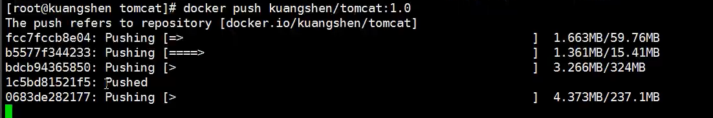

### 概述

dockerfile是用来构建新镜像层的文件


### 示例

1、创建dockerfile文件

```shell
touch dockerfile01

# 内容如下，文件格式：命令(大写) 参数
FROM centos

VOLUME ["volume01"]

CMD echo "----end----"
CMD /bin/bash

# FROM：指定父镜像
# VOLUME：指定容器卷
```

2、build命令构建新镜像

```shell
docker build -f dockerfile01 -t mycentos:01 .

Sending build context to Docker daemon  2.048kB
Step 1/4 : FROM centos
 ---> 5d0da3dc9764
Step 2/4 : VOLUME ["volume01"]
 ---> Running in 9365fad5e3f7
Removing intermediate container 9365fad5e3f7
 ---> 74e881b15c2a
Step 3/4 : CMD echo "----end----"
 ---> Running in 9e026edd1a8f
Removing intermediate container 9e026edd1a8f
 ---> 57f95eb0c338
Step 4/4 : CMD /bin/bash
 ---> Running in c7a3e1f33a33
Removing intermediate container c7a3e1f33a33
 ---> eb5a2563f38e
Successfully built eb5a2563f38e
Successfully tagged mycentos:01

# -f：指定文件参数
# -t：镜像标签，格式为name:tag
# .：表示当前目录下
```


3、创建容器

```shell
docker run -it eb5a2563f38e  /bin/bash
```


4、查看容器卷挂载信息


5、使用容器在容器卷中创建test.txt文件，在容器外查看容器卷

```shell
cd /var/lib/docker/volumes/0c8294efbb7391cf330e87f546159c943daf9e04aa3e1988c80acf07e653da8

[root@localhost _data]# ls
test.txt
```

`在dockerfile中指定容器卷后会在创建容器时会自动挂载`


### Dockerfile指令

基本知识

1. 每个指令必须大写

2. 指令从上到下执行

3. #为单行注释

```shell
FROM：			#设置镜像父镜像
MAINTAINER：		#设置作者
RUN：			#编译镜像时需要运行的脚本
CMD：			#设置容器启动时需要运行的脚本
LABEL：			#设置镜像的标签
EXPOESE：		#设置容器的端口
ENV：			#设置容器的环境变量
ADD：			#添加内容到镜像中，会自动解压
COPY：			#复制内容到镜像中
ENTRYPOINT：		#设置容器的入口程序，在容器启动时会运行
VOLUME：			#设置挂载的容器卷
USER：			#设置运行RUN CMD ENTRYPOINTD 用户名
WORKDIR：		#设置RUN CMD ENTRYPOINTD等指令的工作目录，默认进入的目录
ARG：			#设置编译镜像时加入的参数
ONBUILD：		#设置镜像的ONBUILD指令，在镜像被继承时会触发
STOPSIGNAL：		#设置容器退出信号量
```

dockerfile基本形式


### 示例

给centos镜像安装vim命令

1、dockerfile02

```shell
FROM centos		# 父镜像
MAINTAINER ZLP<1255813208@qq.com>	# 作者
ENV MYPATH /usr/local		# 设置环境变量
WORKDIR $MYPATH				# 设置工作目录
RUN yum -y install vim		# 编译时运行，安装vim程序
EXPOSE 80					# 暴露端口80
CMD echo $MYPATH			# 容器启动时运行，打印工作目录
CMD /bin/bash				# 容器启动时运行
```

2、docker build -f dockerfile01 -t mycentos:1 .


### 其他

CMD和ENTRYPOINT的区别

相同点：两者都是设置容器启动时执行的命令

不同点：设置cmd设置的命令时，无法在运行时添加其他命令参数，ENTRYPOINT跨域在运行临时添加其他参数


### 发布到DockerHub

1. 登录

   ```
   docker login -u 用户名
   输入密码：
   ```

2. 发布

   ```
   dockers push 镜像名
   ```

   


### Docker全流程图

