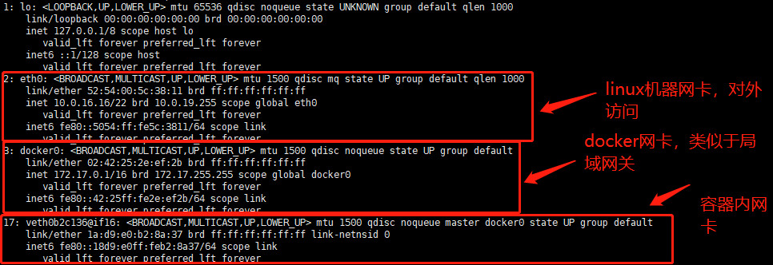
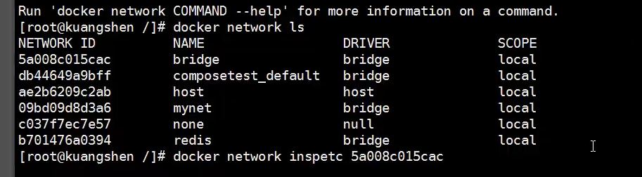
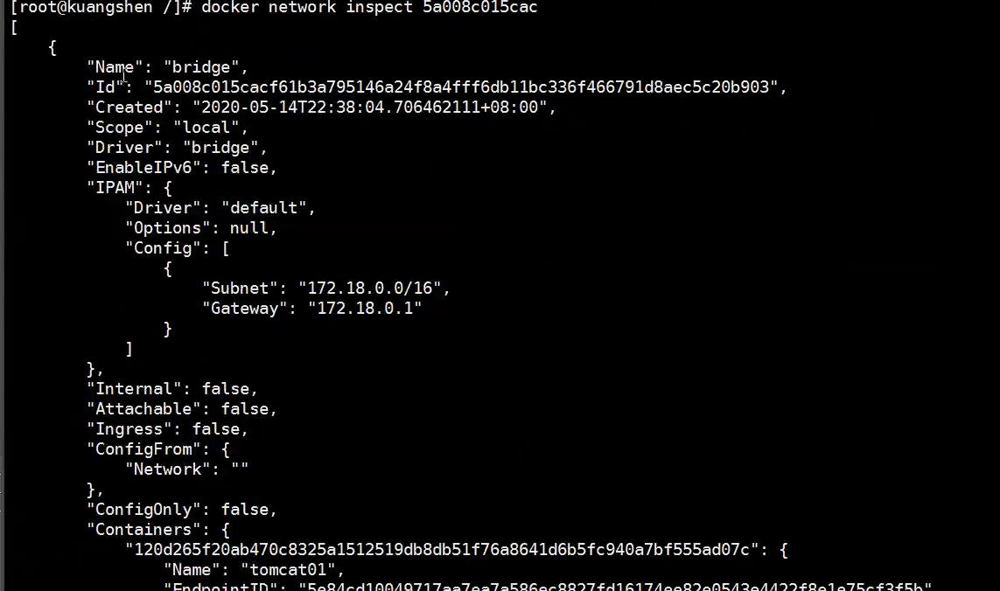
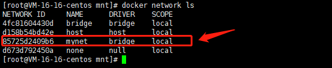

### 容器网卡

每个容器在创建时都会被分配一个网卡，通过这个网卡可以模拟网络间的通信




### Docker网络

`Docker网络模型类似于局域网模型`，不同容器处于一个局域网内可以互相访问。

也可以人为将容器划分为不同网络，使得容器间通信隔离


docker network ls：查看docker下所有网络



docker network inspect 网络id：查看指定网络的详情




### Docker本地网络的问题

不支持通过服务名进行网络查找，不使用当下高可用要求的场景


### 自定义网络

自定义一个局域网

```shell
# docker network create指令创建网络
docker network create --driver bridge --subnet 192.168.0.0/16 --gateway 192.168.0.1 mynet

# --driver bridge指定桥接模式
# --subnet 192.168.0.0/16设置子网网段
# --gateway 192.168.0.1设置子网网关
# mynet：自定义网络名
```

```shell
docker network create --driver bridge --subnet 192.169.1.0/24 --gateway 192.169.1.1 mynet
85725d2409b6065206e77fc6fb2c2b5542456a89b95f9acc0dfc49c1fb018c0a
```




将容器放置在mynet网络中

```shell
docker run -d --net mynet nginx

# 通过mynet参数将容器配置到对应网络中
```

> 自定义网络中的容器可以通过容器名代替网络地址进行通信


### 网络互通

命令：docker network connect，连接一个容器到一个网络

格式：docker network connect [options] 网络 容器

原理：一个容器两个ip，容器加入到另一个网络中时会获得对应网络的ip地址，从而实现网络连通

```shell
docker network connect mynet nginx01
```

