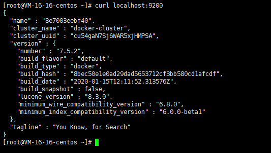
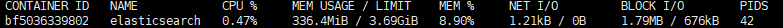

1、安装

```shell
[root@VM-16-16-centos ~]#  docker run -d --name=elasticsearch  -p 9200:9200 -p 9300:9300 -e "discovery.type=single-node" elasticsearch:7.5.2
```

2、测试



3、限制内存占用


```shell
docker run -d --name=elasticsearch  -p 9200:9200 -p 9300:9300 -e "discovery.type=single-node" -e ES_JAVA_OPTS="-Xms64m -Xmx512m" elasticsearch:7.5.2

# 创建容器时增加内存大小限制：-e ES_JAVA_OPTS="-Xms64m -Xmx512m"
```

