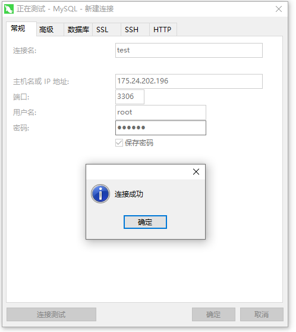
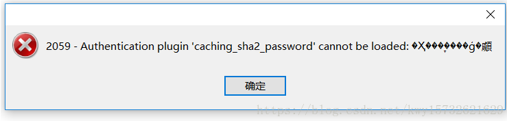
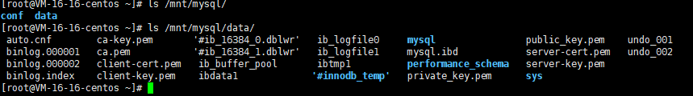
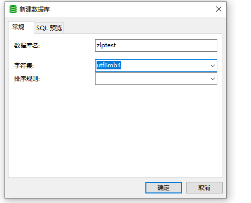

### 1、下载镜像

```shell
[root@VM-16-16-centos ~]# docker pull mysql:8.0
8.0: Pulling from library/mysql
72a69066d2fe: Pull complete 
93619dbc5b36: Pull complete 
99da31dd6142: Pull complete 
626033c43d70: Pull complete 
37d5d7efb64e: Pull complete 
ac563158d721: Pull complete 
d2ba16033dad: Pull complete 
688ba7d5c01a: Pull complete 
00e060b6d11d: Pull complete 
1c04857f594f: Pull complete 
4d7cfa90e6ea: Pull complete 
e0431212d27d: Pull complete 
Digest: sha256:e9027fe4d91c0153429607251656806cc784e914937271037f7738bd5b8e7709
Status: Downloaded newer image for mysql:8.0
docker.io/library/mysql:8.0
```

### 2、创建并启动容器

```shell
docker run --name mysql -e MYSQL_ROOT_PASSWORD=zlp123 -d -p 3306:3306 -v /mnt/mysql/conf:/etc/mysql/conf.d -v /mnt/mysql/data:/var/lib/mysql mysql:8.0 

4e32226a74b29915ca3772776951bc50dfc4a37192b441c8267457ab163985b6

--name：设置容器名
-e：设置容器的环境参数，该参数由对应应用自定义
-d：后台运行
-p：端口映射
-v：挂载数据卷
```

### 3、远程连接测



若出现2059错误，是由于mysql8 之前的版本中加密规则是mysql_native_password,而在mysql8之后,加密规则是caching_sha2_password



有两种方式处理

一、更新navicat驱动

二、修改加密方式

```mysql
mysql -uroot -p #登录

use mysql; #选择数据库
# 远程连接请将'localhost'换成'%'

ALTER USER 'root'@'localhost' IDENTIFIED BY '你的密码' PASSWORD EXPIRE NEVER; #更改加密方式

ALTER USER 'root'@'localhost' IDENTIFIED WITH mysql_native_password BY '你的密码'; #更新用户密码

FLUSH PRIVILEGES; #刷新权限
```


### 4、测试数据卷挂载



使用navicat创建一个数据库




