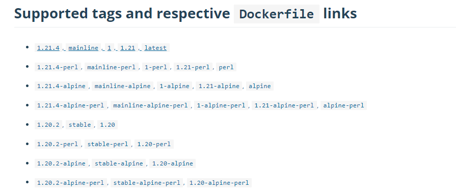
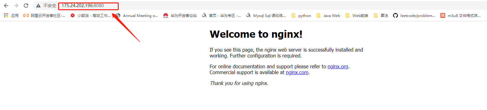

### 1、在Docker Hub上搜索Nginx相关的版本信息



### 2、下载镜像

```shell
[root@VM-16-16-centos docker]# docker pull nginx
```

### 3、创建配置文件和挂载目录（主机上必须创建）

```shell
[root@VM-16-16-centos nginx]# ll
total 16
drwxr-xr-x 2 root root 4096 Dec 31 21:47 conf
drwxr-xr-x 2 root root 4096 Dec 31 21:47 html
drwxr-xr-x 2 root root 4096 Dec 31 22:07 log
-rw-r--r-- 1 root root  648 Nov  2 23:01 nginx.conf
[root@VM-16-16-centos nginx]# 

```

nginx.conf

```conf

user  nginx;
worker_processes  auto;

error_log  /var/log/nginx/error.log notice;
pid        /var/run/nginx.pid;


events {
    worker_connections  1024;
}


http {
    include       /etc/nginx/mime.types;
    default_type  application/octet-stream;

    log_format  main  '$remote_addr - $remote_user [$time_local] "$request" '
                      '$status $body_bytes_sent "$http_referer" '
                      '"$http_user_agent" "$http_x_forwarded_for"';

    access_log  /var/log/nginx/access.log  main;

    sendfile        on;
    #tcp_nopush     on;

    keepalive_timeout  65;

    #gzip  on;

    include /etc/nginx/conf.d/*.conf;
}

```

在conf下创建test.conf

```conf
gzip_min_length 1k;
gzip_buffers 4 16k;
gzip_comp_level 2;
gzip_vary off;

server{

    listen  80;
    server_name zlp1116.top www.zlp1116.top;
    index   index.html;
     location / {

           root   /usr/share/nginx/html;

           index index.html;

      }
}
```

在html目录下创建index.html

```shell
[root@VM-16-16-centos html]# pwd
/docker/nginx/html
[root@VM-16-16-centos html]# ll
total 12
-rw-r--r-- 1 root root  512 Dec 31 22:27 index.html

```

### 4、创建容器并运行Nginx，挂载对应目录

```shell
docker run --name nginx-course -d -p 80:80 -v /docker/nginx/log:/var/log/nginx -v /docker/nginx/conf:/etc/nginx/conf.d -v /docker/nginx/nginx.conf:/etc/nginx/nginx.conf -v /docker/nginx/html:/usr/share/nginx/html nginx
```


在浏览器中访问



注意要开放云服务器防火墙对应端口

