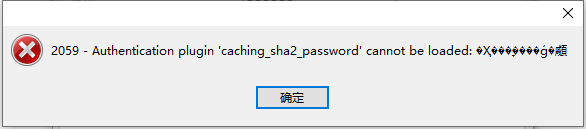
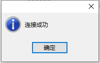
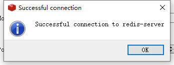
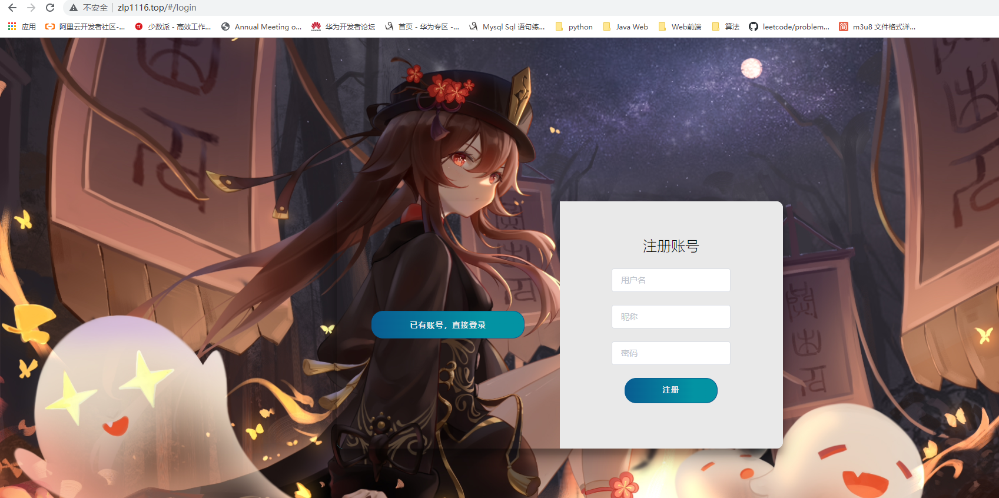
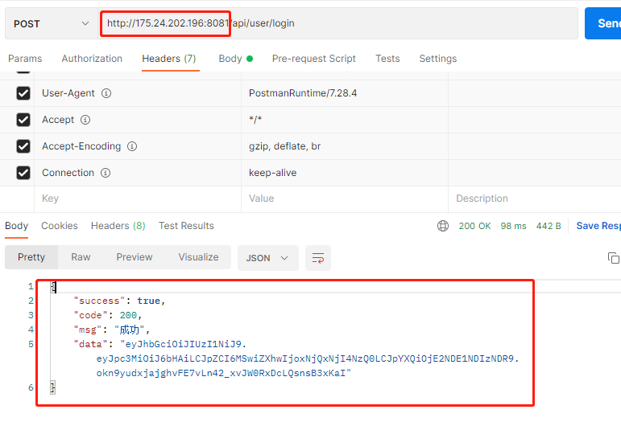

### 项目环境

- java8
- mysql8
- redis
- nginx
- spring boot2.6.0


### Docker准备

拉取镜像

- nginx
- redis
- mysql8
- 创建项目网络course-app-net

```shell
docker network create --subnet 192.168.1.0/24 --gateway 192.168.1.1 course-app-net
8c6062494c35bfc24aff109e796108cfc2821ac625282917e2012f8c3d247a5d
```


### 准备环境

创建项目目录：/mnt/docker/course-app


### 部署Mysql

1、在/mnt/docker/course-app下创建mysql目录

```shell
[root@VM-16-16-centos course-app]# pwd
/mnt/docker/course-app
[root@VM-16-16-centos course-app]# ll
total 4
drwxr-xr-x 4 root root 4096 Jan  7 12:26 mysql

```

2、在mysql下创建conf、data、logs目录

```shell
[root@VM-16-16-centos course-app]# cd mysql/
[root@VM-16-16-centos mysql]# ll
total 12
drwxr-xr-x 2 root    root 4096 Jan  7 12:26 conf
drwxr-xr-x 2 polkitd root 4096 Jan  7 12:33 data
drwxr-xr-x 2 root    root 4096 Jan  7 12:33 logs
```

3、创建容器

```shell
docker run -d --name course-app-database -p 3306:3306 \
> -v /mnt/docker/course-app/mysql/conf:/etc/mysql/conf.d \
> -v /mnt/docker/course-app/mysql/data/:/var/lib/mysql \
> -v /mnt/docker/course-app/mysql/logs:/logs \
> -e MYSQL_ROOT_PASSWORD=zlp123 \
> mysql:8


f823b95d0528d3569447f0adb00853844a0ed6dbcc61fdc0a866617cfbefc7dc

[root@VM-16-16-centos mysql]# docker ps -a
CONTAINER ID   IMAGE     COMMAND                  CREATED          STATUS          PORTS                               NAMES
880cc373ef5d   mysql:8   "docker-entrypoint.s…"   27 seconds ago   Up 25 seconds   0.0.0.0:3306->3306/tcp, 33060/tcp   course-app-database
```

4、navicat连接测试



修改加密模式

```mysql
mysql -uroot -p #登录

use mysql; #选择数据库
# 远程连接请将'localhost'换成'%'

ALTER USER 'root'@'localhost' IDENTIFIED BY '你的密码' PASSWORD EXPIRE NEVER; #更改加密方式

ALTER USER 'root'@'localhost' IDENTIFIED WITH mysql_native_password BY '你的密码'; #更新用户密码

FLUSH PRIVILEGES; #刷新权限
```



5、将容器加入course-app-net网络

```shell
docker network connect course-app-net course-app-database
```


### 部署Redis

1、创建redis容器

```shell
docker run -d --name course-app-redis -p 6379:6379 redis
```

2、连接测试



3、将容器加入course-app-net网络

```shell
docker network connect course-app-net course-app-redis
```


### 部署nginx

1、在/mnt/docker/course-app下创建nginx目录

```shell
[root@VM-16-16-centos course-app]# mkdir nginx
[root@VM-16-16-centos course-app]# ll
total 8
drwxr-xr-x 5 root root 4096 Jan  7 12:33 mysql
drwxr-xr-x 2 root root 4096 Jan  7 13:18 nginx

```

2、在nginx目录下创建conf、html、log目录和nginx.conf配置文件

```shell
[root@VM-16-16-centos nginx]# docker run --name course-app-nginx -d -p 80:80 \
> -v /mnt/docker/course-app/nginx/conf:/etc/nginx/conf.d \
> -v /mnt/docker/course-app/nginx/nginx.conf:/etc/nginx/nginx.conf \
> -v /mnt/docker/course-app/nginx/html/:/usr/share/nginx/html \
> -v /mnt/docker/course-app/nginx/log:/var/log/nginx \
> --net course-app-net \
> nginx

3efc8cf3b777dd5b37af742bbda9427291e6f644dea86e40368039c2dad6cc0a

```

3、测试




### 部署Spring Boot应用

1、在/mnt/docker/course-app下创建app目录，在app目录下准备好.jar包

```shell
[root@VM-16-16-centos course-app]# mkdir app
[root@VM-16-16-centos course-app]# ll
total 12
drwxr-xr-x 2 root root 4096 Jan  7 15:44 app
drwxr-xr-x 5 root root 4096 Jan  7 12:33 mysql
drwxr-xr-x 5 root root 4096 Jan  7 13:59 nginx
[root@VM-16-16-centos course-app]# cd app/
[root@VM-16-16-centos app]# ll
total 38816
-rw-r--r-- 1 root root 39744983 Jan  7 15:44 course.jar
```

2、在app目录下编写dockerfile01文件

```shell
FROM java:8
MAINTAINER  ZLP<1255813208@qq.com>
ADD ./course.jar /course.jar
CMD java -jar /course.jar --spring.profiles.active=prod
RUN /bin/cp /usr/share/zoneinfo/Asia/Shanghai /etc/localtime && echo 'Asia/Shanghai' >/etc/timezone
```

3、构建应用镜像

```shell
docker build -f dockerfile01 -t course:1.0 .
```

4、创建容器

```shell
docker run -d --name course-app -p 8081:8081 --net course-app-net course:1.0
6e076e07f8cbdc0f359ab4986cc82386e1f7bbc8414cc2868e16300cc339a337
```

5、Postman测试




