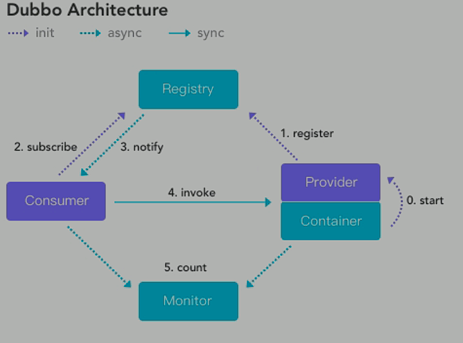

### 1、Dubbo

​		Apache Dubbo 是一款微服务开发框架，它提供了 RPC通信 与 微服务治理 两大关键能力。这意味着，使用 Dubbo 开发的微服务，将具备相互之间的远程发现与通信能力， 同时利用 Dubbo 提供的丰富服务治理能力，可以实现诸如服务发现、负载均衡、流量调度等服务治理诉求。同时 Dubbo 是高度可扩展的，用户几乎可以在任意功能点去定制自己的实现，以改变框架的默认行为来满足自己的业务需求。

​		Dubbo 最早诞生于阿里巴巴，随后加入 Apache 软件基金会，项目从设计之初就是为了解决企业的服务化问题，因此充分考虑了大规模集群场景下的服务开发与治理问题，如易用性、性能、流量管理、集群可伸缩性等。

​		Dubbo3 基于 Dubbo2 演进而来，在保持原有核心功能特性的同时， Dubbo3 在易用性、超大规模微服务实践、云原生基础设施适配、安全设计等几大方向上进行了全面升级。 以下文档都将基于 Dubbo3 展开。

​		Dubbo3 的整个设计与开发过程，始终有来自社区团队与众多企业用户的共同参与，因此 Dubbo3 的许多核心架构与功能都充分考虑了大规模微服务实践诉求。阿里巴巴是参与在 Dubbo3 中的核心力量之一，作为企业用户其主导了该版本许多核心功能的设计与开发，阿里巴巴把 Dubbo3 社区版本确定为其未来内部主推的服务框架，并选择将内部 HSF 通过 Dubbo3 的形式贡献到开源社区，在阿里巴巴内部，众多业务线包括电商系统的考拉、交易平台，以及饿了么、钉钉等都已经成功迁移到 Dubbo3 版本。

Dubbo2功能：

1. 面向接口代理的高性能RPC调用：服务以`接口为粒度`，为开发者屏蔽远程底层细节
2. 服务自动注册与发现：支持多种注册中心服务，服务实例上下线感知
3. 运行期流量调度：内置条件、脚本等路由策略，通过配置不同路由规则轻松实现灰度发布，同机房优先等功能
4. 负载均衡：内置多种负载均衡策略感知下游节点健康状态，显著减少调用延迟，提高系统吞吐量
5. 高度可拓展：遵循微内核+插件的设计原则，所有核心功能如Protocol、Transport、Serialization被设计为扩展点，平等对待内置实现和第三方实现
6. 可视化服务治理与运维：提供丰富的服务治理、运维工具：随时查询服务元数据、服务健康状态及调用统计，实时下发路由策略、调整配置参数

Dubbo3功能：

1. 全新的RPC协议-Triple：Triple 协议是基于 HTTP/2 之上定义的下一代 RPC 通信协议，相比于上一代 Dubbo2 协议，它具有更好的穿透性、通用性、以及面向网关代理场景的高性能表现， 提供了 Reactive Stream 数据交换模型。Triple 实现了对 gRPC 的完全兼容。（Dubbo中RPC协议是建立在TCP上的自定义协议）
2. 应用级服务发现：`从服务/接口粒度到应用粒度的升级`，使得 Dubbo 在集群可伸缩性、连接异构微服务体系上更具优势。应用粒度能以更低的资源消耗支持超百万实例规模集群程； 实现与 Spring Cloud、Kubernetes Service 等异构微服务体系的互联互通。
3. Mesh解决方案：依赖 Dubbo Mesh 将 Dubbo 纳入 Istio 等开源 Mesh 治理体系， 3.0 同时支持 ThinSDK + Sidecar 与 FatSDK（Proxyless）的部署模式，为 Mesh 架构提供了更多选择，尤其对于面临迁移或混合部署的场景， Dubbo 提供了统一控制面的能力。

### 2、注册中心

中心化的服务信息管理中心，统一管理分布式系统中所有应用提供的对外服务。

优点

1. 简化提供服务配置：每个服务消费者只需要从配置中心拉取对应服务的信息，当一个服务提供者发生改变时只需要修改注册中心的信息，不需要逐个修改每个服务消费者的配置。
2. 动态服务管理：当某个服务不可用时及时下线处理，将其他可用的服务者对外提供。

Dubbo支持的支持中心

1. Multicast
2. Zookeeper：官方推荐使用
3. Redis
4. Simple

