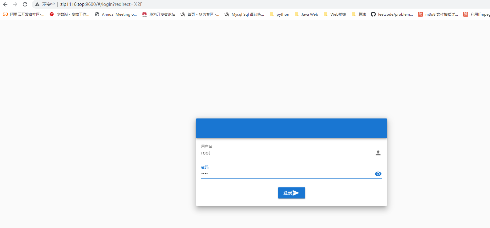
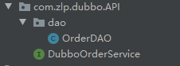
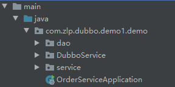
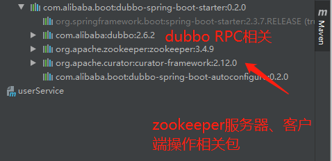
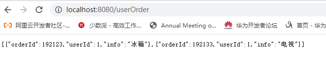
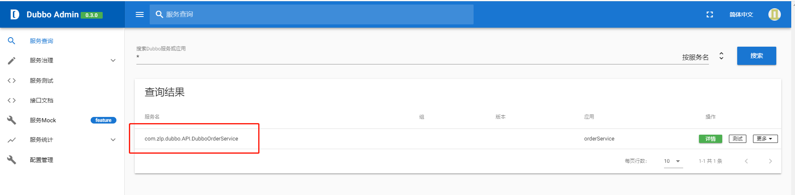

### 1、Docker安装注册中心

1、拉取zookeeper镜像

```shell
docker pull zookeeper
```

2、创建zookeeper容器

```shell
docker run -d --name zk -p 2181:2181 zookeeper
```


### 2、Docker安装Dubbo后台管理

1、拉取dubbo-admin镜像

```shell
docker pull apache/dubbo-admin
```

2、创建容器

```shell
docker run -d \
--name dubbo-admin \
-v /workspace/software/dubbo/data:/data \
-p 9600:8080 \
--link zk \
-e admin.registry.address=zookeeper://10.0.16.16:2181 \
-e admin.config-center=zookeeper://10.0.16.16:2181 \
-e admin.metadata-report.address=zookeeper://10.0.16.16:2181 \
--restart=always \
docker.io/apache/dubbo-admin;
```

4、访问默认用户名密码root




### 3、Spring Boot创建Dubbo示例

样例目录结构


### 1、统一接口包



提供订单服务接口，和对应的实体类

```java
public interface DubboOrderService {
    public List<OrderDAO> getOrderByUserId(Long userId);
}
```

#### 2、创建服务提供者

目录结构

1. service存放自身服务实现类

2. dao存放自身依赖的实体类

3. DubboService存放对外提供服务的实现类。



1、创建SpringBoot项目，引入dubbo依赖

```xml
        <!--dubbo依赖-->
		<dependency>
            <groupId>com.alibaba.boot</groupId>
            <artifactId>dubbo-spring-boot-starter</artifactId>
            <version>0.2.0</version>
        </dependency>

        <!--API接口包-->
        <dependency>
            <groupId>com.zlp.dubbo</groupId>
            <artifactId>demo1-orderService-API</artifactId>
            <version>1.0-SNAPSHOT</version>
        </dependency>
```



2、定义服务接口实现类

```java
import com.alibaba.dubbo.config.annotation.Service;

// 改Service注解是dubbo提供，表示对外提供服务
@Service
public class DubboOrderServiceImpl implements DubboOrderService {
    // 注入内部Service，dubboService复用本地Service
    @Autowired
    OrderService orderService;

    @Override
    public List<OrderDAO> getOrderByUserId(Long userId){
        List<Order> list = orderService.getOrderByUserId(userId);
        List<OrderDAO> list1 = new ArrayList<>();
        for (Order order : list) {
            OrderDAO orderDAO = new OrderDAO();
            BeanUtils.copyProperties(order,orderDAO);
            list1.add(orderDAO);
        }
        return list1;
    }
}
```

本地Service

```java
@Service
public class OrderServiceImpl implements OrderService {

    @Override
    public List<Order> getOrderByUserId(Long userId) {
        List<Order> list = new ArrayList<>();
        list.add(new Order(192123L,1L,"冰箱"));
        list.add(new Order(192133L,1L,"电视"));
        return list;
    }
}
```


3、配置文件

```xml
# 应用名称
spring.application.name=orderService

# 对外提供服务名
dubbo.application.name=orderService
# 注册中心地址，协议
dubbo.registry.address=www.zlp1116.top:2181
dubbo.registry.protocol=zookeeper
# 通信协议名称、端口（本机对外暴露的远程调用RPC端口）
dubbo.protocol.name=dubbo
dubbo.protocol.port=20880
# dubbo监视器配置，可以通过协议或地址直连两种方式配置（registry表示从注册中心发现地址）
dubbo.monitor.protocol=registry
```

#### 3、创建服务消费者

1、引入依赖

```xml
        <!--dubbo依赖-->
		<dependency>
            <groupId>com.alibaba.boot</groupId>
            <artifactId>dubbo-spring-boot-starter</artifactId>
            <version>0.2.0</version>
        </dependency>

        <!--API接口包-->
        <dependency>
            <groupId>com.zlp.dubbo</groupId>
            <artifactId>demo1-orderService-API</artifactId>
            <version>1.0-SNAPSHOT</version>
        </dependency>
```

2、配置文件

```properties
dubbo.application.name=userService
dubbo.registry.protocol=zookeeper
dubbo.registry.address=www.zlp1116.top:2181
```

3、调用远程服务

```java
@Service
public class UserServiceImpl implements UserService {
    // 通过dubbo提供的@Reference标识远程服务接口
    @Reference
    private DubboOrderService dubboOrderService;

    @Override
    public List<OrderDAO> getUserOrder(Long userId) {
        return dubboOrderService.getOrderByUserId(userId);
    }
}
```

```java
@RestController
@RequestMapping("/")
public class UserController {
    @Autowired
    private UserService userService;

    @GetMapping("userOrder")
    public List<OrderDAO>  getUserOrder(){
        return userService.getUserOrder(1L);
    }

}
```

效果




dubbo-admin界面

