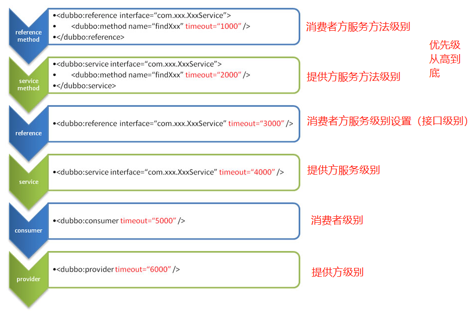

## Dubbo常用功能配置

官方文档：https://dubbo.apache.org/zh/docsv2.7/user/examples/

属性配置覆盖优先级

- 方法级优先，接口级次之，全局配置再次之。
- 如果级别一样，则消费方优先，提供方次之。



### 1、启动时检查

Dubbo 缺省会在启动时检查依赖的服务是否可用，不可用时会抛出异常，阻止 Spring 初始化完成，以便上线时，能及早发现问题，默认 `check="true"`。

可以通过 `check="false"` 关闭检查，比如，测试时，有些服务不关心，或者出现了循环依赖，必须有一方先启动。

另外，如果你的 Spring 容器是懒加载的，或者通过 API 编程延迟引用服务，请关闭 check，否则服务临时不可用时，会抛出异常，拿到 null 引用，如果 `check="false"`，总是会返回引用，当服务恢复时，能自动连上。


SpringBoot配置文件

```properties
# 单个服务关闭启动时检查
dubbo.reference.com.foo.BarService.check=false
# 所有reference注解关闭启动时检查
# 相当于每个 @Reference(check = false)
dubbo.reference.check=false
// 当前消费者全局关闭启动检查
dubbo.consumer.check=false
// 关闭注册中心检查，当注册中心不存在时不会报错可以正常启动
dubbo.registry.check=false
```


### 2、超时配置

当服务调用超出默认时间时抛出异常，默认值为消费者级别1000毫秒

```properties
# @Reference(timeout = 2000)
dubbo.consumer.timeout=5000
```


### 3、重试次数

服务调用失败时，会在进行几次调用尝试，避免偶然失败场景。

```properties
# 如果存在多个服务提供方，则会在重试失败后换一个服务提供方进行调用
# 在幂等操作下需要设置重试次数，非幂等下不要设置重试次数

# @Reference(retries = 3)
dubbo.consumer.retries=3
```


### 4、多版本

dubbo支持一个接口多个实现类，提供不同服务，常使用于灰度发布，发布新功能时让一部分用户先使用，无误后在让全部用户使用。

```java
// 指定当前实现类的版本
@Service(version = "1.0.0")


// 指定引用服务的版本
@Reference(version = "2.0.0")
```


### 5、本地存根

​		远程服务后，客户端通常只剩下接口，而实现全在服务器端，但提供方有些时候想在客户端也执行部分逻辑，比如：`做 ThreadLocal 缓存，提前验证参数，调用失败后伪造容错数据等等`，此时就需要在 API 中带上 Stub，客户端生成 Proxy 实例，会把 Proxy 通过构造函数传给 Stub [1](https://dubbo.apache.org/zh/docsv2.7/user/examples/local-stub/#fn:1)，然后把 Stub 暴露给用户，Stub 可以决定要不要去调 Proxy。


本地存根实现

- stub必须有一个代理对象的实参构造器

```java
// 1、集成服务接口
public class OrderServiceStub implements DubboOrderService {
    private final DubboOrderService dubboOrderService;

    // 2、包含服务代理对象构造方法
    public OrderServiceStub(DubboOrderService dubboOrderService) {
        this.dubboOrderService = dubboOrderService;
    }

    @Override
    public List<OrderDAO> getOrderByUserId(Long userId) {
        if (userId<2){
            return dubboOrderService.getOrderByUserId(userId);
        }
        System.out.println("userId 大于2");
        return null;
    }
}
```

> 调用流程
>
> 1. 客户端调用代理对象getOrderByUserId方法——>
> 2. stub.getOrderByUserId——>
> 3. 代理对象.getOrderByUserId——>
> 4. 提供方.getOrderByUserId方法
>
> 


## 通过配置类的形式实现上述效果


```java
@Configuration
public class DubboConfig {

    /**
     * dubbo.application.name=userService
     * @return
     */
    @Bean
    public ApplicationConfig applicationConfig(){
        ApplicationConfig applicationConfig = new ApplicationConfig();
        applicationConfig.setName("UserService");
        return applicationConfig;
    }

    /**
     * dubbo.registry.protocol=zookeeper
     * dubbo.registry.address=www.zlp1116.top:2181
     * @return
     */
    @Bean
    public RegistryConfig registryConfig(){
        RegistryConfig registryConfig = new RegistryConfig();
        registryConfig.setProtocol("zookeeper");
        registryConfig.setAddress("www.zlp1116.top:2181");
        return registryConfig;
    }

    /**
     * 相当于@Servive注解
     * @param dubboOrderService
     * @return
     */
    @Bean
    public ServiceConfig<DubboOrderService> serviceServiceConfig(DubboOrderService dubboOrderService){
        ServiceConfig<DubboOrderService> serviceConfig = new ServiceConfig<>();
        serviceConfig.setTimeout(1000);
        // 服务接口
        serviceConfig.setInterface(DubboOrderService.class);
        // 具体实现对象
        serviceConfig.setRef(dubboOrderService);
        serviceConfig.setVersion("1.0.0");

        // 方法级配置
        MethodConfig methodConfig = new MethodConfig();
        methodConfig.setName("getOrderByUserId");
        methodConfig.setTimeout(2000);

        List<MethodConfig> list = new ArrayList<>();
        list.add(methodConfig);

        serviceConfig.setMethods(list);
        return serviceConfig;
    }

}

```

