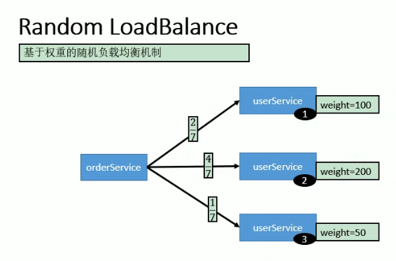
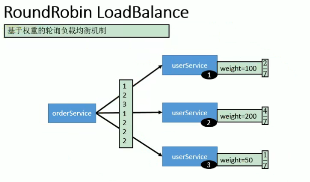
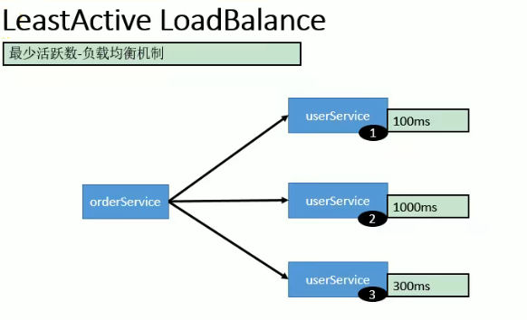

### 1、注册中心宕机

在服务消费者已经通过注册中心发现服务提供者后，注册中心宕机，不影响消费者正常消费，消费者本地已经缓存了服务提供方的地址，不需要每次调用时再走注册中心。

（不通过注册中心，通过服务直连的方式可以绕过注册中心）

```java
// ip:port方式直连服务提供者
@Reference(url = "127.0.0.1:20882")
```


### 2、集群模式下Dubbo的负载均衡

#### Random LoadBalance（默认）

- **随机**，按权重设置随机概率。
- 在一个截面上碰撞的概率高，但调用量越大分布越均匀，而且按概率使用权重后也比较均匀，有利于动态调整提供者权重。

每次都基于概率随机分发请求




#### RoundRobin LoadBalance

- **轮询**，按公约后的权重设置轮询比率。
- 存在慢的提供者累积请求的问题，比如：第二台机器很慢，但没挂，当请求调到第二台时就卡在那，久而久之，所有请求都卡在调到第二台上。

如下：总权重为350，2号为4/7的概率，若开始轮询，那么在7次调用中2号一定会被调用4次，每次轮询都会按照顺序逐个调用一遍，若次数用尽则退出下次轮询，直到一次轮询周期结束（这里为7次一周期）




#### LeastActive LoadBalance

- **最少活跃调用数**，相同活跃数的随机，活跃数指调用前后计数差。
- 使慢的提供者收到更少请求，因为越慢的提供者的调用前后计数差会越大

总是将请求分发给上一次响应最快的服务，如下会分发给1号服务



#### ConsistentHash LoadBalance

- **一致性 Hash**，相同参数的请求总是发到同一提供者。
- 当某一台提供者挂时，原本发往该提供者的请求，基于虚拟节点，平摊到其它提供者，不会引起剧烈变动。
- 算法参见：http://en.wikipedia.org/wiki/Consistent_hashing
- 缺省只对第一个参数 Hash，如果要修改，请配置 `<dubbo:parameter key="hash.arguments" value="0,1" />`
- 缺省用 160 份虚拟节点，如果要修改，请配置 `<dubbo:parameter key="hash.nodes" value="320" />`


配置

```xml
服务级别
<dubbo:service interface="..." loadbalance="roundrobin" />

客户端级别
<dubbo:reference interface="..." loadbalance="roundrobin" />

服务端级别
<dubbo:service interface="...">
    <dubbo:method name="..." loadbalance="roundrobin"/>
</dubbo:service>

方法级别
<dubbo:reference interface="...">
    <dubbo:method name="..." loadbalance="roundrobin"/>
</dubbo:reference>
```


### 3、服务降级

可以通过服务降级功能临时屏蔽某个出错的非关键服务，并定义降级后的返回策略。目的是为了是否不必要的资源占用，保障其他服务的稳定使用

向注册中心写入动态配置覆盖规则：


配置（在消费者端设置）

```java
RegistryFactory registryFactory = ExtensionLoader.getExtensionLoader(RegistryFactory.class).getAdaptiveExtension();
Registry registry = registryFactory.getRegistry(URL.valueOf("zookeeper://10.20.153.10:2181"));
registry.register(URL.valueOf("override://0.0.0.0/com.foo.BarService?category=configurators&dynamic=false&application=foo&mock=force:return+null"));
```

其中：

- `mock=force:return+null` 表示消费方对该服务的方法调用都直接返回 null 值，不发起远程调用。用来屏蔽不重要服务不可用时对调用方的影响。
  （强制返回为空，不进行远程调用）
- 还可以改为 `mock=fail:return+null` 表示消费方对该服务的方法调用在失败后，再返回 null 值，不抛异常。用来容忍不重要服务不稳定时对调用方的影响。


### 4、服务容错

在集群调用失败时，Dubbo 提供了多种容错方案，缺省为 failover 重试。实现原里图如下


- 这里的 `Invoker` 是 `Provider` 的一个可调用 `Service` 的抽象，`Invoker` 封装了 `Provider` 地址及 `Service` 接口信息
- `Directory` 代表多个 `Invoker`，可以把它看成 `List<Invoker>` ，但与 `List` 不同的是，它的值可能是动态变化的，比如注册中心推送变更
- `Cluster` 将 `Directory` 中的多个 `Invoker` 伪装成一个 `Invoker`，对上层透明，伪装过程包含了容错逻辑，调用失败后，重试另一个
- `Router` 负责从多个 `Invoker` 中按路由规则选出子集，比如读写分离，应用隔离等
- `LoadBalance` 负责从多个 `Invoker` 中选出具体的一个用于本次调用，选的过程包含了负载均衡算法，调用失败后，需要重选


容错模式如下

#### Failover Cluster（默认）

失败自动切换，当出现失败，重试其它服务器。通常用于读操作，但重试会带来更长延迟。可通过 `retries="2"` 来设置重试次数(不含第一次)。

#### Failfast Cluster[ ](https://dubbo.apache.org/zh/docsv2.7/user/examples/fault-tolerent-strategy/#failfast-cluster)

快速失败，只发起一次调用，失败立即报错。通常用于非幂等性的写操作，比如新增记录。

#### Failsafe Cluster

失败安全，出现异常时，直接忽略。通常用于写入审计日志等操作。

#### Failback Cluster

失败自动恢复，后台记录失败请求，定时重发。通常用于消息通知操作。

#### Forking Cluster

并行调用多个服务器，只要一个成功即返回。通常用于实时性要求较高的读操作，但需要浪费更多服务资源。可通过 `forks="2"` 来设置最大并行数。

#### Broadcast Cluster

广播调用所有提供者，逐个调用，任意一台报错则报错。通常用于通知所有提供者更新缓存或日志等本地资源信息。

现在广播调用中，可以通过 broadcast.fail.percent 配置节点调用失败的比例，当达到这个比例后，BroadcastClusterInvoker 将不再调用其他节点，直接抛出异常。 broadcast.fail.percent 取值在 0～100 范围内。默认情况下当全部调用失败后，才会抛出异常。 broadcast.fail.percent 只是控制的当失败后是否继续调用其他节点，并不改变结果(任意一台报错则报错)。broadcast.fail.percent 参数 在 dubbo2.7.10 及以上版本生效。

Broadcast Cluster 配置 broadcast.fail.percent。

broadcast.fail.percent=20 代表了当 20% 的节点调用失败就抛出异常，不再调用其他节点。

```java
@reference(cluster = "broadcast", parameters = {"broadcast.fail.percent", "20"})
```


#### 配置

可以自行扩展集群容错策略，参见：[集群扩展](https://dubbo.apache.org/zh/docsv2.7/dev/impls/cluster)

```xml
// 提供方
<dubbo:service cluster="failsafe" />

// 消费者方
<dubbo:reference cluster="failsafe" />
```


#### 整合hystrix进行容错管理

hystrix常被使用在spring cloud中进行服务容错管理

1、导入依赖

```xml
        <dependency>
            <groupId>org.springframework.cloud</groupId>
            <artifactId>spring-cloud-starter-netflix-hystrix</artifactId>
            <version>1.4.7.RELEASE</version>
        </dependency>
```

2、开启注解

```java
@EnableHystrix
```

3、provider端配置

```java
@Service(version = "1.0.0")
public class DubboOrderServiceImpl implements DubboOrderService {
    @Autowired
    OrderService orderService;

    // 被hystrix代理，若出现异常则加入hystrix处理流程
    @HystrixCommand
    @Override
    public List<OrderDAO> getOrderByUserId(Long userId){
        System.out.println("1.0.0");
        List<Order> list = orderService.getOrderByUserId(userId);
        List<OrderDAO> list1 = new ArrayList<>();
        for (Order order : list) {
            OrderDAO orderDAO = new OrderDAO();
            BeanUtils.copyProperties(order,orderDAO);
            list1.add(orderDAO);
        }
        return list1;
    }
}
```

4、consumer端配置

```java
@Service
public class UserServiceImpl implements UserService {
    @Reference(url = "127.0.0.1:20882")
    private DubboOrderService dubboOrderService;

    // 远程服务调用失败时，调用failDeal方法
    @HystrixCommand(fallbackMethod = "failDeal")
    @Override
    public List<OrderDAO> getUserOrder(Long userId) {
        return dubboOrderService.getOrderByUserId(userId);
    }

    private void failDeal(){
        System.out.println("调用失败");
    }
}
```

