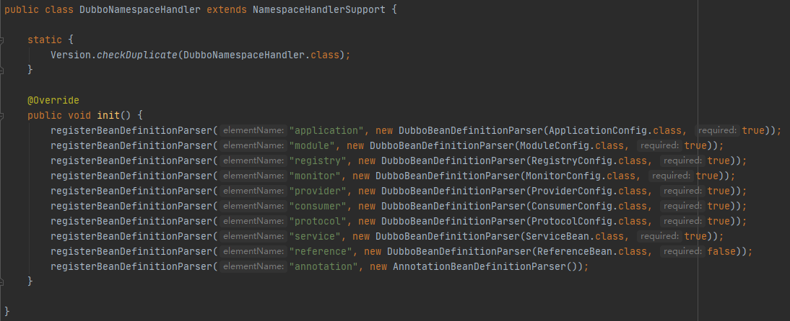

### 基础

RPC&Netty

dubbo框架时对RPC过程的实现，其中网络通信使用netty框架

### 框架

官方文档：https://dubbo.apache.org/zh/docsv2.7/dev/design/

### 1、标签解析

类：DubboBeanDefinitionParser的parse()方法

dubbo名字空间解析器，中配置了所有dubbo相关标签的对象

### 2、服务暴露过程

### 3、服务引用

### 4、服务调用

