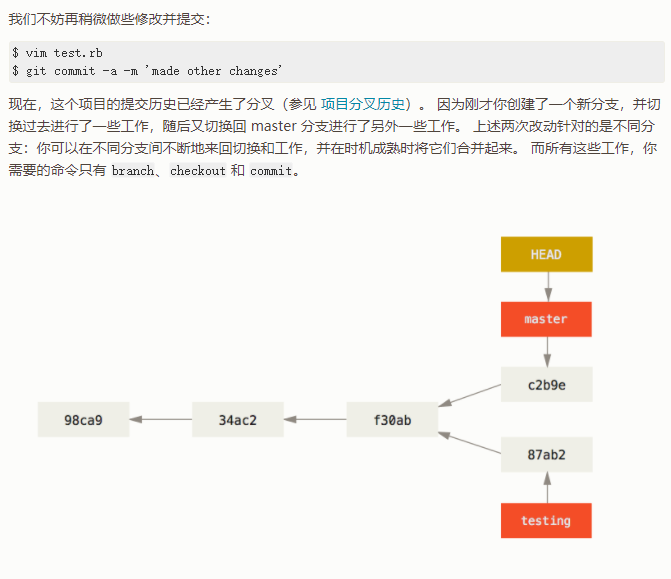
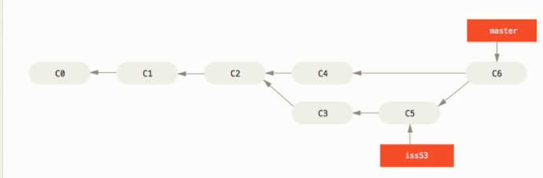

## Git基础

### 零、基础操作

#### 1、介绍安装

> 介绍：Git是一个版本控制软件，可以对项目文件进行快照，以便故障时能够恢复到上一个版本
>
> windows中可以到https://msysgit.io，下载
>
> Linux中可以使用：sudo apt-get install git命令安装

#### 2、使用仓库

> 1、配置Git，在配置中的全局变量上写入是谁在使用Git
>
> ```
> git config --global user.name "username"
> git config --global user.email "username@example.com"
> ```
>
> 2、创建忽略文件
>
> ```
> .gitignore文件中保存Git不跟踪的文件，在Git拍摄文件快照时会自动忽略这些文件
> ```
>
> 3、初始化仓库
>
> ```
> 在对应的项目根目录下初始化一个Git仓库，里面保存有项目的所有历史快照记录，是一个./git文件夹
> 初始化命令：git init
> ```
>
> 4、查看状态
>
> ```
> 命令：git status
> 将会显示当前分支，跟踪文件，未跟踪文件，发生了修改的文件
> 若输出working directory clean则表示当前工作目录是干净的不存在未提交的文件这是最希望看到的信息
> ```
>
> 5、将文件加入仓库
>
> ```
> 命令：git add .
> 将项目中未被跟踪的文件都加入到仓库中，可以使得Git知道这些文件是否被修改
> 它不提交这些文件，只是让Git开始关注他们
> ```
>
> 6、执行提交
>
> ```
> 命令：git commit -m "Started project."
> git commit是提交命令，-m为提交参数，表示这次提交的信息为"Started project."
> 每次提交都是一次快照
> 
> 命令：git commit -am “xxxx”
> 这条命令中-a表示将所有被修改的文件都提交
> ```
>
> 7、查看历史提交记录
>
> ```
> 命令：git log
> 该命令可以查看所有的提交，以及每次的提交人，提交时间，可以追加参数“--pretty=oneline”使的只输出提交ID和提交信息
> ```
>
> 8、恢复到最近一次提交
>
> ```
> 命令：git checkout .
> 该命令将放弃最后一次提交后所做的所有修改，恢复到上一次提交的状态
> ```
>
> 9、恢复到某次提交
>
> ```
> 命令：git checkout id
> 该命令将当前项目指定恢复到特点一次提交时的状态，id为那次提交的id的前6位，id可以由查看历史命令查看
> ```

#### 3、git文件状态

> #### 未跟踪（untracketed）
>
> #### 已跟踪（tracketed）
>
> 1. 未修改（unmodified）：文件没有发生修改
> 2. 修改（modified）：文件发生修改，但还没放入暂存区域
> 3. 暂存（staged）：修改文件暂存在内存中，这时只执行了add指令没有使用commit指令
>
> 
>
> 

#### 4、工作流程

> ## Git工作流程
>
> 修改——>暂存——>提交
>
> 
>
> 
>
> 暂存区
>
> 
>
> 未暂存区
>
> 
>
> 未跟踪区
>
> 
>
> 干净状态
>
> 

#### 5、忽略文件

> 在.gitignore文件中添加git仓库要忽略的文件
>
> 
>
> 

### 一、Git远程操作

#### 1、添加远程仓库：git remote add <shortname> <url>

> 

#### 2、从远程仓库下载：git fetch <remote>\[可指定分支\]

> 
>
> 该命令只会拉取本地仓库没有的数据，不会自动合并到本地仓库

#### 3、从远程仓库下载（合并）：git pull <remote> master

> 在设置了跟踪远程仓库后，该命令拉取远程仓库中的新数据后会自动合并到指定分支

#### 4、推送到远程仓库：git push <remote> master

> 

#### 5、查看远程仓库：git remote show <remote>

> 
>
>  Local branches configured for 'git pull' 表示哪些本地分支可以与它跟踪的远程分支自动合并
>
>  Local refs configured for 'git push':当你在特定的分支上执行 git push会自动地推送到哪一个远程分支
>
> 添加‘-v’参数查看简化信息
>
> 

#### 6、重命名远程仓库：git remote rename

> 

#### 7、删除远程仓库：git remote remove

> 

#### 8、添加并下载远程仓库：git clone <url> [rename]

> 
>
> 默认使用origin或url中的仓库名作为仓库名，可以指定别名

### 二、Git标签

#### 1、创建标签

> 1. 创建附注标签
>
>    ```git
>    $ git tag -a v1.4 -m "my version 1.4"
>    -a：表示添加一个标签，后面跟标签名
>    -m：表示标签的信息
>    ```
>
> 2. 创建轻量级标签
>
>    ```
>    $ git show v1.4
>    ```

#### 2、对已提交打标签

> ```console
> $ git tag -a v1.2 9fceb02
> ```
>
> 要在那个提交上打标签，你需要在命令的末尾指定提交的校验和（或部分校验和）

#### 3、推送标签

> 向远程仓库推送一个标签
>
> ```console
> git push origin v1.5
> ```
>
> 向远程仓库推送多个标签，不会区分附注标签和轻量级标签
>
> ```console
> $ git push origin --tags
> ```

#### 4、删除标签

> git tag -d <tagname>
>
> ```console
> $ git tag -d v1.4-lw
> ```
>
> 删除远程仓库的标签
>
> ```console
> $ git push origin --delete <tagname>
> ```

#### 5、检出标签

> 如果你想查看某个标签所指向的文件版本，可以使用 `git checkout` 命令， 虽然这会使你的仓库处于“分离头指针（detached HEAD）”的状态——这个状态有些不好的副作用：
>
> ```console
> $ git checkout 2.0.0
> ```

#### 6、查看标签

> ```console
> $ git tag
> ```

#### 7、查看标签对应的提交

> ```console
> $ git show v1.4
> ```


### 三、Git别名

#### 1、内部命令创建别名

> 通过配置文件创建命令别名
>
> ```console
> $ git config --global alias.co checkout
> $ git config --global alias.br branch
> $ git config --global alias.ci commit
> $ git config --global alias.st status
> 等价：
> git co=git checkout
> git br=git branch
> git ci=git commit
> git st=git status
> 
> ```
>
> 别名等价于替换可以包含参数
>
> ```console
> $ git config --global alias.unstage 'reset HEAD --'
> 等价
> $ git unstage fileA = $ git reset HEAD -- fileA
> ```

#### 2、外部命令创建别名

> 使用别名替换外部命令（非git命令）时需要用‘！’开头
>
> ```console
> $ git config --global alias.visual '!gitk'
> 等价
> git visual = gitk
> ```

## Git分支

### 四、Git分支

#### 1、Git对象

> 场景：一个Git仓库中有README、test.rb、LICENSE三个文件
>
> 执行下面两个命令后
>
> ```console
> $ git add README test.rb LICENSE
> $ git commit -m 'The initial commit of my project'
> ```
>
> 仓库中有3类对象
>
> blob对象：保存当前文件快照
>
> tree对象：记录当前目录结构和blob对象索引
>
> commit对象：包含指向当前树对象指针、父commit对象指针、提交作者、提交者邮箱、提交信息
>
> 
>
> 多次提交后每个**提交对象**都指向一个**父提交对象**和一个**仓库快照树**。
>
> 

#### 2、分支指针、head指针

> 分支指针：指向某一分支（如master）
>
> head指针：指向当前工作分支
>
> 

#### 3、创建分支、切换分支

> 使用：$ git branch testing命令创建testing分支，会在当前工作分支下的最新快照处创建一个分支指针
>
> 
>
> 切换分支：$ git checkout testing命令，就是改变head指针的指向
>
> 
>
> 创建并切换到分支：git checkout -b <newbranchname>
>
> 在指定分支上创建分支：$ git checkout -b serverfix origin/serverfix

#### 4、项目分叉

> 在testing分支上进行提交
>
> 
>
> 切换到master分支进行提交
>
> 

#### 5、查看分支历史

> 命令：**$ git log --oneline --decorate --graph --all**，可以查看整个工作项目的分支变化过程
>
> 
>
> 可以看到从f30ab提交对象后项目开始分支

#### 6、查看各个分支当前指向的提交对象

> 命令：$ git log --oneline --decorate，下面表示testing、master分支都指向f30ab提交对象
>
> 

### 五、分支合并

#### 1、快进式合并

> 特点：两条合并的分支处于一条直线上，可以直接后移分支指针实现合并。如下将hotfix分支合并到master分支
>
> 常用于：开发新版本、修复紧急bug
>
> 
>
> ```console
> $ git checkout master，切换回master
> $ git merge hotfix，合并hotfix分支
> $ git branch -d hotfix，删除hotfix分支指针
> ```
>
> 
>
> 
>
> 

#### 2、三方合并（无冲突）

> 特点：合并两个不在同一直线上的分支，分支合并后会创建一个新的提交对象，该对象有两个父提交对象。
>
> 常用于：同时处理多个问题时
>
> 将iss53分支合并到master分支
>
> 
>
> ```console
> $ git checkout master
> $ git merge iss53
> ```
>
> 

#### 3、三方合并（带冲突）

> 特点：合并两个不在同一直线上的分支，且不同分支都对同一个文件进行了修改，导致git不知道该使用哪一个快照的内容。
>
> 常用于：同时处理多个问题时
>
> 将iss53分支合并到master分支
>
> 
>
> ```console
> $ git checkout master
> $ git merge iss53
> ```
>
> 出现问题：合并在index.html文件处发生冲突
>
> 
>
> 使用git status命令会现实出合并冲突
>
> 
>
> git会在冲突文件中加入标志的冲突解决标记
>
> ```
> <<<<<<<：表示当前head指针所在分支的快照内容
> =======：分隔两个快照的内容
> >>>>>>>：表示另一分支的快照内容
> ```
>
> 
>
> 修改冲突文件后使用：git add暂存，使用status查看状态
>
> 
>
> 命令：git branch -D testing强制删除冲突还没解决的分支

### 六、分支管理（branch命令）

#### 1、查看所有分支

> 命令：$ git branch
>
> 

#### 2、查看每个分支最后的提交

> 命令：$ git branch -v
>
> *表示当前head所在分支
>
> 

#### 3、以合并到当前分支的分支

> 命令：$ git branch --merged
>
> 

#### 4、未合并到当前分支的分支

> 命令：$ git branch --no-merged
>
> 

#### 5、携带参数

> 命令：$ git branch --no-merged master
>
> 尚未合并到 `master` 分支的有哪些
>
> 

### 七、远程分支

#### 1、远程引用

> 远程引用是对远程仓库的引用（指针），包括分支、标签等等。 你可以通过 `git ls-remote <remote>` 来显式地获得远程引用的完整列表， 或者通过 `git remote show <remote>` 获得远程分支的更多信息。 然而，一个更常见的做法是利用远程跟踪分支。

#### 2、远程分支

> 远程分支：是远程分支状态的引用，它们以 `<remote>/<branch>` 的形式命名
>
> 特点：无法移动远程分支指针
>
> 使用：git fetch <remote>，可以更新远程分支指针
>
> 
>
> 

#### 3、跟踪分支

> 从一个远程跟踪分支检出一个本地分支会自动创建所谓的“跟踪分支”（它跟踪的分支叫做“上游分支”）。
>
> 使用：$ git fetch origin，获得远程分支指针时**并不会自动创建对应的本地分支指针**。
>
> ```console
> $ git checkout -b serverfix origin/serverfix
> 创建serverfix分支，跟踪origin/serverfix
> 
> $ git checkout --track origin/serverfix
> 跟踪origin/serverfix，使用默认后缀serverfix
> 
> $ git branch -u origin/serverfix
> 设置已有的本地分支跟踪一个刚刚拉取下来的远程分支
> ```

#### 4、查看所有跟踪分支

> 命令：$ git branch -vv，显示出本地分支跟踪的远程分支，并提示本地分支是否是领先、落后或是都有。
>
> 
>
> iss53分支：本地有两个提交还没有推送到服务器上
>
> server-fix-good分支：领先 3 落后 1， 意味着服务器上有一次提交还没有合并入同时本地有三次提交还没有推送
>
> master分支：是最新的
>
> testing分支没有跟踪远程分支。
>
> （该命令只对比上次从服务器获取的仓库信息，如想要对比最新的信息需要先进行拉取操作）

#### 5、拉取分支

> 命令： `git fetch`，从服务器上抓取本地没有的数据时，它并不会修改工作目录中的内容。 它只会获取数据然后让你自己合并。
>
> 命令：`git pull`，查找当前分支所跟踪的服务器与分支， 从服务器上抓取数据然后尝试合并入那个远程分支。相当于执行git fetch和git merge指令

#### 6、删除远程仓库上的分支

> 命令：$ git push origin --delete serverfix

#### 7、同时跟踪多个远程仓库

> 
>
> 

### 八、变基（rebase）

#### 1、变基与合并

> 变基：也是一种合并分支的手段
>
> 相同点：无论是通过变基，还是通过三方合并，整合的最终结果所指向的快照始终是一样的
>
> 不同点：变基后的提交历史无法看出曾经存在过的分支
>
> 原理：将另一分支在**公共祖先**后的提交对象**重新提交**到另一分支上，在使用快进合并方式**调整分支指针**完成合并（重新提交后的对象不是原来的对象）

#### 2、变基操作

> 场景：使用变基将experiment分支合并到master中
>
> 
>
> ```console
> $ git checkout experiment
> 检出到experiment分支
> $ git rebase master
> 将experiment分支变基到master
> ```
>
> 
>
> ```
> $ git checkout master
> $ git merge experiment
> 使用进步合并调整分支指针
> ```
>
> 

> 跨分支的变基
>
> 将client分支合并到master中
>
> 
>
> ```console
> $ git rebase --onto master server client
> ```
>
> 
>
> ```console
> $ git checkout master
> $ git merge client
> ```
>
> 
>
> 使用：**$ git rebase master server**，将server分支变基到master中，省略检出到server的操作

#### 3、变基使用原则

> **如果提交存在于你的仓库之外，而别人可能基于这些提交进行开发，那么不要执行变基。**
>
> 场景：https://git-scm.com/book/zh/v2/Git-%E5%88%86%E6%94%AF-%E5%8F%98%E5%9F%BA

## 自建Git服务器

### 九、自建Git服务器

#### 1、选择协议

> 4.1 [协议](https://git-scm.com/book/zh/v2/服务器上的-Git-协议)

#### 2、使用SSH协议搭建

> 4.2 [在服务器上搭建 Git](https://git-scm.com/book/zh/v2/服务器上的-Git-在服务器上搭建-Git)
>
> 4.3 [生成 SSH 公钥](https://git-scm.com/book/zh/v2/服务器上的-Git-生成-SSH-公钥)
>
> 4.4 [配置服务器](https://git-scm.com/book/zh/v2/服务器上的-Git-配置服务器)

#### 3、使用Git协议搭建

> 4.5 [Git 守护进程](https://git-scm.com/book/zh/v2/服务器上的-Git-Git-守护进程)

#### 4、使用智能http协议搭建

> 4.6 [Smart HTTP](https://git-scm.com/book/zh/v2/服务器上的-Git-Smart-HTTP)

#### 5、GitWeb（基于网页的git UI）

> 4.7 [GitWeb](https://git-scm.com/book/zh/v2/服务器上的-Git-GitWeb)

#### 6、GitLab（开源Git服务器）

> 4.8 [GitLab](https://git-scm.com/book/zh/v2/服务器上的-Git-GitLab)

## 分布式Git

### 十、分布式工作流程

#### 1、集中式工作流

> 
>
> 特点： 每个人都可以对共享仓库进行读写，开发者在推送修改之前，必须先将其他人的工作合并进来，这样才不会覆盖第一个人的修改

#### 2、集成管理者工作流（github的工作流程）

> 
>
> 特点：每个开发者拥有自己仓库的写权限和其他所有人仓库的读权限，这种情形下通常会有个代表“官方”项目的权威的仓库。
>
> 工作流程：
>
> 1. 项目维护者推送到主仓库。
> 2. 贡献者克隆此仓库，做出修改。
> 3. 贡献者将数据推送到自己的公开仓库。
> 4. 贡献者给维护者发送邮件，请求拉取自己的更新。
> 5. 维护者在自己本地的仓库中，将贡献者的仓库加为远程仓库并合并修改。
> 6. 维护者将合并后的修改推送到主仓库。

#### 3、主管与副主管工作流

> 
>
> 特点：这其实是多仓库工作流程的变种。 一般拥有数百位协作开发者的超大型项目才会用到这样的工作方式，例如著名的 Linux 内核项目。
>
> 工作流程：
>
> 1. 普通开发者在自己的主题分支上工作，并根据 `master` 分支进行变基。 这里是主管推送的参考仓库的 `master` 分支。
> 2. 副主管将普通开发者的主题分支合并到自己的 `master` 分支中。
> 3. 主管将所有副主管的 `master` 分支并入自己的 `master` 分支中。
> 4. 最后，主管将集成后的 `master` 分支推送到参考仓库中，以便所有其他开发者以此为基础进行变基。

### 十一、向一个项目进行贡献

#### 1、提交准则

> Git 项目提供了一个文档，其中列举了关于创建提交到提交补丁的若干好的提示——可以在 Git 源代码中的 `Documentation/SubmittingPatches` 文件中阅读它。
>
> 1. 提交不应该包含任何空白错误
> 2. 尝试让每一个提交成为一个逻辑上的独立变更集
> 3. 有一个创建优质提交信息

#### 2、私有小型团队场景

> 一两个其他开发者的私有项目。 “私有” 在这个上下文中，意味着闭源——不可以从外面的世界中访问到。 你和其他的开发者都有仓库的推送权限。

> 使用集中式工作流，每个人推送提交前都需要合并其他人的提交
>
> 

#### 3、私有管理团队场景

> 让我们假设 John 与 Jessica 在一个特性（`featureA`）上工作， 同时 Jessica 与第三个开发者 Josie 在第二个特性（`featureB`）上工作。 

> 

#### 4、向公开git仓库贡献

> 集成管理者工作流
>
> 1. 首先，你可能想要克隆主仓库，为计划贡献的补丁或补丁序列创建一个主题分支，然后在那儿做工作。 顺序看起来基本像这样：
>    
>
> 2. 在本地完成工作并提交
>
> 3. 将本地提交推送到自己的公开仓库上
>
>    ```
>    $ git remote add myfork <url>
>    $ git push -u myfork featureA
>    ```
>
> 4. 你需要通知原项目的维护者你有想要他们合并的工作。 这通常被称作一个 **拉取请求（Pull Request）**
>
>    ```
>    $ git request-pull origin/master myfork
>    ```
>
>    
>
>    此输出可被发送给维护者——它告诉他们工作是从哪个分支开始的、提交的摘要、以及从哪里拉取这些工作。

> 使用分支创建特性进行贡献
>
> 场景：编写新特性B
>
> 流程：
>
> ```console
> $ git checkout -b featureB origin/master
>   ... work ...
> $ git commit
> $ git push myfork featureB
> $ git request-pull origin/master myfork
>   ... email generated request pull to maintainer ...
> $ git fetch origin
> ```
>
> 
>
> 现在，每一个特性都保存在一个贮藏库中——类似于补丁队列——可以重写、变基与修改而不会让特性互相干涉或互相依赖
>
> **使用变基合并特性A：**
>
> ```console
> $ git checkout featureA
> $ git rebase origin/master
> $ git push -f myfork featureA
> ```
>
> 因为你将分支变基了，所以必须为推送命令指定 `-f` 选项，这样才能将服务器上有一个不是它的后代的提交的 `featureA` 分支替换掉
>
> **创建新分支Bv2合并特性B到master**
>
> ```console
> $ git checkout -b featureBv2 origin/master
> $ git merge --squash featureB
>   ... change implementation ...
> $ git commit
> $ git push myfork featureBv2
> ```
>
> 
>
> `--squash` 选项接受被合并的分支上的所有工作，并将其压缩至一个变更集， 使仓库变成一个真正的合并发生的状态，而不会真的生成一个合并提交，这种方式`不会出现两个父提交的状态`。相当于复制原分支的副本到新分支

#### 5、通过邮件维护的公开项目

> 许多项目建立了接受补丁的流程——需要检查每一个项目的特定规则，因为它们之间有区别。 因为有几个历史悠久的、大型的项目会通过一个开发者的邮件列表接受补丁
>
> 1. 本地提交
> 2.  使用 `git format-patch` 来生成可以邮寄到列表的 mbox 格式的文件，它将每一个提交转换为一封电子邮件，提交信息的第一行作为主题，剩余信息与提交引入的补丁作为正文
>    
> 3. 发送邮件
>    1. 使用git提供的工具发送，配置.gitconfig文件
>       
>    2. 发送
>       
>    3. 使用SMTP服务器发送
>       

### 十二、维护项目

#### 1、接收来着邮件的补丁

> 1. 使用：git apply(如果你收到了一个使用 `git diff` 或 Unix `diff` 命令的变体创建的补丁)
>    1. 假设你将补丁保存在了 `/tmp/patch-ruby-client.patch` 中
>    2. 运行，`$ git apply /tmp/patch-ruby-client.patch`命令
>    3. `git apply` 命令采用了一种“全部应用，否则就全部撤销（apply all or abort all）”的模型， 即补丁只有全部内容都被应用和完全不被应用两个状态，而 `patch` 可能会导致补丁文件被部分应用
>    4. 可以使用 `git apply `来检查补丁是否可以顺利应用
>       
> 2. 使用：git am
>    1. 要应用一个由 `format-patch` 命令生成的补丁，你应该使用 `git am` 命令 （该命令的名字 `am` 表示它“应用（Apply）一系列来自邮箱（Mailbox）的补丁”）
>    2. 使用`$ git am 0001-limit-log-function.patch`
>    3. 查看历史可以得知补丁的作者和提交该补丁的人
>       

> **合并补丁时发生冲突**：有时候无法顺利地应用补丁。 这也许是因为你的主分支和创建补丁的分支相差较多，也有可能是因为这个补丁依赖于其他你尚未应用的补丁
>
> 解决流程：而你解决问题的手段很大程度上也是一样的——即手动编辑那些文件来解决冲突，暂存新的文件， 之后运行 `git am --resolved` 继续应用下一个补丁：
>
> ```console
> $ (fix the file)
> $ git add ticgit.gemspec
> $ git am --resolved
> ```
>
> 使用`-3`选项来使 Git 尝试进行三方合并，该选项默认并没有打开，因为如果用于创建补丁的提交并不在你的版本库内的话，这样做是没有用处的。
>
> 
>
> 也可以在交互模式下运行 `am` 命令， 这样在每个补丁之前，它会停住询问你是否要应用该补丁：
>
> 

#### 2、合并远程分支

> 1. **拉取远程分支**
>
>    1. 跟踪远程分支并拉取
>
>    ```console
>    $ git remote add jessica git://github.com/jessica/myproject.git
>    $ git fetch jessica
>    $ git checkout -b rubyclient jessica/ruby-client
>    ```
>
>    2. 不跟踪远程仓库，拉取分支
>
>    ```console
>    $ git pull https://github.com/onetimeguy/project
>    From https://github.com/onetimeguy/project
>     * branch            HEAD       -> FETCH_HEAD
>    Merge made by the 'recursive' strategy.
>    ```
>
> 2. **查看新增的提交**
>
>    1. `$ git log contrib --not master`表示contrib分支中master分支没有的提交
>        `git log` 命令传递 `-p` 选项，这样它会在每次提交后面附加对应的差异（diff）。
>
>    ```console
>    $ git log contrib --not master
>    commit 5b6235bd297351589efc4d73316f0a68d484f118
>    Author: Scott Chacon <schacon@gmail.com>
>    Date:   Fri Oct 24 09:53:59 2008 -0700
>    
>        seeing if this helps the gem
>    
>    commit 7482e0d16d04bea79d0dba8988cc78df655f16a0
>    Author: Scott Chacon <schacon@gmail.com>
>    Date:   Mon Oct 22 19:38:36 2008 -0700
>    
>        updated the gemspec to hopefully work better
>    ```
>
>    2. 找到两个分支的公共祖先比较差异
>
>       ```console
>       $ git merge-base contrib master
>       36c7dba2c95e6bbb78dfa822519ecfec6e1ca649
>       $ git diff 36c7db
>       ```
>
>        Git 提供了一种比较便捷的方式：三点语法。 对于 `git diff` 命令来说，你可以通过把 `...` 置于另一个分支名后来对该分支的最新提交与两个分支的共同祖先进行比较：
>
>       ```console
>       $ git diff master...contrib
>       ```
>
> 3. **合并贡献**
>
>    1. 合并到master**（小型项目）**
>       
>    2. 使用两阶段合并循环，维护两个长期分支`master` 和 `develop`，`master` 分支只会在一个非常稳定的版本发布时才会更新，而所有的新代码会首先整合进入 `develop` 分支。**（中型项目）**
>       
>    3. 维护四个长期分支**（大型项目）**，
>       `master`：分支只会在一个非常稳定的版本发布时才会更新
>       `next`：安全的主题分支会被合并入 
>        `pu`：测试新特性
>       `maint`：用于维护性向后移植工作
>       
>    4. 变基到分支，使得项目分支更加简洁
>    5. 使用`拣选`，该操作可以将分支中的某个提交合并到另一个分支中，该提交不一定是最新的
>       


#### 3、发布新版本

> 1. 为发布打标签（不需要公钥情况）
>    
>
> 2. 生成PGP公钥
>
>    1. 首先你可以通过运行 `gpg --list-keys` 找出你所想要的 key
>       
>    2. 导出 key 并通过管道传递给 `git hash-object` 来直接将 key 导入到 Git 的数据库中
>       
>    3. 给出的新 SHA-1 值来创建一个直接指向它的标签：
>       
>
> 3. 生成一个构建号（版本号）
>    `git describe` 命令需要有注解的标签（即使用 `-a` 或 `-s` 选项创建的标签）
>
>    ```console
>    $ git describe master
>    v1.6.2-rc1-20-g8c5b85c
>    ```
>
>    它由最近的标签名、自该标签之后的提交数目和你所描述的提交的部分 SHA-1 值（前缀的 `g` 表示 Git）构成
>
> 4. 发布（为那些不使用 Git 的可怜包们创建一个最新的快照归档）
>
>    1. 发布tar
>
>       ```console
>       $ git archive master --prefix='project/' | gzip > `git describe master`.tar.gz
>       $ ls *.tar.gz
>       v1.6.2-rc1-20-g8c5b85c.tar.gz
>       ```
>
>    2. 发布zip
>
>       ```
>       $ git archive master --prefix='project/' --format=zip > `git describe master`.zip
>       ```
>
> 5. 制作提交简报
>    现在是时候通知邮件列表里那些好奇你的项目发生了什么的人了。 使用 `git shortlog` 命令可以快速生成一份包含从上次发布之后项目新增内容的修改日志（changelog）类文档。 它会对你给定范围内的所有提交进行总结。
>    比如，你的上一次发布名称是 v1.0.1，那么下面的命令可以给出上次发布以来所有提交的总结：
>
>    ```console
>    $ git shortlog --no-merges master --not v1.0.1
>    Chris Wanstrath (6):
>          Add support for annotated tags to Grit::Tag
>          Add packed-refs annotated tag support.
>          Add Grit::Commit#to_patch
>          Update version and History.txt
>          Remove stray `puts`
>          Make ls_tree ignore nils
>    
>    Tom Preston-Werner (4):
>          fix dates in history
>          dynamic version method
>          Version bump to 1.0.2
>          Regenerated gemspec for version 1.0.2
>    ```

## GitHub

### 十三、使用GitHub

#### 1、注册用户

> GitHub是一个著名的第三方Git仓库托管平台
>
> 进入对应网页注册用户即可使用

#### 2、对项目做出贡献

> fork：派生项目，创建一个目标仓库的副本，使得自己能进行修改
>
> github使用流程和集成管理者工作流基本一致：
>
> 1. 派生一个项目(fork)
> 2. 从 `master` 分支创建一个新分支
> 3. 提交一些修改来改进项目
> 4. 将这个分支推送到 GitHub 上（自己的fork仓库）
> 5. 创建一个拉取请求（Pull Request，简称 PR）
> 6. 讨论，根据实际情况继续修改
> 7. 项目的拥有者合并或关闭你的拉取请求
> 8. 将更新后的 `master` 分支同步到你的派生中
>
> 
>
> Pull Request，第一次创建的拉取请求github会提醒原仓库拥有者。后续对请求中的修改不会触发提醒
>
> **存在冲突合并时的处理**
>
> 

#### 3、维护项目

> 1. 创建仓库
> 2. 添加合作者（合作者具有提交权限）
> 3. 管理合并请求

4、管理组织

> 除了个人帐户之外，GitHub 还提供被称为组织（Organizations）的帐户。 组织账户和个人账户一样都有一个用于存放所拥有项目的命名空间，但是许多其他的东西都是不同的。
>
> 
>
> 管理组织成员
>
> 
>
> 邀请成员
>
> 
>
> 审计
>
> 

#### 4、github脚本

> 1. 服务：github内置的服务功能，如设置邮件提醒，当收到PR可以自动回复一个邮件给PR提出者
> 2. 钩子：一个更加强大的功能，仓库持有者可以设置一个hooks，每当收到一个PR时，将其发生到指定的url，然后可以在这个url上绑定web service进行自定义处理
> 3. github API：github对外提供的API
>    1. 获取仓库基本可读信息
>       
>    2. 在一个问题上评论
>       
>       
>    3. 修改PR状态
>       
>       
>       


