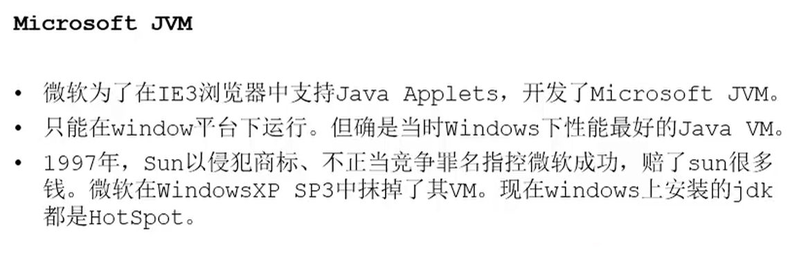

### JVM阅读书目

### JVM跨语言的平台

不同的语言都可以提供符合规范的字节码文件交给JVM来运行

JVM相比Java语言来说更加是一个成功的产品，java语言可能不是最强大的语言，但Java虚拟机是最强大的虚拟机

### 多语言混合编程

### JVM历史事件

### Java虚拟机

### JVM的位置

### JVM的整体结构

- 类加载器：将字节码文件解析为一定的数据结构保存在运行时数据区，其中方法区和堆区是所有线程共享的，java栈，本地方法栈，程序计数器是线程私有的。

- 本地方法区：是C++库

- 执行引擎：是用来输出对应机器代码的模块

### Java执行流程

### JVM架构模型

JVM采用基于栈的指令集架构，另一种物理机上的指令集架构是基于寄存器的

- 基于栈的指令集架构
  - 设计和实现简单，适用于资源受限的系统
  - 避开了寄存器分配难题（NP问题），使用零地址格式来设计指令，一个指令占用8bit
  - 指令集小，执行过程依赖栈操作
  - 编译器容易实现
  - 不需要硬件支持，移植性号
- 基于寄存器的指令架构
  - 典型应用是x86芯片，Android的Davlik虚拟机
  - 指令集和硬件高度耦合，移植性差
  - 效率高、性能优秀
  - 用更少的指令完成一个操作
  - 指令往往采用一地址、二地址、三地址的格式设计，每个指令占16为或更多

### JVM生命周期

1. 启动：java虚拟机的启动是通过`引导类加载器`(bootstrap class loader)创建一个初始类来完成的，这个类由虚拟机的具体实现指定
2. 执行：运行的JVM有一个清晰的任务——执行java程序，程序开始执行是它才运行，程序结束时它就停止。`一个java程序在JVM中体现为一个进程`
3. 退出：有多种退出情况
   1. 程序正常执行结束
   2. 执行过程中遇到异常或者错误
   3. 由于操作系统错误导致java虚拟机进程终止
   4. 某线程调用Runtime类或System类的exit()方法，或Runtime中的halt方法，并且java安全管理器也允许这次exit()或halt()操作
   5. 用JNI在加载或卸载java虚拟机

### JVM发展历程

- Sun Class VM
  
- Exact VM
  
- HotSlop VM
  
- JRockit（商用）
  
- J9 VM（IBM公司开发的商用虚拟机）
  
- 其他虚拟机
  
  
  
  
  
  
  

### JVM展望

