### 内存结构图

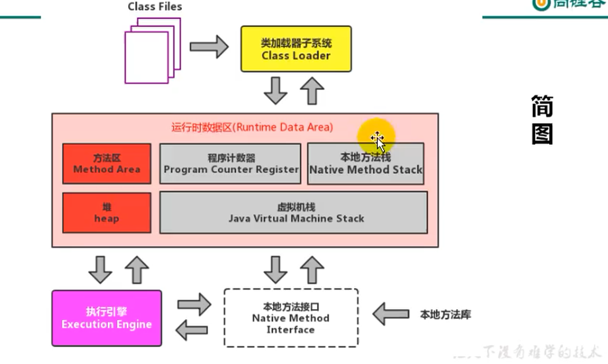

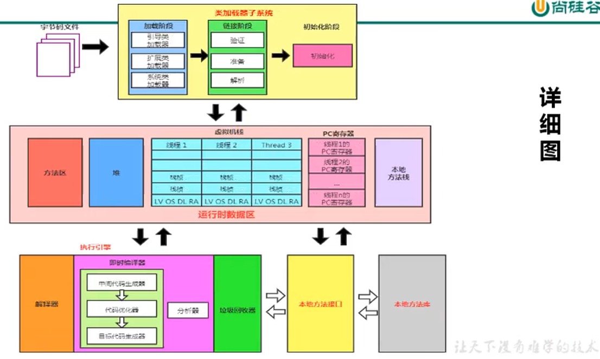


### 类加载子系统

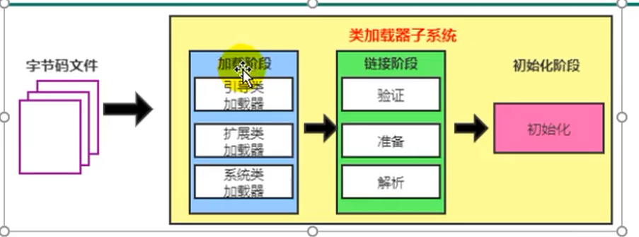


- 类加载子系统负责从文件系统或网络中加载class文件class文件在文件开头有特定的文件标识，不同的语言根据规范生成的class文件也能够被加载
- ClassLoader只负责class文件的加载，是否能够允许有Execution Engine决定
- 类加载器将类信息存放在方法区中

> 反编译命令：javap -v xxx.class
>
> 可以得到class被类加载器解析后的情况
>
> 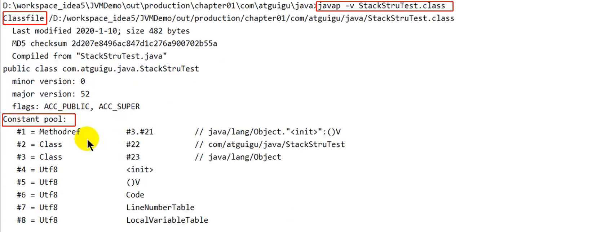


### 类的加载过程

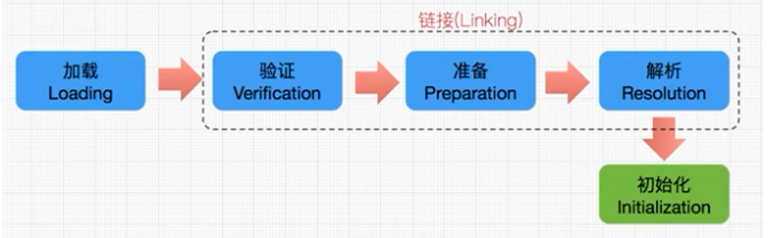

- 加载阶段：
  - 通过类的全限定名获取定义此类的二进制文件
  - 将字节流所代表的静态存储结构转化为方法区的运行时数据结构
  - 在堆中生`成一个代表这个类的Class对象`，作为方法区中class文件数据的访问入口

> 获取 .class文件的方式
>
> - 从本地获取
> - 通过网络获取，例Web Applet
> - 从zip压缩包中获取，例：jar、war文件
> - 运行时技术生成，例：动态代理
> - 由其他文件生成，例jsp
> - 从专有数据库中获取
> - 从加密文件中获取，防止class文件被反编译的措施

- 链接阶段
  - 验证：确保class文件的字节流所包含的信息符合当前虚拟机的要求，保证类被正确加载不会危害虚拟机本身。主要验证手段由四种：文件格式验证、元数据验证，字节码验证、符号引用验证
  - 准备：`为类变量（static标识的）分配内存，并设置该类变量的默认初始值（不同类型不同初始值）`，这里不会为final修饰的static变量赋值，因为final变量在编译时就已经确定值
  - 解析：将常量池内的符号引用转换为直接引用的过程
- 初始化阶段：执行执行类构造器的\<clinit>()方法的过程
  - 该方法不需要定义，由javac编译器自动收集类中所有变量的赋值动作和静态代码块中的语句合并而来。`在编译时生成<clinit>()方法`，若没有需要初始化的语句则不生成该方法
  - \<clinit>()方法的指令顺序按照class文件中的定义顺序来执行
  - 虚拟机会保证子类的\<clinit>()方法方法会在父类的\<clinit>()方法方法之后执行
  - 虚拟机保证一个类的\<clinit>()方法在多线程环境下被加锁进行
  - 类的构造器在JVM视角下为\<init>()方法

> 静态变量的声明可以在赋值语句之后，不会出现语法错误，原因如下
>
> 1. 在类加载系统中，链接阶段中的`准备步骤`已经为静态变量进行声明分配内存和默认初始值，`相当于提前声明`
> 2. 所以在`初始化阶段的\<clinit>()方法`执行过程中赋值语句和声明语句都是赋值语句，不会出现变量未定义异常
> 3. 赋值过程如下，number=0，number=10，number=20
>
> 注意，这种静态变量可以在赋值语句后但是不能在声明预计之前使用，如打印
>
> ```java
> public class StringDemo1 {
>     static {
>         // 赋值
>         number=10;
>     }
> 
>     // 声明
>     private static int number = 20;
>     public static void main(String[] args){
>         System.out.println(number);
>     }
> }
> ```


### 类加载器分类

- 引导类加载器

- 自定义加载器：所有派生与抽象类ClassLoader的类加载器都是自定义加载器，常见的扩展类加载器和系统类加载器就属于该类

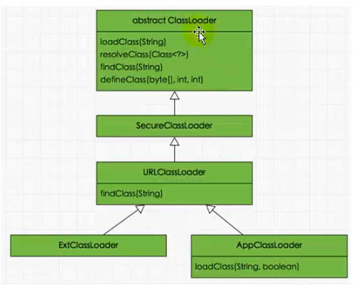

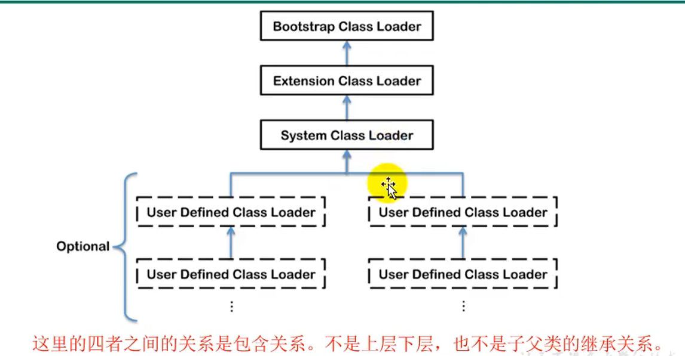

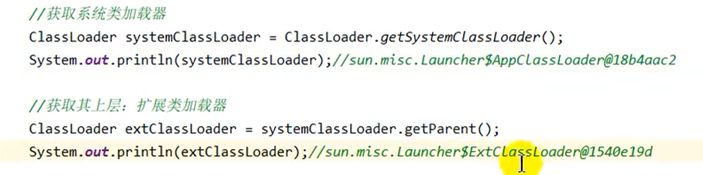


> 用户自定义类默认使用系统类加载器进行加载
>
> String类使用引导类加载器（java核心类库都是使用引导类加载器加载）


### 引导类加载器

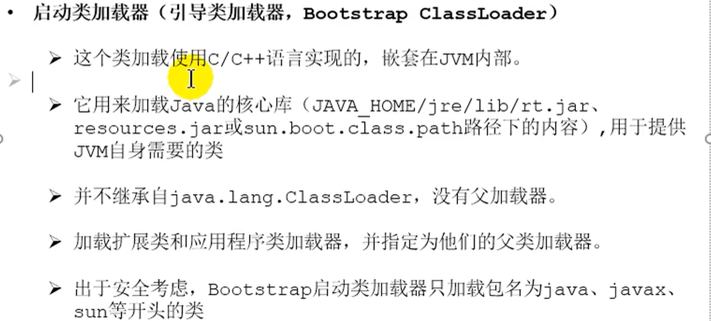

获取引导类加载器加载的路径

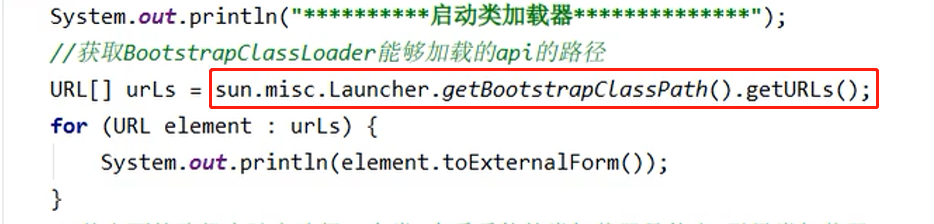


### 扩展类加载器

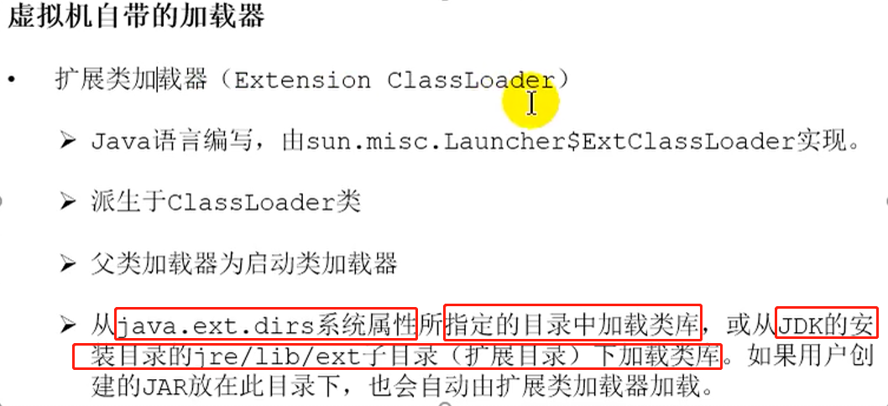

获取扩展类加载器加载的路径

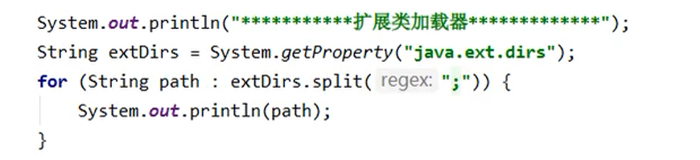

### 系统类加载器

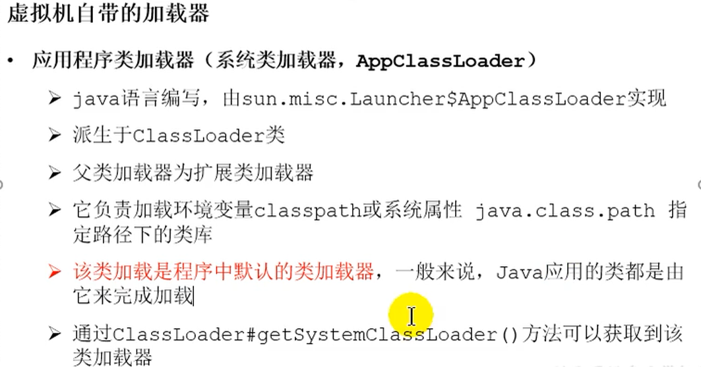


### 自定义类加载器


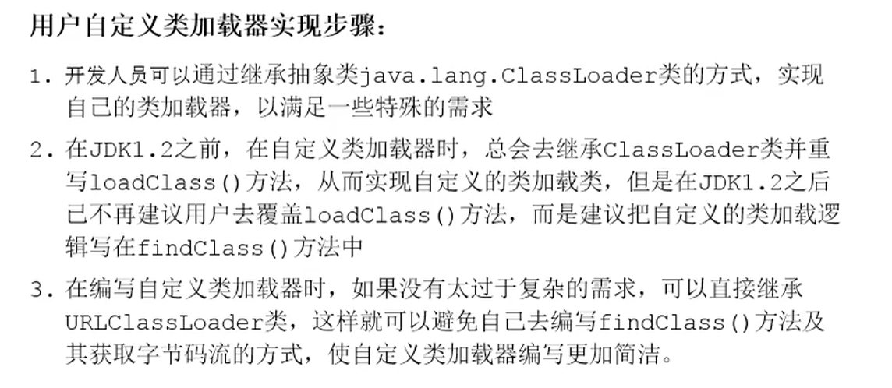


### ClassLoader抽象类

#### 常见方法

- 获取该类加载器的超类

  ```java
  public final ClassLoader getParent()
  ```

- 加载名称为name的类，返回结果为java.lang.Class类的实例

  ```java
  public Class<?> loadClass(String name) throws ClassNotFoundException;
  protected Class<?> findClass(String name) throws ClassNotFoundException
  ```

- 查找名称为name的已加载类，返回结果为java.lang.Class类的实例

  ```java
  protected final Class<?> findLoadedClass(String name)
  ```

- 把字节数组中的内容转换为一个java类，返回结果为java.lang.Class类的实例（搭配findClass方法使用）

  ```java
  protected final Class<?> defineClass(String name, byte[] b, int off, int len,
                                           ProtectionDomain protectionDomain)
          throws ClassFormatError
  ```

- 连接指定的一个java类

  ```java
  protected final void resolveClass(Class<?> c)
  ```


#### 获取ClassLoader对象的方法

1. 获取当前类的ClassLoader对象

   ```java
   //通过Class对象的getClassLoader方法
   clazz.getClassLoader()
   ```

2. 获取当前线程的上下文ClassLoader对象

   ```java
   Thread.currentThread().getContextClassLoader()
   ```

3. 获取当前系统的ClassLoader对象(系统类加载器)

   ```java
   ClassLoader.getSystemClassLoader()
   ```

4. 获取调用者的ClassLoader对象

   

   

### 双亲委派机制

JVM对class文件采用`按需加载`的方式，当需要使用某个类时才会将该类加载到内存中生成class对象。加载某个类的class文件时，JVM采用`双亲委派机制`，把请求交给父类处理，它是一种任务委派设计模式。


原理

1. 一个类加载器接收到类加载请求，它并不会自己去加载而是把这个请求委托给父类的加载器去执行
2. 如果父类加载器还存在其父类加载器，则进一步向上委托，直到引导类加载器为止
3. 如果父类加载器可以完成类加载，就成功返回，若无法完成则子加载器才会尝试去加载

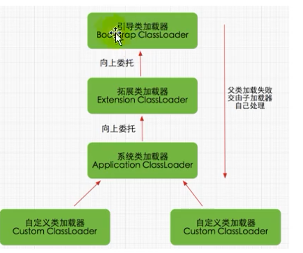


优势

- 避免重复加载
- 保护程序安全，防止核心API被篡改


### 安全沙箱机制

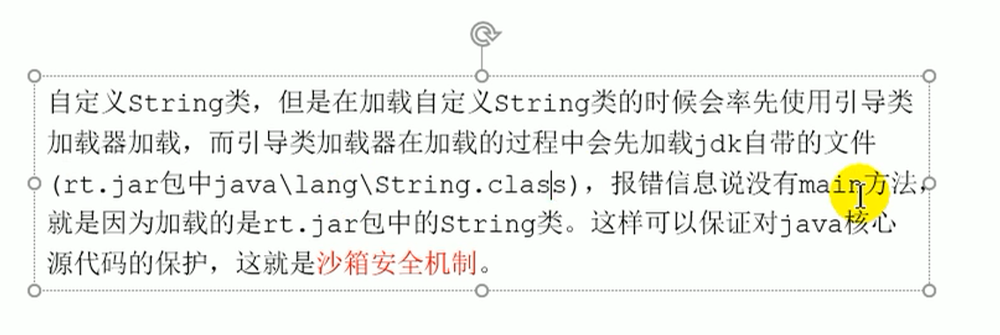


### 同类判断

在JVM中表示两个对象是否为同一个类的条件

- 对象的全类名必须一致
- 类的加载器必须一致

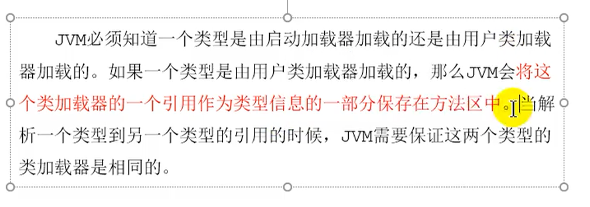


### 类的自动使用和被动使用

被动使用不会进行类加载过程中的初始化阶段

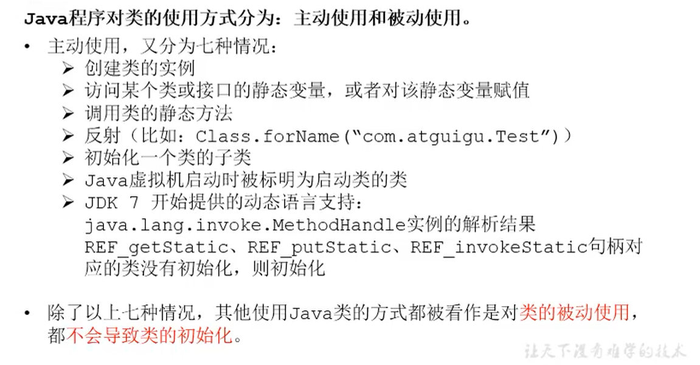