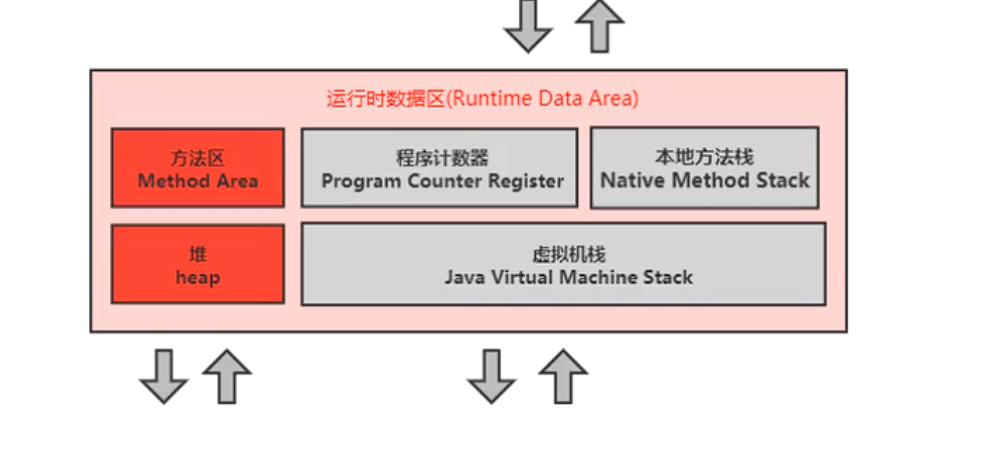
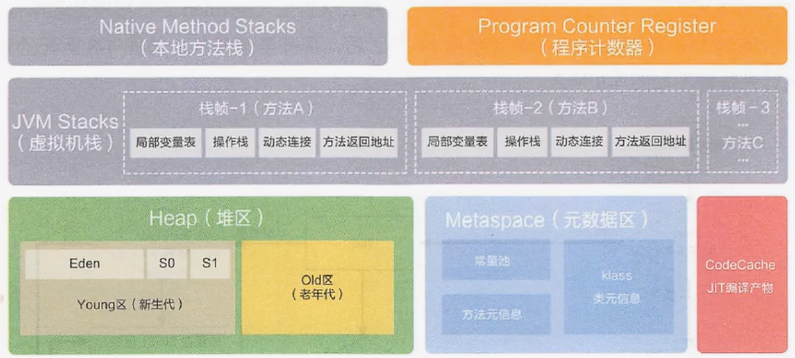
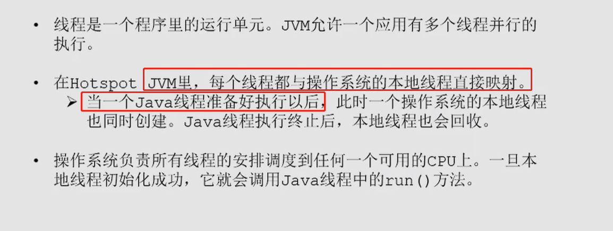
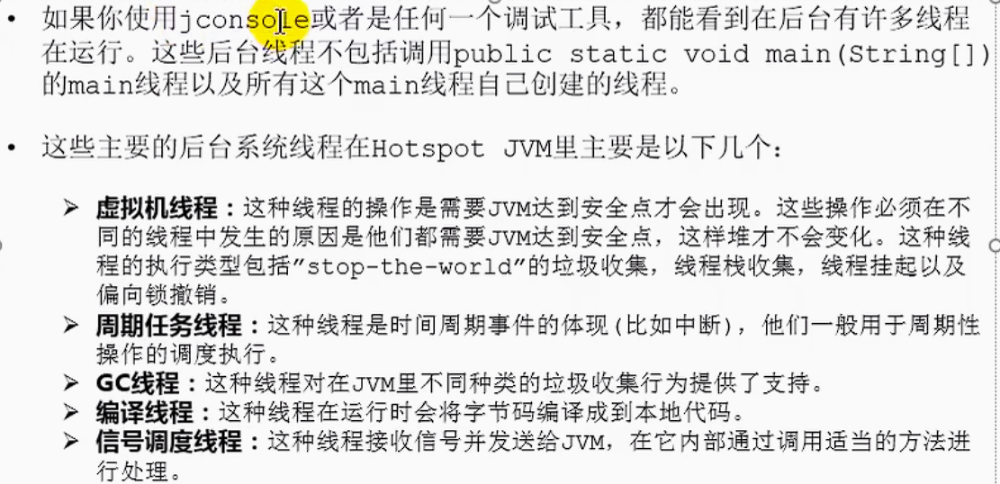

### 运行时数据区

是一块内存区域，JVM规定了java程序在运行时内存的申请、分配和管理策略，保证JVM的高效稳定运行。不同的JVM堆内存的划分和管理存在差异

### 经典的内存布局

### 不同内存区域的生命周期

JVM类生命周期：JVM启动时创建，JVM停止时销毁（堆、方法区）

线程类生命周期：线程创建时分配，线程结束时释放（程序计数器、本地方法栈、虚拟机栈）

> 堆内存时猪妖的内存使用部分，占内存的90%左右、
>
> JVM中提供了一个Runtime对象来作为运行时数据区的访问接口，可以通过该对象访问运行时数据区的一些数据，每个JVM只有一个Runtime对象

### JVM中的线程

