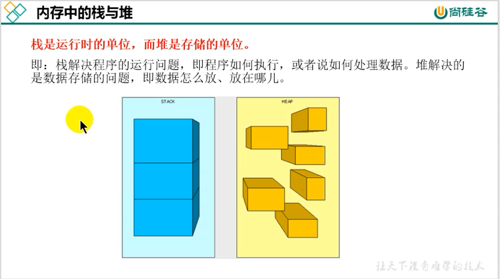
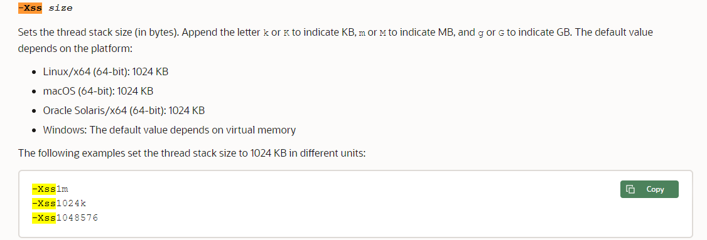

### 内存中的栈和堆

JVM中的堆并不时数据结构意义上的堆，JVM中的堆是一块被分配的内存用来存储java对象

### 虚拟机栈

早期也叫java栈，作用是作为线程的活动记录，每个线程独有。栈中的`基本单位是栈帧`。

java栈中可能出现的异常，JVM运行栈的大小可以是固定的或者动态的

- 如果采用固定大小的虚拟机栈，那每个线程的java虚拟机栈容量可以在线程创建的时候独立选定。如果线程要求的虚拟机栈容量超出JVM运行的最大容量则会抛出`stackoverflowError异常`
- 如果java栈是动态扩展的，在尝试扩展时无法获得足够的内存，或者在创建新线程时无法提供足够的内存则会抛出`OutOfMemoryError异常`

> -Xss 参数设置动态申请栈空间的最大值
>
> 

### 栈帧

与编译原理中的栈帧含义一致

### 虚拟机栈活动流程

几个名称，当前栈顶的栈帧成为当前栈帧、栈帧代表的方法叫做当前方法，方法属于的类叫做当前类，每次方法调用都会创建一共栈帧压入栈顶，方法结束或异常时会弹出栈帧销毁。

### 栈帧的结构

- 局部变量表
- 方法返回地址
- 操作数栈：也叫表达式栈
- 动态链接
- 其他信息

### 局部变量表

