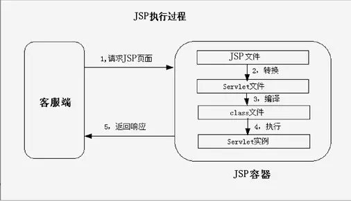
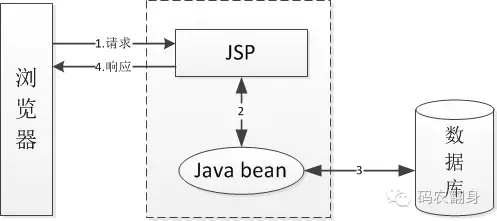
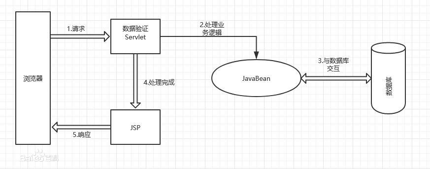
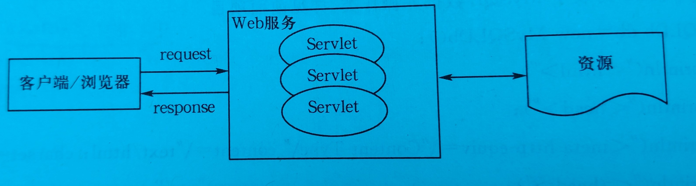
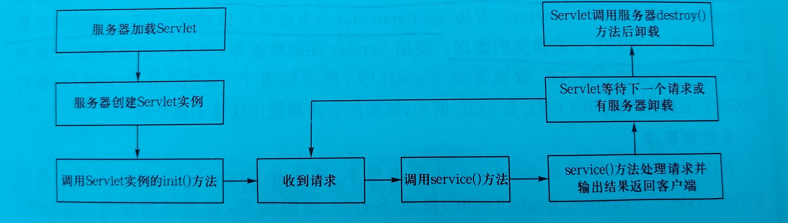

**Java Web发展历程**

> **单JSP的Java Web后台工作流程**
> 	这个时候一个JSP页面中混杂了html代码，数据库连接代码，Java代码。程序结构比较混乱，代码复用率低，模块分工不明显。
>
> 
>
> **JSP + Java Bean的后台工作流程**
> 	引入JavaBean后，代码的复用率得到了极大的提高，数据库模块得到解耦，数据库连接被单独的写成一个模块负责与数据库的交互，JSP负责处理请求和页面的展示。
>
> 
>
> **Servlet + JSP + Bean的后台工作流程**
> 	引入Servlet后将JSP负责的处理请求和展示页面的功能分开，Servlet负责处理客户端请求，JSP负责响应页面，进一步对程序进行解耦，使得后台程序分工明了，故障排除效率提高。当JSP中依然混杂着大量的Java代码和HTML代码。
>
> ​	试想起初为了实现网页的动态交互就必须要有一种，响应请求式的后台程序和可以动态展示内容的页面去实现。那么在Servlet+JSP+Bean模式下，Java程序很好的实现了对请求的响应和处理，对特定的用户产生特定的输出，而JSP页面用来承载和展示这种动态变化的输出结果。
> ​	正因为JSP的这种特点，导致了后台程序与前端展示联系的过于紧密，每当前端需要有所变动时
>
> 

**1、Servlet概述**

> **Servlet简介**
> 	Servlet是一个执行在服务器端的Java Class文件，载入入前必须先将Servlet程序代码编译成.class文件。
> 	通常说的Servlet指的是继承了javax.servlet.http.HttpServlet类的实例，所以开发一个Servlet的主要任务就是重	写javax.servlet.http.HttpServlet方法
>
> **Servlet依赖包**
> 	Servlet API使用==javax.servlet==和==javax.servlet.http==两个接口包。
>
> **Servlet代码结构**
> 	典型的Servlet代码结构
>
> ```java
> import io.IOException;
> import javax.servlet.ServletException;
> import javax.servlet.ServletConfig;
> import javax.servlet.annotation.WebServlet;
> import javax.servlet.http.HttpServlet;
> import javax.servlet.http.HttpServletRequest;
> import javax.servlet.http.httpServletReponse;
> 
> public DemoServlet extends HttpServlet{
>     // 初始化函数，接受一个ServletConfig类型的参数，可以不重写
>     public void init(ServletConfig config) throw ServletException{}
>     
>     // 销毁函数，调用该函数销毁Servlet对象释放Servlet对象占用的资源
>     public void destroy(){}
>     
>     // 主要实现函数，用于处理客户端发起的get请求
>     protected void doGet(HttpServletRequest request, HttpServletResponse response) throw ServletException, IOException{
>         pass;
>     }
>     
>     // 主要实现的函数，用于处理客户端发起的Post请求
>     protected void doPost(HttpServletRequest request, HttpServletResponse Response) throw ServletException, IOException{
>         pass;
>     }
> }
> ```
>
> **Servlet功能**
> 	Servlet主要用于处理客户端的请求并提供服务，为客户端和服务器提供了一种 “ 请求/应答 ” 模式机制

**2、Servlet工作过程及相关接口**

> **Servlet工作过程** 
> 	1、客户端发送请求到服务器
> 	2、Web服务器将请求信息发送给对应Servlet引擎，Servlet引擎在把请求发送给对应Servlet
> 	3、Servlet引擎将Servlet生成响应并返回给Web服务器，再有Web服务器放回给客户端
> 
>
> **Servlet生命周期**
> 	1、Servlet初始化，Servlet第一次被请求时加载，即服务器上的Servlet引擎将对应的.Java文件编译成.Class文件，然后创建一个Servlet对象，在调用Servlet对象的init()方法初始化对象。
> 	当Servlet对象第一次被创建后就会被保存在服务器内存中，一下次再有请求访问该对象时服务器就会直接从内存中读取，不用再次编译，响应速度会比第一次快许多。
> 	2、运行service()方法响应对应的请求，service()方法会根据请求的类型调用doGet()或者doGet()方法
> 	3、销毁Servlet，当Web应用被终止时Servlet会先调用Servlet对象的destroy()方法销毁Servlet对象，释放资源
> 	由此可见，在一个Servlet生命周期中初始化和销毁都只执行一次，service()方法执行此处根据客户端请求而定
>
> **Servlet接口**
> 	Servlet API为客户端和服务器之间的请求和应答定义了标准接口
> 	1、Servlet接口（javax.servlet包）
>
> > 常用方法的7个方法
> > init()：初始化Serlet参数，可以缺省，如要重写时需注意在函数内应调用显示的调用父类初始化super.init()方法，确保能成功执行init()方法。
> >
> > destory：销毁Servlet对象，释放服务器资源
> >
> > service()：是Servlet的核心方法，每当要给HttpServlet对象被请求时，都会调用该对象的service方法并传入HttpServletRequest和HttpServletResponse类型的请求和响应对象作为参数。它会根据HTTP请求的类型去调用doGet()、doPost()等方法并将参数传递。
> >
> > doGet()：用来处理get请求。
> >
> > doPost()：用来处理Post请求。
> >
> > getServletConfig()：返回一个ServletConfig对象，该对象用于返回初始化参数和ServletContext，ServletContext接口提供有关Servlet的环境信息。
> >
> > getServletInfo()：提供Servlet相关信息，如作者、版本、版权等。
>
> ​	2、ServletRequest接口（javax.servlet包）
>
> > 该接口封装了客户端请求细节，它与协议无关，并有一个HTTP的子接口**（HttpServletRequest）**
> > 该接口的实例化对象就是JSP中的**内置对象request**，接口相关方法都在request中被实现了
> >
> > 该接口主要处理：
> > 1、找到客户端主机名和IP地址
> > 2、索引请求参数
> > 3、获取和设置请求的属性
> > 4、获取输入和输出流
>
> ​	3、HttpServletRequest接口（javax.servlet.http包）
>
> > 该接口时ServletRequest接口的子接口，接口相关方法都在request中被实现了
> >
> > 该接口主要处理：
> > 1、读取和写入HTTP头标
> > 2、获取和设置cookie
> > 3、URL中的获取路径信息
> > 4、标识HTTP会话
>
> ​	4、ServletResponse接口（javax.servlet包）
>
> > ServletResponse由Servlet引擎生成，有一个Http子接口**（HttpServletResponse）**，接口的主要功能在**内置对象response**中实现了
> >
> > 主要作用：该对象用于返回客户端请求的结果。作为输出流及内容类型和长度的包容器
>
> ​	5、HttpServletResponse接口（javax.servlet.http包）
>
> > 该接口时ServletResponse对象的子接口
> >
> > 主要功能：加入表示状态码、状态信息和响应头标的方法，**负责对URL中写入一个Web页面的Http会话ID**。
>
> ​	6、ServletContext接口（javax.servlet包）
>
> > 是一个Servlet引擎用来服务Web用于的Servlet上下文。一个Web应用只有一个上下文。该接口的方法都由**内置对象application**实现了
> >
> > 主要功能：
> > 1、在调用期间保存和检索属性功能，**并与其他Servlet共享这些属性**
> > 2、读取Web应用中文件内容和其他静态资源
> > 3、互相发送请求的方式
> > 4、记录错误和信息化消息的功能
>
> ​	7、HttpSession接口（javax.servlet.http包）
>
> > 会话接口，功能由**内置对象session**实现
> >
> > 主要功能：用于保存同一用户在某个时间段内的所有信息

**3、Servlet使用**

> 1、创建Servlet
>
> > 在项目文件中创建Servlet文件，==详细见P150==
>
> 2、配置Servlet
>
> > Servlet在创建之后需要结果配置才能被使用。
> >
> > 配置方法：
> > 	注解配置：写在Servlet类前
> >
> > ```java
> > @WebServlet(
> > description = '第一个Servlet程序',
> > urlPatterns = '/HelloServlet'
> > )
> > ```
> >
> > web.xml配置
> >
> > ```xml
> > <servlet>
> >     <description>第一个Servlet程序</description>
> >     <display-name>HelloServlet</display-name>
> >     <servlet-name>HelloServlet</servlet-name>
> >     <servlet-class>HelloServlet</Servlet-class>
> > </servlet>
> > <servlet-mapping>
> >     <servlet-name>HelloServlet</servlet-name>
> >     <url-pattern>HelloServlet</url-pattern>
> > </servlet-mapping>
> > ```
> >
> > 
>
> 3、访问Servlet
>
> > 在浏览器中输入：http://localhost:8080/JavaWebExample/HelloServlet，就可以访问HelloServlet。
>
> 代码实现 
>
> ```java
> import java.io.IOException;
> import javax.io.PrintWriter;
> import javax.servlet.ServletException;
> import javax.serlvet.annotation.WebServlet;
> import javax.servlet.http.HttpServlet;
> import javax.servlet.http.HttpServletRequest;
> import javax.servlet.http.HttpServletResponse;
> 
> // 配置在Servlet引擎中配置该Servlet实例应用的位置
> @WebServlet(
> 	"/HelloServlet",
> )
> 
> 
> public class HelloServlet extends HttpServlet{
>     // 创建构造函数，并调用父类构造函数
>     public HelloServlet(){
>         super();
>     }
>     
>     // 重写doGet方法
>     protected void doGet(HttpServletRequest request, HttpServletResponse response) throw ServletException, IOException{
>         resopnse.setContextType('text/html;charset=UTF-8');
>         PrintWriter out = response.getWriter();
>         out.println('<html>');
>         out.println('<head>');
>         ......
>         our.close;
>     }
> }
> ```
>
> 


**4、Servlet会话存储**

> **原理：**为每一个用户分配一个唯一标识，当用户发起请求时携带上这个唯一标识，这个唯一表示将和服务器中的一个Session对象关联，用来保存用户一段时间内的全部请求信息。
>
> **实现过程：**
> 	1、用户第一次发起请求，服务器会调用HttpServletRequest对象中的getSession()方法去获取这个请求中的会话ID。若返回值为空则服务器会创建一个新的会话并为这个会话分配一个ID。被创建的sessin会话会在有效期内一直保存在服务器内存中。
> 	2、服务器响应请求，并携带这个ID发送给浏览器。浏览器收到后将保存这个ID
> 	3、之后浏览器每次发送的请求都将在请求中携带这个ID。服务器会根据这个ID将请求与内存中的会话绑定，之后处理这个请求的所有Servlet都可以共享这个会话中的资源。
>
> ps：会话是由Servlet引擎维护和管理的，每个Servlet只有在工作时才会调用内存中的会话。
>
> 标准的会话属性都是由“ Key-Value ”组成，可以通过SetAttribute()，getAttribute()方法去设置和获取属性值

**5、Servlet重定向**

> 重定向技术的分类
> 	1、服务器端重定向
> 	RequestDispatcher.forward()，是Servlet引擎传递Http请求从当前的Servlet或JSP到另一个Servlet、JSP或HTML文件，即一个form提交值a.jsp，在a.jsp中使用了forward()重定向至b.jsp，那么form提交至a.jsp的参数会传递給b.jsp。
> 	2、客户端重定向
> 	response.sendreDirect(url)
> 	注意：response.sendreDirect(url)前面不能有HTML输出，后面一个紧跟一句return。

QA

Q：Servlet重定向和response.sendreDirect(url)重定向有什么区别
A：1、前者不会改变浏览器URL，后者会
		2、前者重定向是共享request中的资源，后者不共享并重写发出新的request请求