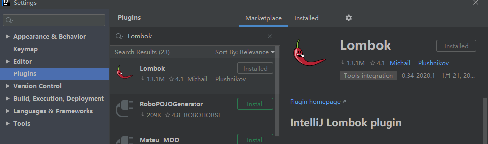
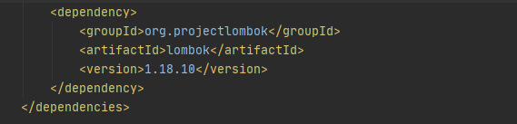
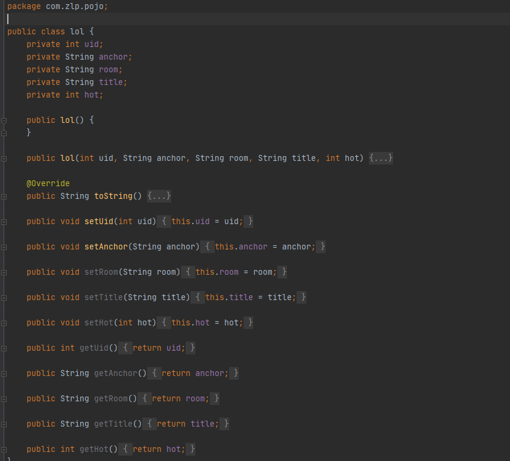
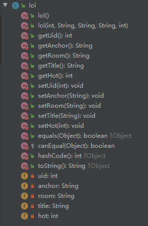
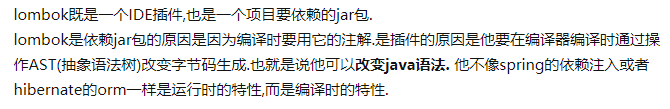

### Lombok

#### 介绍

> Lombok是一个Java工具，可以帮助简便开发，可以快速简单的构建POJO，hashCode() 和 equals() 这样的方法以及以往用来分类各种 accessor 和 mutator 的大量时间。

#### 安装

> 1. DIEA安装插件
>    
> 2. 引入jar包
>    

#### 使用

> 原Pojo
>
> 
>
> 使用Lombok，自动生成get、set、无参、有参构造方法
>
> ```java
> package com.zlp.pojo;
> 
> import lombok.AllArgsConstructor;
> import lombok.Data;
> import lombok.NoArgsConstructor;
> 
> @Data
> @NoArgsConstructor
> @AllArgsConstructor
> public class lol {
>     private int uid;
>     private String anchor;
>     private String room;
>     private String title;
>     private int hot;
> 
> }
> ```
>
> 

#### 本质

> 

#### 优缺点

> 优点：减少java代码量，提高开发效率
>
> 缺点：源码可读性差，编译时依赖Lombok移植性差。改变了java语法，变相暗示java可以被更加方便的语言替代

