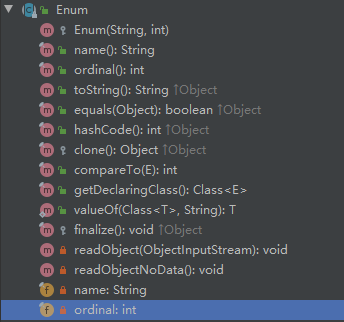

### 介绍

枚举根据其定义，可知其对象的数量一定是有限且确定的

枚举特性在很多语言中都存在，在java中使用枚举可以简化常量的表达，枚举的定义使用**enum**关键字，它可以打包一些杂散的常量

枚举类中的`常量可以是基本数据类型、也可以是对象类型`


### 定义枚举类

- 在jdk5.0之前自定义枚举类
- 在jdk5.0开始使用enum关键字定义枚举类


#### 自定义枚举类

```java
public class EnumDemo {
    public static void main(String[] args) {
        System.out.println(ErrorCode.ACCOUNT_PWD_NOT_EXIST);
        System.out.println(ErrorCode.ACCOUNT_PWD_NOT_EXIST.getCode());
        System.out.println(ErrorCode.ACCOUNT_PWD_NOT_EXIST.getMsg());
    }
}

/**
 * 区别
 * 1. 所有常量定义提前，放在开头
 * 2. 常量之间使用逗号分隔，最后一个常量使用分号
 * 3. 去掉自定义方式中所有重复的报复
 * 4. 默认重写toString方法，返回常量名
 * 5. 枚举类默认继承java.lang.Enum类
 */
class ErrorCode{
    private final int code;
    private final String msg;

    private ErrorCode(int code, String msg) {
        this.code = code;
        this.msg = msg;
    }

    public static final ErrorCode PARAMS_ERROR = new ErrorCode(1000,"参数有误");
    public static final ErrorCode ACCOUNT_PWD_NOT_EXIST = new ErrorCode(1001,"用户名或密码不存在");
    public static final ErrorCode TOKEN_ERROR = new ErrorCode(1002,"token不合法");
    public static final ErrorCode NO_LOGIN = new ErrorCode(1003,"未登录");

    public int getCode() {
        return code;
    }

    public String getMsg() {
        return msg;
    }

}

```

```
ACCOUNT_PWD_NOT_EXIST
1001
用户名或密码不存在
```

#### enum方式

```java
public class EnumDemo2 {
    public static void main(String[] args) {
        System.out.println(ErrorCode1.ACCOUNT_PWD_NOT_EXIST);
        System.out.println(ErrorCode1.ACCOUNT_PWD_NOT_EXIST.getCode());
        System.out.println(ErrorCode1.ACCOUNT_PWD_NOT_EXIST.getMsg());
    }
}


enum ErrorCode1{

    PARAMS_ERROR(1000,"参数有误"),
    ACCOUNT_PWD_NOT_EXIST(1001,"用户名或密码不存在"),
    TOKEN_ERROR(1002,"token不合法"),
    NO_LOGIN(1003,"未登录");

    private final int code;
    private final String msg;

    private ErrorCode1(int code, String msg) {
        this.code = code;
        this.msg = msg;
    }


    public int getCode() {
        return code;
    }

    public String getMsg() {
        return msg;
    }

    @Override
    public String toString() {
        return "ErrorCode{" +
                "code=" + code +
                ", msg='" + msg + '\'' +
                '}';
    }
}

```

```
ErrorCode{code=1001, msg='用户名或密码不存在'}
1001
用户名或密码不存在
```

### 默认提供的方法

（就是父类Enum提供的方法）



toString()：展示常量名称

ordinal()：显示常量的声明顺序

values()：获取所有常量，保存在一个集合中

valueOf(String objName)：通过常量名获取常量对象

```java
public class EnumDemo2 {
    public static void main(String[] args) {
        ErrorCode1 errorCode = ErrorCode1.ACCOUNT_PWD_NOT_EXIST;
        System.out.println(errorCode);
        System.out.println(errorCode.ordinal());
        System.out.println(errorCode.valueOf("PARAMS_ERROR"));
        System.out.println("================");
        ErrorCode1[] values = errorCode.values();
        for (ErrorCode1 value : values) {
            System.out.println(value);
        }
    }
}
```

```
ACCOUNT_PWD_NOT_EXIST
1
PARAMS_ERROR
================
PARAMS_ERROR
ACCOUNT_PWD_NOT_EXIST
TOKEN_ERROR
NO_LOGIN
```


### 枚举类可以继承接口

接口方法的实现位置

- 枚举类中：所有常量共用方法
- 每个常量对象中：每个常量独有方法


在类中实现

```java
public class EnumDemo2 {
    public static void main(String[] args) {
        ErrorCode1 errorCode = ErrorCode1.ACCOUNT_PWD_NOT_EXIST;
        ErrorCode1 errorCode1 = ErrorCode1.PARAMS_ERROR;
        errorCode.show();
        errorCode1.show();

    }
}

interface info{
    void show();
}

enum ErrorCode1 implements info{

    PARAMS_ERROR(1000,"参数有误"),
    ACCOUNT_PWD_NOT_EXIST(1001,"用户名或密码不存在"),
    TOKEN_ERROR(1002,"token不合法"),
    NO_LOGIN(1003,"未登录");

    private final int code;
    private final String msg;

    private ErrorCode1(int code, String msg) {
        this.code = code;
        this.msg = msg;
    }


    public int getCode() {
        return code;
    }

    public String getMsg() {
        return msg;
    }


    @Override
    public void show() {
        System.out.println("ErrorCode1");
    }
}

```

```
ErrorCode1
ErrorCode1
```

在常量对象中实现

```java
public class EnumDemo2 {
    public static void main(String[] args) {
        ErrorCode1 errorCode = ErrorCode1.ACCOUNT_PWD_NOT_EXIST;
        ErrorCode1 errorCode1 = ErrorCode1.PARAMS_ERROR;
        errorCode.show();
        errorCode1.show();

    }
}

interface info{
    void show();
}

enum ErrorCode1 implements info{

    PARAMS_ERROR(1000,"参数有误"){
        @Override
        public void show() {
            System.out.println("PARAMS_ERROR");
        }
    },
    ACCOUNT_PWD_NOT_EXIST(1001,"用户名或密码不存在"){
        @Override
        public void show() {
            System.out.println("ACCOUNT_PWD_NOT_EXIST");
        }
    },
    TOKEN_ERROR(1002,"token不合法"){
        @Override
        public void show() {
            System.out.println("TOKEN_ERROR");
        }
    },
    NO_LOGIN(1003,"未登录"){
        @Override
        public void show() {
            System.out.println("NO_LOGIN");
        }
    };

    private final int code;
    private final String msg;

    private ErrorCode1(int code, String msg) {
        this.code = code;
        this.msg = msg;
    }


    public int getCode() {
        return code;
    }

    public String getMsg() {
        return msg;
    }
}
```


