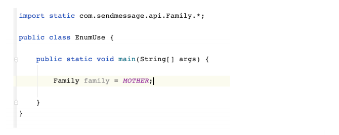

> 枚举：枚举特性在很多语言中都存在，在java中使用枚举可以简化常量的表达，枚举的定义使用**enum**关键字，它可以打包一些杂散的常量

> 枚举类型:枚举类型中都是常量，并且定义是不需要说明内容，可以直接写常量的内容
>
> 
>
> 使用枚举
>
> 
>
> 使用静态导入可以直接使用常量，不用枚举类名.关键字的形式
>
> 

> 枚举类型的方法
>
> toString()：由编译器添加，可以显示enum实例的名字
>
> ordinal()：显示常量的声明顺序
>
> values()：获取所有常量，保存在一个集合中

> 带描述的枚举类：常量后面的括号中是对常量的描述
>
> 

> enum关键字继承Enum类