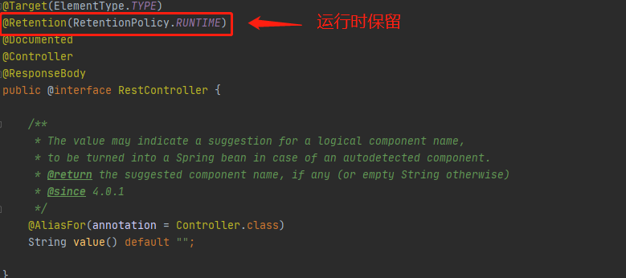
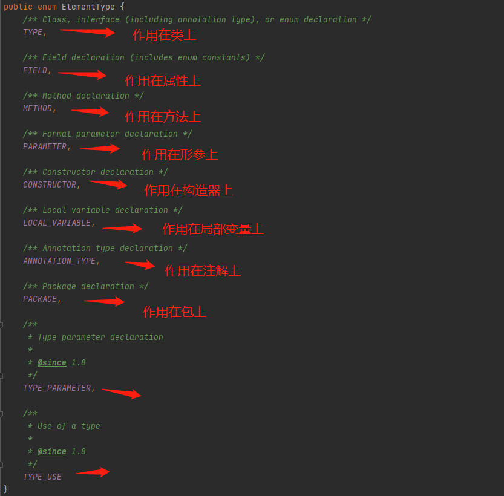

### 概述

Java注解（Annotation）又称为元数据，它为我们在代码中添加消息提供了一种形式化方法，在JDK1.5中被引入。

注解是一种代码里的特殊标记，这些标记可以在编译、类加载、运行时被读取，并执行相应的处理。

程序员可以在不修改源代码逻辑的情况下在源代码文件中添加补充信息，代码分析工具、开发工具、部署工具可以工具这些注解进行验证或者部署

注解可以修饰包、类、构造器、方法、成员变量、参数、局部变量的声明


### 常见的注解


### 三个内置注解

- Override：标识重写方法，可以用于编译时提示被标识的方法是否在父类中存在
- Deprecated：标识过时方法，可能存在问题
- SuppressWarning：抑制编译器警告


### 自定义注解

自定义注解注意点

- 使用`@interface关键字`定义，自定义注解自动继承了`java.lang.annotation.Annotation`接口

- 注解类型的`成员变量在定义时使用无参方法的形式来声明`，方法名表示成员名称，返回类型表示成员类型。

- 注解类的成员类型只能是基本数据类型，String、Class、enum、Annotation这几大类

- 可以使用`default关键字`在为成员设置初始值
- 只有一个成员的注解，建议使用value作为成员名
- 使用注解时必须对注解中的成员进行赋值，除非存在默认值
- 没有成员定义的注解叫做标记，包含成员变量的注解叫做元数据
- 自定义注解必须配上注解的信息处理流程才有意义（配合反射使用，通过反射读取注解值，注解标注的对象，进行一系列逻辑判断，做出对应动作）

```java
@interface MyAnnotation{
    String value() default "";
}
```


### JDK中的元注解

元注解是用来修饰其他注解，用来解释说明其他注解，jdk5提供了4种元注解

> 元数据：是一种对现有数据进行修饰的一种数据，可以和元注解类比进行理解
>
> 例：String name = "zlp"
>
> 其中类型String和变量名name就可以看作是元数据，用来修饰值

- `@Retention`：用来修饰一个注解的定义，用于指定该注解的生命周期，@Retention包含一个RetentionPolicy类型的成员变量，该类型是一个枚举类，其中有如下几个值，分别有不同的含义

  
  示例：@RestController

  

  

- `@Target`：用来修饰一个注解的定义，指定被修饰的注解可以作用的位置，@Target有一个ElementType数组类型的成员，ElementType也是一个枚举对象，可以指定注解作用在类上、方法上、属性上、构造器上等。
  
  示例：@RequestMapping
  

- `@Documented`：用来修饰一个注解的定义，表示被修饰的注解在javadoc解析时会被保留下来

- `@Inherited`：用来修饰一个注解的定义，表示被修饰的注解具有继承性。如注解标注在一个类上，该类的子类都会自动继承该注解。
  示例：@Transactional，Spring事务注解

  


### 利用反射获取注解

```java
public class AnnotationDemo {
    public static void main(String[] args) {
        Class clazz = Person.class;
        System.out.println(clazz);
        Annotation[] annotations = clazz.getAnnotations();
        for (Annotation annotation : annotations) {
            System.out.println(annotation);
        }
    }
}

@MyAnnotation("zlp")
class Person{
}


@Target(ElementType.TYPE)
@Retention(RetentionPolicy.RUNTIME)
@interface MyAnnotation{
    String value() default "";
}
```

> 注意点：注解一定要使用@Retention(RetentionPolicy.RUNTIME)表示否则默认只保留在class文件中


### JDK8中注解的新特性

- 可重复注解，一个注解可以重复作用在同一个位置
  jdk1.8之前的做法

  ```java
  // 原理是使用一个数组包含相同类型的注解
  @MyAnnotations({@MyAnnotation("zlp"), @MyAnnotation("zlp123")})
  class Person{
  }
  
  
  @Target(ElementType.TYPE)
  @Retention(RetentionPolicy.RUNTIME)
  @interface MyAnnotation{
      String value() default "";
  }
  
  @Target(ElementType.TYPE)
  @Retention(RetentionPolicy.RUNTIME)
  @interface MyAnnotations{
      MyAnnotation[] value();
  }
  ```

  jdk1.8的做法

  ```java
  // 原理同样是使用数组包含相同类型的注解，只不过对外不需要使用数组体现
  // 这是由于使用了@Repeatable注解的效果
  @MyAnnotation("zlp")
  @MyAnnotation("zlp123")
  class Person{
  }
  
  
  // @Repeatable注解将当前注解绑定到一个成员为当前注解类型数组形式的注解中
  // 要求MyAnnotations的@Target、@Retention作用范围和MyAnnotation一致
  @Repeatable(MyAnnotations.class)
  @Target(ElementType.TYPE)
  @Retention(RetentionPolicy.RUNTIME)
  @interface MyAnnotation{
      String value() default "";
  }
  
  @Target(ElementType.TYPE)
  @Retention(RetentionPolicy.RUNTIME)
  @interface MyAnnotations{
      MyAnnotation[] value();
  }
  ```

- @Target新增作用范围
  
  示例
  