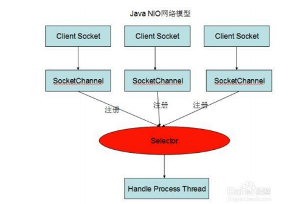

> 
>
> 

> 
>
> 
>
> 

> ## NIO的三大要素
>
> #### Channel
>
> ​	通道：与Stream类是，区别是Channel是双向的可以读写，Stream是单向的区分InputStream、OutStream，主要实现有
>
> 1. FileChannel：文件通道
> 2. DatagramChannel：UDP数据包
> 3. SocketChannel：客户端TCP数据报
> 4. ServerSocketChannel：服务器TCP数据报
>
> #### Buffer
>
> ​		缓冲区：是一个容器，一个数组，用来保存要读或写的数据
>
> 
>
> #### Selector
>
> ​		选择器：这时NIO的核心组件，它会轮询Channel每收到一个请求就进行处理，一个处理对应多个请求是典型的多路复用模式

> ## IO模型的发展
>
> 1. 阻塞IO：调用read()或write()后线程等待数据读取或写入
> 2. 非阻塞IO：调用read()或write()后若数据没有准备好就返回一个错误，不在一直等待
> 3. 多路复用IO：多个IO复用一个控制，充分利用“并不是所有IO都是长时间同时工作的特点”，利用各个IO的空档期为需要处理的IO进行服务。使得整体上看起来向一对一服务。
> 4. 异步IO：操作分离，互不影响
>
> 从本质上看IO的发展离不开OS的支持，非阻塞型IO需要OS支持通知操作，IO操作一直都是OS内核的任务