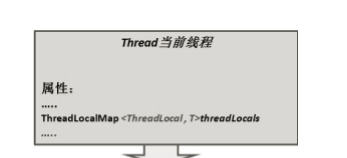

> ## ThreadLocal
>
> ​	ThreadLocal类的作用时创建一个线程本地变量，这个变量在线程的生命周期内起作用，该变量可以省去函数间参数传递的繁琐，相当于一个线程中的全局变量
>
> 主要方法有
>
> set()：设置一个线程本地变量
>
> get()：获取一个线程本地变量
>
> remove()：移除一个线程本地变量
>
> ```java
> // ThreadLocal可以将需要经常使用的外部变量保存起来共这个线程使用
> 
> class my extends Thread{
>     ThreadLocal<t> tt = new ThreadLocal<t>();
>     public void run() {
> 
>     }
>     void read(){
>         tt.get();
>     }
>     void write(){
>         tt.set(object);
>     }
>     void del(){
>         tt.remove();
>     }
> }
> ```
>
> 线程内部有一个属性ThreadLocalMap，一个哈希表，它将每个ThreadLocal变量名作为key，ThreadLocal变量之作为value，实现统一管理线程本地变量
>
> 