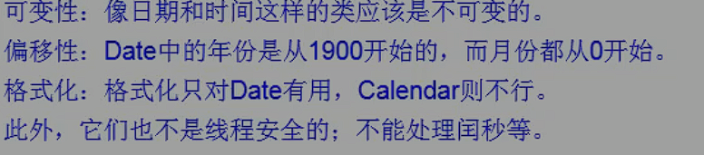

### String

在JDK1.0中就出现了

#### 定义

```java
public final class String
    implements java.io.Serializable, Comparable<String>, CharSequence
```

#### 特点

1. 被final修饰，不可被继承
2. 继承Serializable接口，可以序列化
3. 继承Comparable接口，可以比较大小
4. 内部使用private final char value[]存储字符串，代表`String对象的不可变性`
5. String对象存储在方法区不是经常用于存放对象的堆区，相同字符串不会创建多个对象，只提供引用

#### String对象的不可变示例

相同对象不重复创建

```java
public class StringDemo1 {
    public static void main(String[] args) {
        String s1 = "zlp";
        String s2 = "zlp";
        System.out.println(s1==s2);
    }
}
```

```
true
```

不同对象不会覆盖，只会更改引用，并创建信对象

```java
public class StringDemo1 {
    public static void main(String[] args) {
        String s1 = "zlp";
        String s2 = "zlp";
        s2 = "zlp123";
        System.out.println(s1);
        System.out.println(s2);
    }
}
```

```
zlp
zlp123
```

字符串对象不可修改性

```java
public class StringDemo1 {
    public static void main(String[] args) {
        String s1 = "zlp";
        String s2 = "zlp";
        s2 += "123";
        System.out.println(s1);
        System.out.println(s2);
        System.out.println("=============================");

        // 字符串对象的方法若对字符串进行了修改也是创建一个新的字符串对象
        // 不会改变原有的字符串对象
        s2 = s2.split("l")[0];
        System.out.println(s1);
        System.out.println(s2);
    }
}
```

```
zlp
zlp123
=============================
zlp
z
```

#### 不同实例化方式的对比

```
String s1 = "zlp";
String s2 = new String("zlp");
两种创建String示例的方式有什么区别
```

```java
public class StringDemo1 {
    public static void main(String[] args) {
        String s1 = "zlp";
        String s2 = new String("zlp");
        String s3 = new String("zlp");
        System.out.println(s1==s2);
        System.out.println(s1==s3);
        System.out.println(s2==s3);
    }
}
```

```
false
false
false
```

> String s1 = "zlp";字面量方式创建，`s1直接保存常量池中的引用地址`
>
> String s2 = new String("zlp");使用创建对象的方式构造，对在堆中创建一个String 对象
>
> 再对String对象的`value进行赋值，保存常量池中的字符串实例的地址`
>
> new String("zlp")方式相当于试图创建两个对象，一个String对象放置在堆中，一个char[]对象放置在常量池中


#### 不同拼接操作的区别

```java
public class StringDemo1 {
    public static void main(String[] args) {
        String s1 = "zlp";
        String s2 = "123";
        String s3 = "zlp123";
        String s4 = "zlp" +"123";
        String s5 = s1 +"123";
        String s6 = "zlp" + s2;
        String s7 = s1 + s2;
        System.out.println(s3==s4);// true
        System.out.println(s3==s5);// false
        System.out.println(s3==s6);// false
        System.out.println(s3==s7);// false
        System.out.println(s4==s5);// false
        System.out.println(s6==s7);// false
    }
}
```

```
true
false
false
false
false
false
```

> 字符串拼接时，若只有字面量拼接，则相当于使用新字面量进行创建对象，直接保存常量池中的地址
>
> 若存在String对象进行拼接，则相当于使用new String创建对象，保存堆中的地址
>
> 所有每个存在String对象进行拼接的结果都是一个堆中的新对象

#### intern()方法

```java
public class StringDemo1 {
    public static void main(String[] args) {
        String s1 = "zlp";
        String s2 = "123";
        String s3 = "zlp123";
        String s4 = "zlp" +"123";
        String s5 = s1 +"123";
        String s6 = "zlp" + s2;
        String s7 = s1 + s2;
        String s8 = s7.intern();
        System.out.println(s3==s4);
        System.out.println(s3==s5);
        System.out.println(s3==s6);
        System.out.println(s3==s7);
        System.out.println(s4==s5);
        System.out.println(s6==s7);
        System.out.println(s7==s8);
        System.out.println(s3==s8);// true
    }
}
```

```
true
false
false
false
false
false
false
true
```

> intern方法返回String对象中保存的常量池对象的地址

#### 易错示例

```java
public class StringDemo1 {
    String name = new String("zlp");
    char[] ch = {'z','l','p'};

    public void change(String name,char[] ch){
        name = "zlp123";
        ch[0] = 'b';
    }
    public static void main(String[] args) {
        StringDemo1 t = new StringDemo1();
        t.change(t.name,t.ch);
        System.out.println(t.name);
        System.out.println(t.ch);
    }
}
```

```
zlp
blp
```

> 该示例实际考察值传递和引用传递
>
> change方法的两个形参都接受地址引用
>
> name形参没有通过地址去修改内存中保存的值（也无法修改），而是保存了一个新对象的地址，所以对象中的name属性指向不发生改变
>
> ch形参通过地址修改了数组中的值，对象中的ch属性指向的内存单元中的值发生了改变

#### 内存结构

JDK1.6将字符串常量池放置在方法区（也是永久代）中


JDK1.7放置在堆中


JDK1.8，放置在方法区中，并且方法区，叫做元空间


#### String类型转换

与数值型的转换

```java
public class StringDemo1 {

    public static void main(String[] args) {
        
        // 调用包装类转换成对应的基本数据类型
        // 调用包装类转换成String类型
        // 直接使用连接符转换成字符串
        String s1 = "123";
        int i = Integer.parseInt(s1);
        long l = Long.parseLong(s1);
        String s = String.valueOf(i);
        s = 123 + "";
    }
}

```

与字符数组的转换

```java

public class StringDemo1 {

    public static void main(String[] args) {
        String s1 = "123";
        // String——>char[]
        char[] chars = s1.toCharArray();
        for (char aChar : chars) {
            System.out.println(aChar);
        }
        // char[]——>String
        String string = new String(chars);
        System.out.println(string);
    }
}
```

```
1
2
3
123
```

与字节数组的转换

相当于编码和解码过程

```java
import java.io.UnsupportedEncodingException;
import java.util.Arrays;

public class StringDemo1 {

    public static void main(String[] args) throws UnsupportedEncodingException {
        String s1 = "123张";
        // String——>byte[]
        // 使用默认字符集进行编码，这里为UTF-8
        byte[] bytes = s1.getBytes();
        System.out.println(Arrays.toString(bytes));
        
        // 指定字符集进行编码
        byte[] gbks = s1.getBytes("gbk");
        System.out.println(Arrays.toString(gbks));
        
        // 使用默认字符集进行解码
        String s = new String(bytes);
        System.out.println(s);
        
        // 指定字符集进行解码
        String gbk = new String(gbks, "gbk");
        System.out.println(gbk);
    }
}
```

```
[49, 50, 51, -27, -68, -96]
[49, 50, 51, -43, -59]
123张
123张
```

> UTF-8使用3个字节表示中文，gkb使用2字节

### StringBuffer、StringBuilder

#### 三种字符串类型的区别

- String：定义在JDK1.0，不可变字符串序列
- StringBuffer：定义在JDK1.0，可变字符串序列，线程安全，效率较低
- StringBuilder：定义在JDK1.5，可变字符串序列，非线程安全，效率较高

相同点

- 三种字符串类型底层都使用char[]数组存储，区别是String的char[]数组有final修饰
- StringBuffer、StringBuilder都有一个抽象父类AbstractStringBuilder


#### 构造方法

StringBuffer、StringBuilder两种的构造方法，都是在创建char[]数组时预留16个字符的长度，便于后续增加或删除


StringBuffer、StringBuilder的构造方法

```java
    public StringBuilder() {
        super(16);
    }

    public StringBuilder(String str) {
        super(str.length() + 16);
        append(str);
    }

    public StringBuilder(CharSequence seq) {
        this(seq.length() + 16);
        append(seq);
    }
```

AbstractStringBuilder的构造方法

```java
    AbstractStringBuilder(int capacity) {
        value = new char[capacity];
    }
```

> length()方法返回的是已有字符个数，不是整个字符数组的个数


#### 扩容问题

当前数组容量不足时，创建一个新的char[]数组，将原char[]中的内容复制到新数组中

新数组的长度，若原数组长度*2+2能满足则使用这个新长度，若不能满足则使用要添加的字符串长度+原长度


源码流程

1. 执行添加操作
   
2. 判断容量
   
3. 指定新char[]长度
   
4. 创建新数组（Arrays中的方法）
   

#### 常用方法

```java
public StringBuilder append(xxx);
public StringBuilder insert(xxx);
public StringBuilder delete(xxx);
public StringBuilder replace(int start, int end, String str);
public StringBuilder reverse();
// 上面返回值都是当前对象

public int indexOf(xxx);
public int lastIndexOf(String str);
public String toString();

```


#### 注意点

使用StringBuffer、StringBuilder时要尽量避免扩容操作，数组复制开销较大，可以使用整型参数的构造方法预先指定char[]数组大小


### 时间API


#### 获取当前时间戳

```java
// 当前时间距离1970年1月1日0时0分0秒之间以毫秒为单位的时间差，称为时间戳
System.currentTimeMillis()
```

#### Date


 java.util包下的Date类是java.sql包下Date类的父类， `下面介绍java.util下的Date类`


##### 构造器

```java
    
	// 无参数构造器调用System的currentTimeMillis方法，传入一个时间戳给有参构造器
	public Date() {
        this(System.currentTimeMillis());
    }

    public Date(long date) {
        fastTime = date;
    }
```


##### 常用方法

```java
    public static void main(String[] args) {
        Date date = new Date(System.currentTimeMillis());
        System.out.println(date);
        System.out.println(date.getTime());
    }

// Date对象实现了toString方法，可以将时间戳转换为年月日，时分秒格式
// getTime方法获取Date对象的时间戳
```

```
Sat Nov 06 10:29:31 CST 2021
1636165771660
```

> java.sql包下Date类的toString方法打印格式有所区别，只会打印年月日，没有时分秒


#### SimpleDateFormat

日期格式化器，有两个主要功能

- 格式化：将时间戳转换为自定义日期格式
- 解析：将表示时间的字符串转换为时间戳


##### 构造器

主要接受两个参数，1：日期的格式化形式，2：所在的语言环境（中国）


##### 示例

```java
public class StringDemo1 {
    public static void main(String[] args) throws ParseException {
        // 创建格式化器对象
        SimpleDateFormat simpleDateFormat = new SimpleDateFormat();
        Date date = new Date();
        
        // 将date对象转换为指定格式的字符串
        String format = simpleDateFormat.format(date);
        System.out.println(format);

        // 将指定格式的字符串转换为Date对象
        String s = "21-11-7 上午11:14";
        Date parse = simpleDateFormat.parse(s);
        System.out.println(parse);
        
        
    }
}
```

```
21-11-6 上午11:18
Sun Nov 07 11:14:00 CST 2021
```

```java
public class StringDemo1 {
    public static void main(String[] args) throws ParseException {
        // 传入指定日期格式创建格式化器
        SimpleDateFormat simpleDateFormat = new SimpleDateFormat("yyyy-MM-dd hh:mm:ss");
        Date date = new Date();
        String format = simpleDateFormat.format(date);
        System.out.println(format);

        // 解析的字符串也要符合传入的格式
        String s = "2021-11-06 11:20:58";
        Date parse = simpleDateFormat.parse(s);
        System.out.println(parse);
    }
}
```

```
2021-11-06 11:21:12
Sat Nov 06 11:20:58 CST 2021
```


#### Calendar日历类

Calendar本身是一个抽象类，取代了大部分Date中的方法

获取Calendar实例

```java
// 1、通过子类的构造方法创建
// 2、通过Calendar类的静态getInstance方法获取实例
Calendar instance = Calendar.getInstance();
```


##### 常用方法

```java
// get方法
public class StringDemo1 {
    public static void main(String[] args) throws ParseException {
        Calendar instance = Calendar.getInstance();
        System.out.println(instance.getTime());
        // 当前天是一周内的第几天
        System.out.println(instance.get(Calendar.DAY_OF_WEEK));
        // 当前天是一月内的第几天
        System.out.println(instance.get(Calendar.DAY_OF_MONTH));
        // 当前天是一年内的第几天
        System.out.println(instance.get(Calendar.DAY_OF_YEAR));
    }
}
```

```
Sat Nov 06 13:29:14 CST 2021
7
6
310
```

> 使用get获取月份时，结果的`下标从0开始`，8月会表示为7
>
> ```java
> public class StringDemo1 {
>     public static void main(String[] args) throws ParseException {
>         Calendar instance = Calendar.getInstance();
>         System.out.println(new SimpleDateFormat("yyyy-MM-dd").format(new Date()));
>         System.out.println(instance.get(Calendar.MONTH));
>     }
> }
> ```
>
> ```
> 2021-11-06
> 10
> ```

```java
// set方法
// add方法
public class StringDemo1 {
    public static void main(String[] args) throws ParseException {
        Calendar instance = Calendar.getInstance();
        System.out.println(instance.getTime());
        System.out.println(instance.get(Calendar.DAY_OF_YEAR));
        
        // Calendar.DAY_OF_YEAR字段值为22
        instance.set(Calendar.DAY_OF_YEAR,22);
        System.out.println(instance.get(Calendar.DAY_OF_YEAR));
        
        // 给Calendar.DAY_OF_YEAR字段值增加3，提供一个负数相当于减小
        instance.add(Calendar.DAY_OF_YEAR,3);
        System.out.println(instance.get(Calendar.DAY_OF_YEAR));
    }
}
```

```
Sat Nov 06 13:34:31 CST 2021
310
22
25
```

```java
// getTime方法，返回一个Date对象
// setTime方法，设置一个Date对象
```


### JDK1.8中的时间API

旧API的缺陷




JDK1.8提供time包来满足日期功能需求

包结构

- java
  - time：基础包
    - chrono：提供不同日历系统的访问
    - format：格式化和解析包
    - temporal：底层框架和拓展特性
    - zone：时区包

常用time包下的基础类和format包下的格式化器


#### Time包

- LocalDate类：提供当前本地日期

- LocalTime：提供当前本地时间
- LocalDateTime：提供当前本地日期时间


构造实例

```java
//上述三个方法都不能直接通过调用构造方法创建，他们的构造方法是私有的
// 通过now()方法获取实例，根据当前时间创建实例
// 通过of()方法获取实例，根据指定时间创建实例

public class StringDemo1 {
    public static void main(String[] args) throws ParseException {
        LocalDate now = LocalDate.now();
        LocalTime now1 = LocalTime.now();
        LocalDateTime now2 = LocalDateTime.now();
        LocalDate of = LocalDate.of(2020, 11, 16);
        System.out.println(now);
        System.out.println(now1);
        System.out.println(now2);
        System.out.println(of);
    }
}
```

```
2021-11-06
14:25:23.477
2021-11-06T14:25:23.477
2020-11-16
```

常用方法

```java
// 上述对象的方法与Calendar类提供的方法类似
// getXxxx方法
public class StringDemo1 {
    public static void main(String[] args) throws ParseException {
        LocalDateTime now = LocalDateTime.now();
        // 当前日期时间
        System.out.println(now);
        // 这一周的哪一天
        System.out.println(now.getDayOfWeek());
        // 这一月的哪一天
        System.out.println(now.getDayOfMonth());
        // 这一年的哪一天
        System.out.println(now.getDayOfYear());
        // 当前小时
        System.out.println(now.getHour());
        // 当前分钟
        System.out.println(now.getMinute());
        // 当前秒
        System.out.println(now.getSecond());
    }
}
```

```
2021-11-06T14:27:35.968
SATURDAY
6
310
14
27
35
```

```java
// withXxxx方法，与Calendar中的set方法相似
// 区别是这里不会修改原对象而是返回一个新对象
public class StringDemo1 {
    public static void main(String[] args) throws ParseException {
        LocalDateTime now = LocalDateTime.now();
        // 当前日期时间
        System.out.println(now);
        // 修改年，返回一个新对象
        LocalDateTime now2 = now.withYear(2020);
        System.out.println(now2);
    }
}
```

```
2021-11-06T14:35:41.461
2020-11-06T14:35:41.461
```

```java
// plusXxxx，相当于Calendar中的add方法
// 区别是这里不会修改原对象而是返回一个新对象
public class StringDemo1 {
    public static void main(String[] args) throws ParseException {
        LocalDateTime now = LocalDateTime.now();
        // 当前日期时间
        System.out.println(now);
        // 增加年
        LocalDateTime now2 = now.plusYears(1);
        System.out.println(now2);
    }
}
```

```
2021-11-06T14:38:17.818
2022-11-06T14:38:17.818
```

```java
// minusXxxx，与plusXxxx相对
```

#### Instant（瞬时，时间点）

时间在面向人表示为年月日时分秒，在面向机器时需要表示为一个数，在`UNIX`中这个数从1970年开始，以`秒为单位`计算差值，在`java中以毫秒为单位`。类似于Date类

默认显示英国伦敦的时间，得出的时间和北京时间相差8小时

时间戳根据实际标准不同，展示出的该地区时间不同，但时间差值是绝对的


构造实例

```java
// 通过now()方法获取，显示为伦敦时间
Instant now = Instant.now();

// 通过Date的toInstant方法
// 方法内部调用Instant.ofEpochMilli(getTime());来创建实例，默认使用伦敦时区
Instant instant = new Date().toInstant();

// 根据时间戳创建实例，单位毫秒，显示为伦敦时间
Instant.ofEpochMilli();
// 根据时间戳创建实例，单位秒，显示为伦敦时间
Instant.ofEpochMilli();
    
```

> Instant转换不同地区的时间使用atOffset方法
>
> ```java
> public class StringDemo1 {
>     public static void main(String[] args) throws ParseException {
>         Instant now = Instant.now();
>         OffsetDateTime offsetDateTime = now.atOffset(ZoneOffset.ofHours(8));
>         System.out.println(offsetDateTime);
>     }
> }
> ```
>
> ```
> 2021-11-06T15:06:25.177+08:00
> ```

常用方法

```java
// 获取时间戳
public class StringDemo1 {
    public static void main(String[] args) throws ParseException {
        Instant now = Instant.now();
        // 以秒为单位
        System.out.println(now.getEpochSecond());
        // 以毫秒为单位
        System.out.println(now.toEpochMilli());
    }
}
```

#### format包

DateTimeFormatter类：作用格式化或解析日期时间，作用和SimpleDateFormat类似


创建实例

```java
// 1、使用预定义的格式创建
DateTimeFormatter now = DateTimeFormatter.ISO_LOCAL_DATE_TIME;

// 2、使用本地化相关格式
DateTimeFormatter now = DateTimeFormatter.ofLocalizedDateTime(FormatStyle.FULL);

// 3、自定义模板方式
DateTimeFormatter now = DateTimeFormatter.ofPattern("yyyy-MM-dd hh:mm:ss E");
```

常用方法

```java
// 与SimpleDateFormat功能一致，格式化，将日期对象转换成String
// 解析，将字符串转换为日期对象

public class StringDemo1 {
    public static void main(String[] args) throws ParseException {
        DateTimeFormatter now = DateTimeFormatter.ofPattern("yyyy-MM-dd hh:mm:ss E");
        
        // 格式化
        String format = now.format(LocalDateTime.now());
        System.out.println(format);
        
        // 解析，TemporalAccessor接口是
        // LocalDateTime、LocalDate、LocalTime对象的顶层接口
        TemporalAccessor parse = now.parse("2021-11-06 03:33:03 星期六");
        System.out.println(parse);
    }
}
```

```
2021-11-06 03:35:16 星期六
{MicroOfSecond=0, SecondOfMinute=3, MinuteOfHour=33, NanoOfSecond=0, MilliOfSecond=0, HourOfAmPm=3},ISO resolved to 2021-11-06
```

#### 其他API


