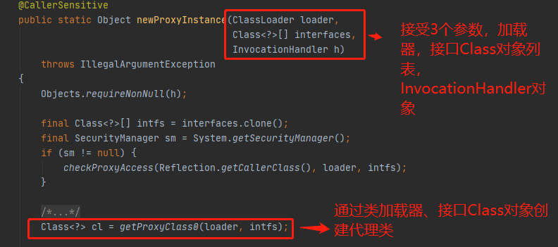
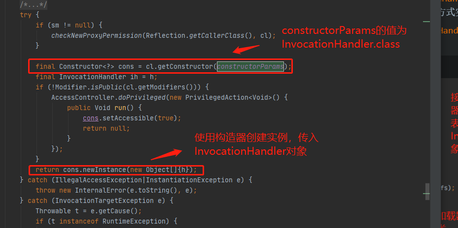
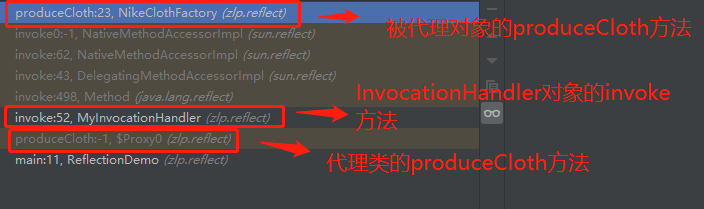

### 代理模式

​	使用代理将对象包装起来，然后使用代理对象取代原始对象，任何原始对象的调用都要通过代理对象代理。代理对象将决定是否以及何时将方法的调用转到原始对象上。


### 静态代理

​	代理类和目标对象的类都时在编译期间确定下来，不利于程序拓展。以接口实现的代理，每个代理类只能为一个接口服务，容易造成代理泛滥的现象。


### 动态代理

作用：在程序运行时根据需求动态创建目标类的代理对象，接口声明的方法都被转移到调用处理器的一个集中方法中处理，依赖反射技术实现。


代理机制：与静态代理一致，都是实现同一个接口，通过调用代理对象的接口方法间接调用被代理对象的接口方法


实现步骤：

1. 获取代理对象的继承接口，创建代理对象继承同样的接口

   > 反射获取被代理对象继承的接口的Class对象列表，通过这些Class对象`获取创建代理类所需要实现的方法`。通过`类加载器创建代理类`。
   >
   > 代理类会`创建一个有参数构造器，参数类型为InvocationHandler`，代理类中所有方法的实现都会以调用InvocationHandler对象invoke方法的方式实现。
   >
   > 所以`所有代理方法的实现都被统一转移到InvocationHandler对象invoke方法中`。

   java.lang.reflect.Proxy创建代理对象的过程
   
   

   

2. 调用代理对象方法，间接调用被代理对象方法

   > `方法调度的流程：调用代理类的方法a——>调用InvocationHandler的invoke方法——>调用被代理对象的方法a`


### 静态代理示例

```java
public class ReflectionDemo {
    public static void main(String[] args){
        ClothFactory nikeClothFactory = new NikeClothFactory();
        ProxyClothFactory proxyClothFactory = new ProxyClothFactory(nikeClothFactory);
        proxyClothFactory.produceCloth();
    }
}

// 接口
interface ClothFactory{
    void produceCloth();
}

// 代理类
class ProxyClothFactory implements ClothFactory{
    private ClothFactory clothFactory;

    public ProxyClothFactory(ClothFactory clothFactory) {
        this.clothFactory = clothFactory;
    }


    @Override
    public void produceCloth() {
        System.out.println("代理对象方法调用前");
        clothFactory.produceCloth();
        System.out.println("代理对象方法调用后");
    }
}

// 被代理类
class NikeClothFactory implements ClothFactory{
    @Override
    public void produceCloth() {
        System.out.println("Nike");
    }
}
```


### 动态代理示例

```java
public class ReflectionDemo {
    public static void main(String[] args){
        ClothFactory nikeClothFactory = new NikeClothFactory();
        ClothFactory proxyInstance = (ClothFactory) ProxyFactory.getProxyInstance(nikeClothFactory);
        proxyInstance.produceCloth();
    }
}

// 接口
interface ClothFactory{
    void produceCloth();
}

// 接口实现类
class NikeClothFactory implements ClothFactory{

    @Override
    public void produceCloth() {
        System.out.println("Nike");
    }
}

// 传入实现类动态获取代理类
class ProxyFactory{

    private static MyInvocationHandler handler = new MyInvocationHandler();

    public static Object getProxyInstance(Object obj){
        handler.bind(obj);
        Object proxy = Proxy.newProxyInstance(obj.getClass().getClassLoader(), obj.getClass().getInterfaces(), handler);
        return proxy;
    }
}

// 集中方法中处理
class MyInvocationHandler implements InvocationHandler{
    private Object obj;
    public void bind(Object obj){
        this.obj = obj;
    }

    @Override
    public Object invoke(Object proxy, Method method, Object[] args) throws Throwable {
        System.out.println("代理对象方法调用前");
        Object res = method.invoke(obj, args);
        System.out.println("代理对象方法调用后");
        return res;
    }
}

```

```
代理对象方法调用前
Nike
代理对象方法调用后
```

> 方法调度流程
>
> 

