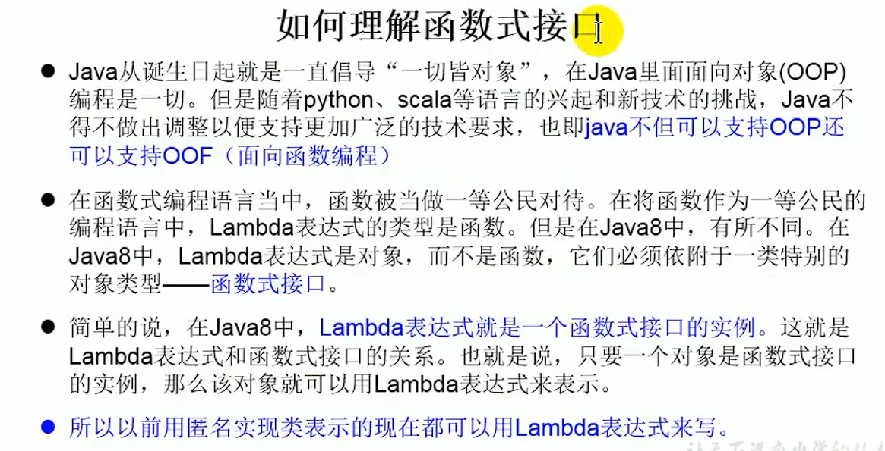
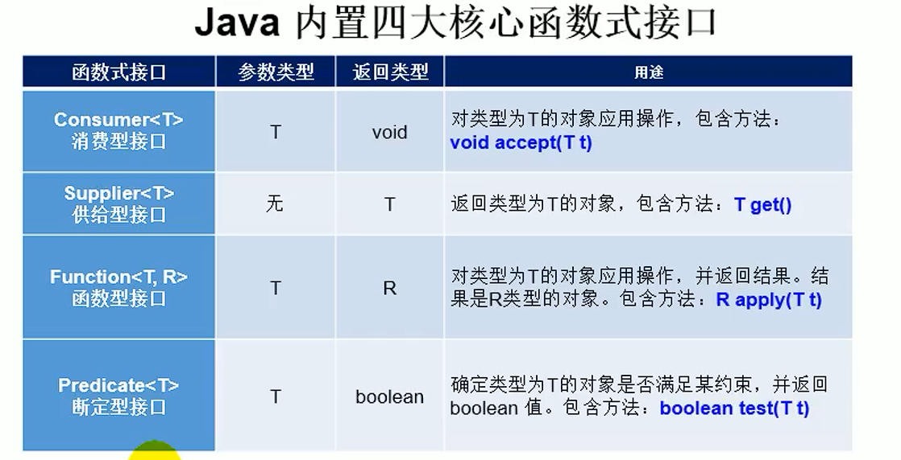
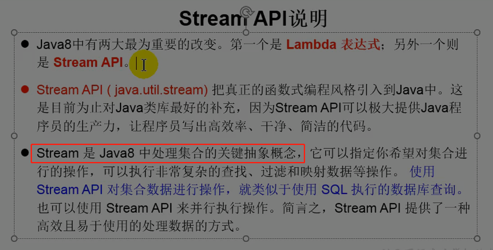
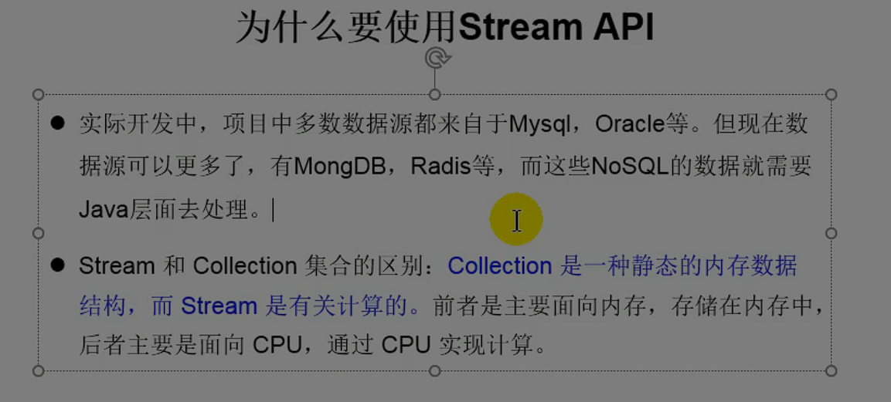
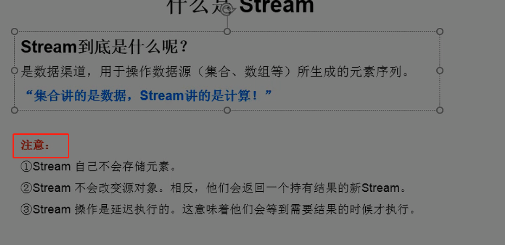
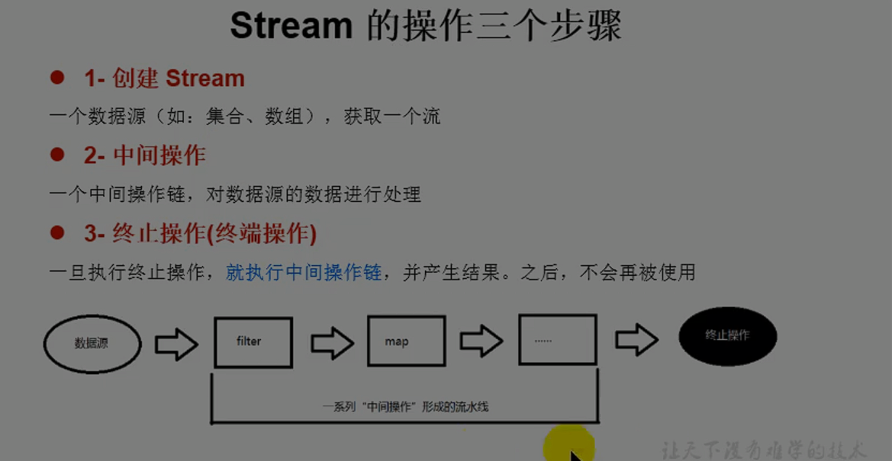
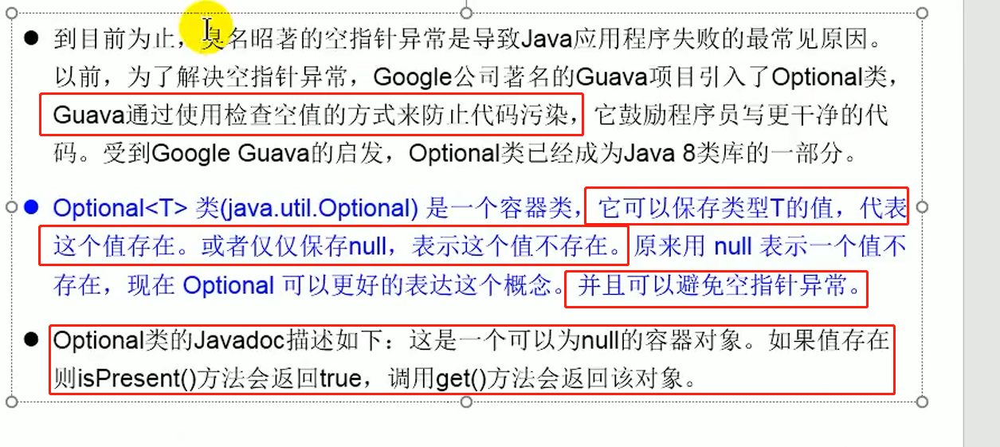

### 接口方面

- 接口可以提供默认方法实现

- 接口可以实现静态方法


### Lambda表达式

是一个匿名函数，由于其他语言使用了并且效果不错，java紧跟时代潮流添加了Lambda表达式语法。在java中Lambda表达式可以理解为一段可以传递的代码（将代码想数据一样进行传递）。

> python中可以将函数名作为引用进行函数调用，将函数名复制给变量，变量也可以进行函数调用，这在java中是无法做到的，而Lambda使得通过函数名调用函数成为可能


#### 主要用途

- 简化接口匿名实例创建（主要，要求接口必须为函数式接口）
- 简化复杂语句编写


#### 示例

```java
public class Demo1 {
    public static void main(String[] args) {
        
        // java8之前，使用匿名类创建接口的对象
        Comparator<Integer> comparable = new Comparator<Integer>() {
            @Override
            public int compare(Integer o1, Integer o2) {
                return Integer.compare(o1,o2);
            }
        };
        int res = comparable.compare(1,2);
        System.out.println(res);

        System.out.println("*************************");
        
        // 使用Lambda表达式创建接口的对象
        Comparator<Integer> comparable1 = (o1,o2) -> Integer.compare(o1,o2);
        int res1 = comparable1.compare(1,2);
        System.out.println(res1);

        // 使用Lambda+方法引用的形式创建接口的对象
        // 当Lambda体已经有现成的方法实现时可以直接使用方法引用代替Lambda表达式
        System.out.println("*************************");
        Comparator<Integer> comparable2 = Integer::compare;
        int res2 = comparable2.compare(1,2);
        System.out.println(res2);      

    }
}
```

```
-1
*************************
-1
*************************
-1
```

#### 语法格式

```
示例：(o1,o2) -> Integer.compare(o1,o2);
->：是Lambda表达式操作符
左边：Lambda表达式形参列表，可以在java能够自动推断类型是可以省略参数类型
右边：Lambda表达式方法体，若只有一条语句则可以省略大括号

原则：能省则省
```

6种Lambda

1. 无参数、无返回值

   ```java
   // 创建Runnable接口的实例
   Runnable run = () -> System.out.println("xxx");
   ```

2. 有参数、无返回值

   ```java
   // 创建Consumer接口实例
   Consumer<String> con1 = (String s1) -> System.out.println("xxx");
   ```

3. 有参数、无返回值、数据类型可以省略

   ```java
   // 创建Consumer接口实例，java可以自动从泛型中推断出s1的类型，可以省略
   Consumer<String> con1 = (s1) -> System.out.println("xxx");
   ```

4. 有参数、无返回值、数据类型可以省略、只有一个参数可以省略小括号

   ```java
   // 创建Consumer接口实例，java可以自动从泛型中推断出s1的类型，可以省略
   Consumer<String> con1 = s1 -> System.out.println("xxx");
   ```

5. 两个或以上参数、多执行语句、有返回值

   ```java
   // 创建Comparator接口实例
   Comparator<Integer> comparable1 = (o1,o2) -> {
       System.out.println("xxx");
       return Integer.compare(o1,o2);
   };
   ```

6. 两个或以上参数、单执行语句、有返回值，可以省略return、大括号

   ```java
   // 创建Comparator接口实例
   Comparator<Integer> comparable1 = (o1,o2) -> Integer.compare(o1,o2);
   ```

   

### 函数式接口

定义：只有一个抽象方法的接口叫做函数式接口

相关注解：@FunctionalInterface，在编译时可以验证该接口是否为函数式接口，与@Override注解功能类似

java.util.function包下定义了java8中的大量函数式接口



#### 内置的4大函数式接口




### 方法引用与构造器引用

方法引用方式：使用双冒号格式，可以通过方法名调用方法

- 对象::非静态方法名，`要求方法的返回值和参数必须和函数式方法的参数返回值一致`
- 类::静态方法名，`要求方法的返回值和参数必须和函数式方法的参数返回值一致`
- 类::非静态方法名，参数个数可以不一致，要求第一个参数必须是作为对象，对象中的方法使用其他参数。
  （`接口参数为n个，实际参数为n-1个`，是可行的，类似python中的self参数，但是形参个数不能再少）


构造器引用：使用双冒号格式，形式和方法引用类似

- 类名::new，无论构造器的参数，都是这个形式，`要求构造器返回的类型就是上层方法的返回值类型`


### Stream API

#### 介绍









#### 实例化

几种实例化方式

- 通过集合创建

  ```java
  List<Integer> list = new ArrayList<>();
  // 创建一个顺序流
  Stream<Integer> stream = list.stream();
  // 创建一个并行流
  Stream<Integer> integerStream = list.parallelStream();
  ```

- Arrays的静态方法创建实例

  ```java
  //public static <T> Stream<T> stream(T[] array)
  int[] arr = {1,2,3,4};
  IntStream stream = Arrays.stream(arr);
  ```

- Stream的静态方法of创建实例

  ```java
  //public static<T> Stream<T> of(T... values) 
  
  ```

- 创建无限流

  ```java
  // public static<T> Stream<T> iterate(final T seed, final UnaryOperator<T> f)
  // 从0开始不断创建偶数，第二个参数为UnaryOperator对象，Lambda就是它的实现
  // 根据表达式不断创建
  Stream.iterate(0,t -> t+2);
  
  // public static<T> Stream<T> generate(Supplier<T> s)
  // 调用其中方法不断获得新数
  Stream.generate(Math::random);
      
  ```

#### Stream中间操作

- 筛选与切片

  - filter方法

    ```java
    // Stream<T> filter(Predicate<? super T> predicate);
    // 根据Predicate对象的方法进行过滤，保留结果为true的元素
    Stream.iterate(0,t -> t+2).limit(10).filter(a->a>3 && a<10).forEach(System.out::println);
    ```

    ```
    4
    6
    8
    ```

  - limit方法

    ```java
    // 获取前n个元素
    Stream<T> limit(long maxSize);
    ```

  - skip方法

    ```java
    // 跳过前n个数据
    //Stream<T> skip(long n);
    ```

  - distinct方法

    ```java
    // 通过元素的hashCode、equals方法过滤重复元素
    Stream<T> distinct();
    ```

- 映射

  - map方法

    ```java
    // 和python的map方法效果一样
    // 接受一个函数，该函数会应用到流中的每个元素上
    <R> Stream<R> map(Function<? super T, ? extends R> mapper);
    ```

  - flatMap方法

    ```java
    // 对流中的每个元素都应用对应的函数，函数的返回值是一个流，flatMap会自动把流打开，变成一个个元素，类似于自动拆包
    <R> Stream<R> flatMap(Function<? super T, ? extends Stream<? extends R>> mapper);
    ```

    

- 排序

  - sorted方法

    ```java
    // 自然排序，调用默认的Comparator，内置的基础类型、String等类型都实现了
    // Comparable接口
    Stream<T> sorted();
    
    // 按照比较器顺序排序
    Stream<T> sorted(Comparator<? super T> comparator);
    ```


#### 终止操作

- 匹配与查找

  ```java
  // 流中任意一个元素符合条件即返回true
  boolean anyMatch(Predicate<? super T> predicate);
  // 流中所有一个元素符合条件即返回true
  boolean allMatch(Predicate<? super T> predicate);
  // 流中没有一个元素符合条件即返回true
  boolean noneMatch(Predicate<? super T> predicate);
  // 返回第一个元素
  Optional<T> findFirst();
  // 串行流返回总是第一个，并行流返回任意一个流的第一个
  Optional<T> findAny();
  // 返回流中元素的个数
  long count();
  // 返回流中的最大值元素
  Optional<T> max(Comparator<? super T> comparator);
  // 返回流中的最小值元素
  Optional<T> min(Comparator<? super T> comparator);
  // 对流中每个元素调用接受的消费者行为，与map功能相似，map不属于终止操作
  void forEach(Consumer<? super T> action);
  ```

- 归约

  ```java
  // 和python中的reduce方法功能类似，将流中的数反复结合，可以实现求总和等操作
  // 接受一个函数式对象
  Optional<T> reduce(BinaryOperator<T> accumulator);
  // 接受一个初始值和函数式对象
  T reduce(T identity, BinaryOperator<T> accumulator);
  // 
  <U> U reduce(U identity,
                   BiFunction<U, ? super T, U> accumulator,
                   BinaryOperator<U> combiner);
  ```

  ```java
  public class Demo1 {
  
      public static void main(String[] args) {
          List<Integer> list = Arrays.asList(1, 2, 3, 4, 5, 6, 7);
          Optional<Integer> reduce = list.stream().reduce(Integer::sum);
          System.out.println(reduce);
          System.out.println("******************************");
          List<String> strings = Arrays.asList("a", "b", "c");
          Optional<String> reduce1 = strings.stream().reduce((a, b) -> a + b);
          System.out.println(reduce1);
      }
  }
  ```

  ```
  Optional[28]
  ******************************
  Optional[abc]
  ```

- 收集

  ```java
  // 将流的结果保存到集合中，Collectors工具类提供了大量的静态方法用来创建一个Collector
  <R, A> R collect(Collector<? super T, A, R> collector);
  <R> R collect(Supplier<R> supplier,
                    BiConsumer<R, ? super T> accumulator,
                    BiConsumer<R, R> combiner);
  ```

  ```java
  public class Demo1 {
  
      public static void main(String[] args) {
          List<Integer> list = Arrays.asList(1, 2, 3, 4, 5, 6, 7);
          Set<Integer> collect = list.stream().collect(Collectors.toSet());
          System.out.println(collect);
      }
  }
  ```

  ```
  [1, 2, 3, 4, 5, 6, 7]
  ```

  

### Optional类



判断对象是否可能为null的地方都可以使用Optional来优化


#### Optional实例化

```java
// 传入一个对象构造Optional对象，要求对象不能为空
public static <T> Optional<T> of(T value);
// 传入一个对象构造Optional对象，对象可以为null
public static <T> Optional<T> ofNullable(T value);
// 创建一个值为null的Optional对象
public static<T> Optional<T> empty();
```

> 常用方式：ofNullable

#### Optional对象方法

- 判断Optional中是否包含对象

  ```java
  // 判断是否包含对象
  public boolean isPresent();
  // 若非空则执行Consumer对象的方法，传递Optional对象的内容给消费者
  public void ifPresent(Consumer<? super T> consumer);
  ```

- 获取

  ```java
  // 获取Optional对象中保存的值，如果值为空则抛出异常
  public T get()
  // 获取Optional对象中保存的值，如果值为空则返回设定的值
  public T orElse(T other);
  // 获取Optional对象中保存的值，如果值为空则返回Supplier接口返回的对象
  public T orElseGet(Supplier<? extends T> other);
  // 获取Optional对象中保存的值，如果值为空则抛出指定异常
  public <X extends Throwable> T orElseThrow(Supplier<? extends X> exceptionSupplier)
  ```

  > 常用方法：orElse、


#### Optional使用示例

模拟null异常

```java
public class Demo1 {

    public static void main(String[] args) {
        String name = getName(null);
        System.out.println(name);
    }

    public static String getName(Person person){
        return person.name;
    }
}

class Person{
    public String name;
}
```

```java
Exception in thread "main" java.lang.NullPointerException
	at zlp.java8demo.Demo1.getName(Demo1.java:16)
	at zlp.java8demo.Demo1.main(Demo1.java:11)
```


传统处理手段

```java
public class Demo1 {

    public static void main(String[] args) {
        String name = getName(null);
        System.out.println(name);
    }

    public static String getName(Person person){
        // 进行空值判断
        if(person!=null){
            return person.name;
        }
        return null;
    }
}

class Person{
    public String name;
}
```

```
null
```


Optional处理方式

```java
public class Demo1 {

    public static void main(String[] args) {
        String name = getName(null);
        System.out.println(name);
    }

    public static String getName(Person person){
        // 包装传入参数
        Optional<Person> person1 = Optional.ofNullable(person);
        // 从Optional中获取传入参数
        Person person2 = person1.orElse(new Person());
        return person2.name;
    }
}

class Person{
    public String name;
}
```

```
null
```

> 指导思想：将默认的数据放入安全的容器中，从安全的容器中取数据时总会是预料之内的结果

