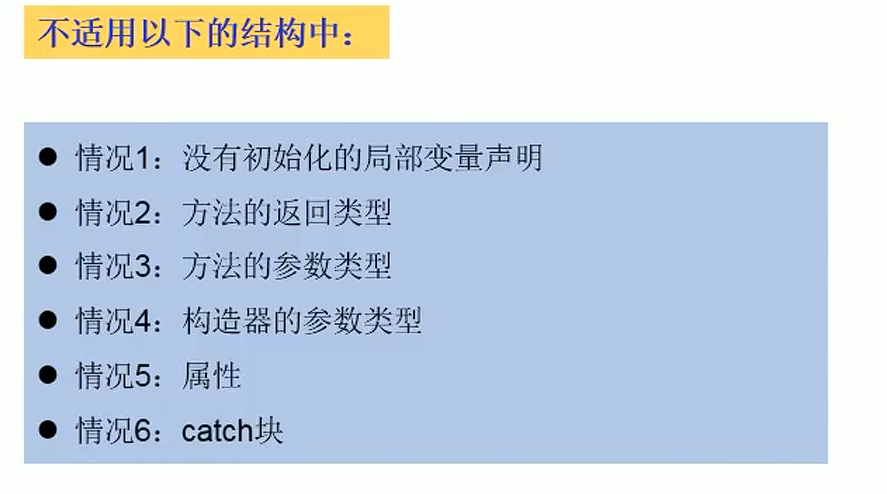

### JDK9

#### 发布


#### 新特性


#### 1、模块化

模块的层级处于包外一层，一个模块可以包含多个包，模块默认对外不开放，需要手动设置对外暴露的包（一个包没有对外暴露时不能被其他包引用）

模块暴露和导入信息写在文件中


对外暴露包


导入模块


#### 2、REPL工具


#### 3、接口的私有方法

接口可以实现私有方法，由于接口可以定义默认方法和静态方法的特性，为了提高代码复用性加入私有方法是合理的


#### 4、钻石操作符的使用升级

`< >`即为钻石操作符


#### 5、try语法改进


`java8中的try语法`：自动释放资源，需要自动关闭的资源必须在try后的括号中声明

（与python中的with关键字类似，要求自动释放对象要实现close方法）


`java9中的try语法`：自动释放资源，需要自动关闭的资源可以在try外部定义，在放置在try后的括号中

（作为自动关闭的资源其属性会被自动修改为final，在try语句块中不应该去修改它，不然会造成自动关闭资源异常）


#### 6、String存储结构的变更

- 动机：当前字符串类型的存储使用char数组的形式，对于`每个char元素都占用了两个字节（16位）`，根据统计string类型对象在不同的应用中都是堆空间的主要占用部分，`而大多数string都是用来保存拉丁字符。也就是所只需要一个字节就可以保存`，这样就存在大量string对象有一半的空间没有被使用，造成浪费。
- 改进：从默认string使用uft-16的编码转变到增加一个encoding-flag属性，将根据这个属性决定编码使用ISO-8859-1/Latin-1（一个char一个字节）或者UTF-16（一个char2个字节）

> StringBuffer、StringBuilder同样发生了改变

#### 7、集合工厂方法：创建只读集合

- java8中，创建只读集合

  ```java
  // 通过unmodifiableCollection方法
  Collections.unmodifiableCollection();
  // 通过asList方法
  List<Integer> list = Arrays.asList(1, 2, 3, 4);
  ```

- java9中

  ```java
  // 创建只读列表
  List.of();
  // 创建只读集合
  Set.of();
  // 创建只读哈希表
  Map.of();
  ```


#### 8、InputStream加强

InputStream对象可以字节使用transferTo方法，将数据直接传输到OutStream

```java
// 格式
输入流对象.transferTo(输出流对象)
```

#### 9、增强的Stream API

- 创建实例的方式增加

  ```java
  // 1、java9中的Optional对象有一个新方法stream()，可以返回一个stream实例（可能是个空的）
  
  // 2、Stream.iterate()方法增加重载
  // 原方法
  public static<T> Stream<T> iterate(final T seed, final UnaryOperator<T> f);
  // 重载方法，Predicate对象用来判断是否继续创建下一个流元素
  public static<T> Stream<T> iterate(final T seed, Predicate<? super Integer> hasNext ,final UnaryOperator<T> f);
  ```

- 中间操作的增加

  ```java
  // 选择从头开始的尽量多的元素，接受一个Predecate对象来进行选择
  // 一旦出现一个不满足的，就终止后续查找
  takeWhile();
  // 丢弃从头开始的尽量多的元素，接受一个Predecate对象来进行选择
  // 一旦出现一个不满足的，就终止后续查找
  dropWhile();
  // 允许创建一个单元素stream，元素可以为null
  //public static<T> Stream<T> of(T... values) 不允许只传入一个null来创建流
  ofNullable()
  ```


### JDK10

#### 更新概述

更新了12个JEP，其中大多数是针对JVM的优化，少数针对，实际应用场景。


#### 1、局部变量类型推断

作用：从等号右边的类型推断出等号左边变量的类型，从而省略等号左边变量类型的书写


从上述例子中可以看出等号左边的类型声明往往是不必要的，其类型都由右边创建的实例类型决定，所有java10中引入一个局部变量关键字来省略左边的类型书写。


> 越来越像js了
>
> 注意在需要左边类型时不能使用var关键字，如定义时没有进行初始化的变量，Lambda表达式，数组静态初始化等等。
>
> 


#### 集合新创建不可变集合的方法

- copyOf()

  ```java
  // 接受一个集合，创建一个不可变集合
  // 若接受的集合本身为不可变集合则直接返回引用（相当同一个集合）
  // 若接受的集合为可变集合，则创建一个不可变集合，返回引用
  ```


### JDK11

#### 更新概述


#### 1、String新增方法


#### 2、Optional加强


#### 3、局部变量推断升级

可以在Lambda表达式的小括号中使用var，原本Lambda表达式参数类型是可以自动推导的，这里加上var没有增加新意义，不同的是可以在var之前使用注解了。


#### 4、Http Client

该更新在JDK9中就引入了，后来在11中又重新大更新了该API


示例


#### 5、更简化的编译允许程序

原有编译-运行流程

- 编译：javac xxx.java
- 运行：java xxx.class

11中的编译-运行流程

- 编译-运行：java xxx.class


#### 6、废弃Nashorn引擎


#### 7、ZGC


#### 8、其他特性


### JDK后续发展展望

- 一个轻量化的JSON API
- 新的货币API

