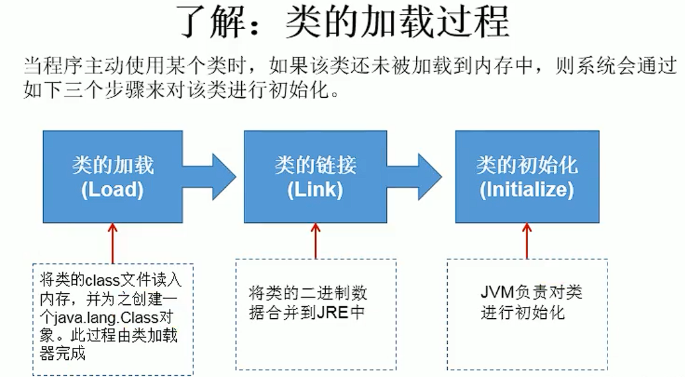

### 反射

反射机制被视为`动态语言`的关键技术，它允许程序在`运行期间`借助Reflection API获取任何类的内部信息，直接操作任意对象的内部属性和方法。


### JAVA中的反射

在类加载完后，在堆内存的方法区中就产生了一个`Class类型的对象`（一个类只有一个Class对象），该对象包含一个类的所有结构，可以从该对象中获取类的任意信息


### Java反射提供的功能


### Java反射API


#### 获取Class对象

- 类.class属性获取

  ```java
  Class<Person> personClass = Person.class;
  ```

- 对象.getgetClass()方法获取

  ```java
  Class<? extends Person> aClass = person.getClass();
  ```

- Class的静态方法forName()

  ```java
  Class<?> aClass1 = Class.forName("zlp.reflect.Person");
  ```

- 使用类加载器(ClassLoader)，获取Class对象

  ```java
  public class ReflectionDemo {
      public static void main(String[] args) throws Exception {
          // Class对象getClassLoader方法获取类加载器
          ClassLoader classLoader = ReflectionDemo.class.getClassLoader();
          // 使用类加载器，动态加载类，获取Class对象
          Class<?> aClass = classLoader.loadClass("zlp.reflect.Person");
          System.out.println(aClass);
      }
  }
  ```

  


#### Class对象相关方法

- 获取类的构造器

  ```java
  // 获取公有的构造器
  personClass.getConstructor(Class<?>... parameterTypes);
  // 获取所有公有构造器
  personClass.getConstructors();
  // 获取当前类声明的构造器
  personClass.getDeclaredConstructor(Class<?>... parameterTypes);
  // 获取当前类所有声明的构造器
  personClass.getDeclaredConstructors();
  ```

- 获取属性

  ```java
  // 获取公有属性，可以获取父类继承的属性
  personClass.getField(String name);
  // 获取所有公有属性，包含父类继承的共有属性
  personClass.getFields();
  // 获取声明的属性，不可以获取父类继承的属性
  personClass.getDeclaredField(String name);
  // 获取当前类所有声明的属性，不包含父类的属性
  personClass.getDeclaredFields()
  ```

- 获取方法

  ```java
  // 获取公有方法，可以获取父类继承的方法
  personClass.getMethod(String name, Class<?>... parameterTypes);
  // 获取所有公有方法，可以获取父类继承的方法
  personClass.getMethods();
  // 获取当前类声明方法，不可以获取父类继承的方法
  personClass.getDeclaredMethod(String name, Class<?>... parameterTypes);
  // 获取当前类所有声明方法，不可以获取父类继承的方法
  personClass.getDeclaredMethods()
  ```

- 获取注解

  ```java
  // 作用在类上的注解
  personClass.getAnnotation(Class<A> annotationClass);
  // 获取所有作用在类上的注解
  personClass.getAnnotations();
  // 获取
  personClass.getDeclaredAnnotation(Class<A> annotationClass);
  personClass.getDeclaredAnnotations();
  ```

- 获取全类名

  ```java
  // 包名+类名
  getName()
  ```

- 创建实例

  ```java
  // 默认使用无参数构造器创建
  newInstance()
  ```

- 获取当前对象的父类

  ```java
  Class<? super Person> superclass = personClass.getSuperclass();
  
  // 父接口
  personClass.getInterfaces()
  // 带泛型的父类
  personClass.getGenericSuperclass();
  // 带泛型的接口
  personClass.getGenericInterfaces()
  ```

  > 泛型内容的获取，通过`ParameterizedType类对象`的getActualTypeArguments方法
  >
  > 

- getPackage()：获取类所在的包


#### Constructor对象相关方法

- getName()：获取构造器名，返回全类名
- getParameterCount()：获取构造器参数个数
- getParameterTypes()：获取构造器参数类型，返回值`Class<?>[]`
- genericParameterTypes()：获取构造器参数类型，返回值`Type[]`
- newInstance(Object ... initargs)：使用构造器，创建对象


#### Field对象相关方法

- set(Object obj, Object value)：给对象的属性设置值
- get(Object obj)：获取对象的属性值
- getAnnotations()：获取对象属性的注释
- getModifiers()：获取属性权限修饰符，返回整型表示权限（默认权限=0，public=1，private=2）
- getType()：获取属性类型，返回Class对象
- getName()：获取属性名


#### Method对象相关方法

- invoke(Object obj, Object... args)：执行对象方法，对象方法返回值即为invoke方法的返回值，调用静态方法时不需要传入对象参数，可以传入null或传入`类.class`进行调用
- getName()：返回方法名
- getParameterCount()：获取参数个数
- getParameterTypes()：获取参数类型，返回值`Class<?>[]`
- genericParameterTypes()：获取参数类型，返回值`Type[]`，（带泛型的参数）
- getModifiers()：获取方法权限修饰符
- getAnnotations()：获取对象方法的注释
- getReturnType()：获取方法返回值类型
- getExceptionTypes()：获取方法抛出的异常


### Java反射示例

反射应用大致流程

- 获取对应类的Class对象
- 通过Class对象获取构造器
- 通过Class对象获取属性
- 通过Class对象获取方法

```java
public class ReflectionDemo {
    public static void main(String[] args) throws Exception {
        // 1、获取Person类的Class对象
        Class<Person> personClass = Person.class;
        
        // 2、通过Class对象，获取Person类的构造器
        Constructor<Person> constructor = personClass.getConstructor(String.class);
        // 调用构造器对象创建实例
        Person person = constructor.newInstance("zlp");
        System.out.println(person);
        
        // 3、通过Class对象，获取Person类的属性
        Field name = personClass.getDeclaredField("name");
        // 调用属性对象设置属性值
        // 属性对象接受两个参数，第一个为要修改属性的对象，第二个为属性值
        // 对于私有访问权限，需要调用setAccessible方法设置为true
        name.setAccessible(true);
        name.set(person, "zlp123");
        System.out.println(person);
        
        // 4、通过Class对象，获取Person类的方法
        // 第一个参数为方法名，后续参数为方法的形参类型，因为可能存在重载情况
        // 若不传递则获取无参方法
        Method show = personClass.getDeclaredMethod("show");
        // 方法对象的第一个参数为要执行方法的对象，后续任意个参数为传入方法的实参
        show.invoke(person);

    }
}

class Person{
    private String name;

    public Person(String name) {
        this.name = name;
    }

    public Person() {
    }

    public String getName() {
        return name;
    }

    public void setName(String name) {
        this.name = name;
    }

    public void show(){
        System.out.println(name);
    }

    @Override
    public String toString() {
        return "Person{" +
                "name='" + name + '\'' +
                '}';
    }
}

```

```
Person{name='zlp'}
Person{name='zlp123'}
zlp123
```


### Class类的理解

从类的加载过程看，源文件经过javac.exe程序编译成.class字节码文件，在由java.exe解释运行，这个过程中类从磁盘加载到内存中，`java.exe对.class文件进行解读的结果叫做运行时类，用Class对象来表示，Class对象保存在方法区`。所以一个Class对象就代表一个内存中的运行时类。


### Class可以表示的结构


### 类的加载过程



- 加载：读取.class文件，以特定`数据结构保存在方法区`中，在`堆中`创建一个`Class对象`指向方法区中保存数据结构的地址，作为方法区中类数据的入口对外提供访问
- 链接：验证加载类的合法性，为变量分配内存空间
- 初始化：使用类构造器对变量进行初始化，类构造器中的信息就是原有类中的赋值动作


> 所以变量值的初始化都在初始化阶段完成，链接阶段的默认初始值是指0，null等默认值


### 类加载器(ClassLoader)

用于加载阶段，将.class文件读取到内存中，并将静态数据转换成方法区的运行时数据结构，在堆中创建Class对象作为方法区中类数据的入口


### 类加载器种类


> 自定义类使用系统类加载器加载

> 类加载器读取配置文件的默认路径和FileInputStream的默认路径有所不同
>
> （前者在module下的src下，后者是module目录下，工程目录在打包时会丢失，放在src下可以保证准确找到）
>
> 