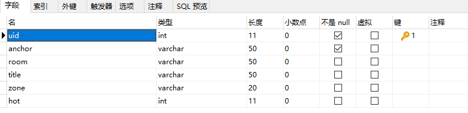
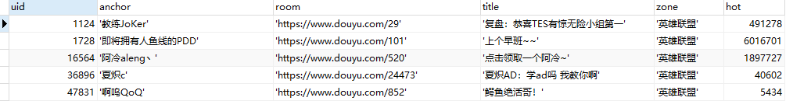
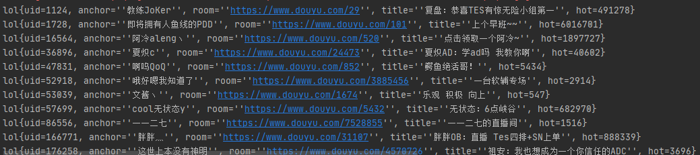

### Mybatis示例

#### 1、搭建环境

> 开发工具：IDEA
>
> 构建根据：Maven
>
> 数据库：mysql
>
> 数据表：
>
> 
>
> 

#### 2、引入依赖

> ```xml
> <dependencies>
>         <dependency>
>             <groupId>org.mybatis</groupId>
>             <artifactId>mybatis</artifactId>
>             <version>3.5.6</version>
>         </dependency>
> 
>         <dependency>
>             <groupId>mysql</groupId>
>             <artifactId>mysql-connector-java</artifactId>
>             <version>8.0.25</version>
>         </dependency>
> 
>         <dependency>
>             <groupId>junit</groupId>
>             <artifactId>junit</artifactId>
>             <version>3.8.2</version>
>             <scope>test</scope>
>         </dependency>
>         <dependency>
>             <groupId>junit</groupId>
>             <artifactId>junit</artifactId>
>             <version>RELEASE</version>
>             <scope>compile</scope>
>         </dependency>
>     </dependencies>
> 
>     <!--在build标签手动配置需要导出的资源文件，Maven默认不导出java目录下的配置文件-->
>     <build>
>         <resources>
>             <resource>
>                 <directory>src/main/java</directory>
>                 <includes>
>                     <include>**/*.xml</include>
>                 </includes>
>                 <filtering>true</filtering>
>             </resource>
>             <resource>
>                 <directory>src/main/resources</directory>
>                 <includes>
>                     <include>**/*.xml</include>
>                 </includes>
>                 <filtering>true</filtering>
>             </resource>
>         </resources>
>     </build>
> ```

#### 3、构建SqlSessionFactory

> mybatis使用SqlSessionFactory实例来获取mysql的操作对象
>
> 1. 创建xml
>
>    ```xml
>    <?xml version="1.0" encoding="UTF-8" ?>
>    <!DOCTYPE configuration
>            PUBLIC "-//mybatis.org//DTD Config 3.0//EN"
>            "http://mybatis.org/dtd/mybatis-3-config.dtd">
>    
>    <configuration>
>        <environments default="development">
>            <environment id="development">
>                <transactionManager type="JDBC"/>
>                <dataSource type="POOLED">
>                    <property name="driver" value="com.mysql.jdbc.Driver"/>
>                    <property name="url" value="jdbc:mysql://localhost:3306/doyu?serverTimezone=UTC&amp;characterEncoding=utf8&amp;useSSL=false&amp;useUnicode=true"/>
>                    <property name="username" value="root"/>
>                    <property name="password" value="zlp123"/>
>                </dataSource>
>            </environment>
>        </environments>
>        <mappers>
>            <mapper resource="com/zlp/dao/lolMapper.xml"/>
>        </mappers>
>    </configuration>
>    ```
>
> 2. 根据xml构建SqlSessionFactoryBuilder对象
>    SqlSessionFactoryBuilder创建SqlSessionFactory实例
>    创建SqlSessionFactory实例获取数据库操作对象（SqlSession）
>
>    ```java
>    public class MybatisUntil {
>        private static SqlSessionFactory sqlSessionFactory;
>    	
>        // 读取xml创建SqlSessionFactoryBuilder对象
>        // SqlSessionFactoryBuilder创建SqlSessionFactory实例
>        static{
>            try {
>                String resource = "mybatis-config.xml";
>                InputStream inputStream = null;
>                inputStream = Resources.getResourceAsStream(resource);
>                sqlSessionFactory = new SqlSessionFactoryBuilder().build(inputStream);
>            } catch (IOException e) {
>                e.printStackTrace();
>            }
>        }
>    
>        // 创建SqlSessionFactory实例获取数据库操作对象
>        public static SqlSession getSqlSession(){
>            return sqlSessionFactory.openSession();
>        }
>    }
>    
>    ```

#### 4、创建pojo对象

> ```java
> public class lol {
>     private int uid;
>     private String anchor;
>     private String room;
>     private String title;
>     private int hot;
> }
> ```

#### 5、dao层定义操作

> 定义接口
>
> ```java
> package com.zlp.dao;
> 
> import com.zlp.pojo.lol;
> 
> import java.util.List;
> 
> public interface User {
>     public List<lol> getAll();
> }
> 
> ```
>
> 定义xml映射文件，绑定抽象类，实现其中方法
>
> ```xml
> <?xml version="1.0" encoding="UTF-8" ?>
> <!DOCTYPE mapper
>         PUBLIC "-//mybatis.org//DTD Mapper 3.0//EN"
>         "http://mybatis.org/dtd/mybatis-3-mapper.dtd">
> <!--绑定dao接口，namespace属性对应要实现的接口全路径-->
> <mapper namespace="com.zlp.dao.User">
>     <!--编写查询语句，id对应接口中的方法，resultMap设置返回集-->
>     <select id="getAll" resultType="com.zlp.pojo.lol">
>     select * from lol
>   </select>
> </mapper>
> ```
>
> xml相当于代理原来的接口实现类（两者功能完全一致）
>
> ```java
> package com.zlp.dao;
> 
> import com.zlp.pojo.lol;
> 
> import java.util.List;
> 
> public class UserImpl implements User{
>     @Override
>     public List<lol> getAll() {
>         String sql="select * from lol";
>         List<lol> results = jdbcTemplate.query(sql,new BeanProertyRowMapper<lol>(lol.class));
>         return results
>     }
> }
> ```

#### 6、Service层调用API

> ```java
> package com.zlp.service;
> 
> import com.zlp.dao.User;
> import com.zlp.pojo.lol;
> import com.zlp.unitls.MybatisUntil;
> import org.apache.ibatis.session.SqlSession;
> import org.junit.Test;
> 
> import java.util.List;
> 
> public class QueryImpl implements Query{
>     @Override
>     public void queryAll() {
>         // 获取数据库操作对象
>         SqlSession s = MybatisUntil.getSqlSession();
>         // 获取对应接口的映射
>         User mapper = s.getMapper(User.class);
>         // 调用方法进行查询
>         List<lol> results = mapper.getAll();
>         // 输出结果
>         results.forEach(System.out::println);
>         // 释放mysql连接
>         s.close();
>     }
> }
> ```

#### 7、测试

> ```java
> @Test
> public void getALLTest(){
>     Query query = new QueryImpl();
>     query.queryAll();
> }
> ```
>
> 