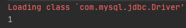
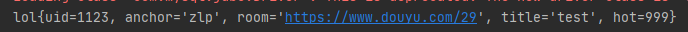
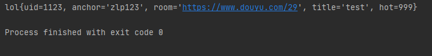
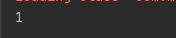
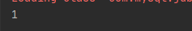

### Mybatis进行CRUD

#### 环境

> 上一案例的环境

#### 添加

> 1. DAO接口中添加方法
>
>    ```java
>    public int insertOne(lol l);
>    ```
>
> 2. 映射文件中编辑sql
>
>    ```xml
>        <insert id="insertOne" parameterType="com.zlp.pojo.lol">
>            insert into lol(uid,anchor,room,title,hot)
>            values (#{uid},#{anchor},#{room},#{title},#{hot})
>        </insert>
>    ```
>
> 3. service接口增加方法
>
>    ```java
>    public void insertOne(lol l);
>    ```
>
> 4. service实现类调用
>
>    ```java
>        @Override
>        public void insertOne(lol l) {
>            SqlSession s = MybatisUntil.getSqlSession();
>            User mapper = s.getMapper(User.class);
>            int res = mapper.insertOne(l);
>            // 执行改动数据库语句时需要提交
>            s.commit();
>            System.out.println(res);
>        }
>    ```
>
> 5. 测试
>
>    ```java
>        @Test
>        public void insertOneTest(){
>            Query query = new QueryImpl();
>            lol l = new lol(1123,"zlp","https://www.douyu.com/29","test",999);
>            query.insertOne(l);
>        }
>    ```
>
>    
>
>    

#### 查询

> 参考上个案例

#### 更改

> 1. 添加DAO接口方法
>
>    ```java
>    public int update(lol l);
>    ```
>
> 2. 添加映射文件配置
>
>    ```xml
>        <update id="update" parameterType="com.zlp.pojo.lol">
>            update lol set anchor = #{anchor} where uid = #{uid}
>        </update>
>    ```
>
> 3. 增加service接口方法
>
>    ```java
>    public void update(lol l);
>    ```
>
> 4. service实现类实现调用
>
>    ```java
>        @Override
>        public void update(lol l) {
>            SqlSession s = MybatisUntil.getSqlSession();
>            User mapper = s.getMapper(User.class);
>            int res = mapper.update(l);
>            s.commit();
>            System.out.println(res);
>        }
>    ```
>
> 5. 测试
>
>    ```java
>        @Test
>        public void updateTest(){
>            Query query = new QueryImpl();
>            lol l = new lol();
>            l.setAnchor("zlp123");
>            l.setUid(1123);
>            query.update(l);
>        }
>    ```
>
>    
>    
>    

#### 删除

> 1. 添加DAO接口方法
>
>    ```java
>    public int deleteById(int uid);
>    ```
>
> 2. 配置映射文件
>
>    ```xml
>        <delete id="deleteById">
>            delete from lol where uid=#{uid}
>        </delete>
>    ```
>
> 3. service接口添加方法
>
>    ```java
>    public void deleteById(int id);
>    ```
>
> 4. service实现类实现调用
>
>    ```java
>        @Override
>        public void deleteById(int id) {
>            SqlSession s = MybatisUntil.getSqlSession();
>            User mapper = s.getMapper(User.class);
>            int res = mapper.deleteById(id);
>            s.commit();
>            System.out.println(res);
>        }
>    ```
>
> 5. 测试
>
>    ```java
>    @Test
>    public void deleteByIdTest(){
>        Query query = new QueryImpl();
>        query.deleteById(1123);
>    }
>    ```
>
>    

#### 总结

> Mybatis映射参数时
>
> 1. 当SQL语句中只需要一个参数时可以直接传递基本类型数据
>
> 2. 当SQL语句中存在两个或以上的参数中必须使用pojo或者Map对象传递参数，否则无法正常映射

> 使用Map传递参数
>
> 1. DAO接口配置
>
>    ```java
>    public int update1(Map<String,Object> map);
>    ```
>
> 2. 映射文件配置
>
>    ```xml
>    <update id="update1" parameterType="map">
>            update lol set anchor = #{anchor} where uid = #{uid}
>        </update>
>    ```
>
> 3. service接口配置
>
>    ```java
>    public void update1(Map<String,Object> map);
>    ```
>
> 4. service实现类调用
>
>    ```java
>        @Override
>        public void update1(Map<String, Object> map) {
>            SqlSession s = MybatisUntil.getSqlSession();
>            User mapper = s.getMapper(User.class);
>            int res = mapper.update1(map);
>            s.commit();
>            System.out.println(res);
>        }
>    ```
>
> 5. 测试
>
>    ```java
>        @Test
>        public void updateTest(){
>            Query query = new QueryImpl();
>            Map<String,Object> map = new HashMap<String,Object>();
>            map.put("anchor","zlp");
>            map.put("uid",1124);
>            query.update1(map);
>        }
>    ```
>
>    