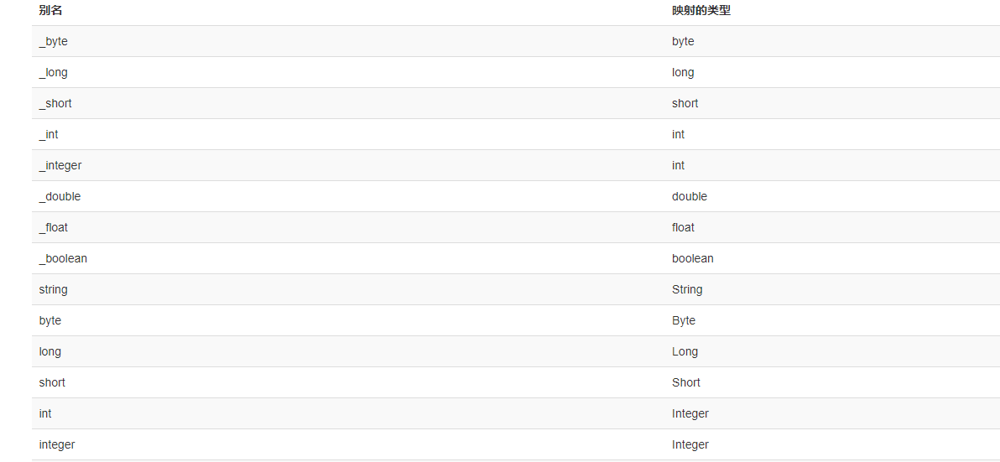

### 配置文件

#### 结构

> - configuration（配置）
>   - [properties（属性）](https://mybatis.org/mybatis-3/zh/configuration.html#properties)
>   - [settings（设置）](https://mybatis.org/mybatis-3/zh/configuration.html#settings)
>   - [typeAliases（类型别名）](https://mybatis.org/mybatis-3/zh/configuration.html#typeAliases)
>   - [typeHandlers（类型处理器）](https://mybatis.org/mybatis-3/zh/configuration.html#typeHandlers)
>   - [objectFactory（对象工厂）](https://mybatis.org/mybatis-3/zh/configuration.html#objectFactory)
>   - [plugins（插件）](https://mybatis.org/mybatis-3/zh/configuration.html#plugins)
>   - environments（环境配置）
>     - environment（环境变量）
>       - transactionManager（事务管理器）
>       - dataSource（数据源）
>   - [databaseIdProvider（数据库厂商标识）](https://mybatis.org/mybatis-3/zh/configuration.html#databaseIdProvider)
>   - [mappers（映射器）](https://mybatis.org/mybatis-3/zh/configuration.html#mappers)

#### properties

> 作用：可以在当前上下文中设置变量，通过`${name}`访问
>
> 设置方式：
>
> 1. 使用resource或url属性根据外部配置文件引入变量
>
>    ```XML
>    <properties resource="org/mybatis/example/config.properties"/>
>    ```
>
> 2. 使用property子标签设置变量
>
>    ```xml
>    <properties>
>      <property name="username" value="dev_user"/>
>      <property name="password" value="F2Fa3!33TYyg"/>
>    </properties>
>    ```
>
> 3. 通过方法传入
>
>    ```java
>    SqlSessionFactory factory = new SqlSessionFactoryBuilder().build(reader, props);
>    ```
>
> 同名优先级：（由读取顺序决定）
>
> - 首先读取在 properties 元素体内指定的属性。
> - 然后根据 properties 元素中的 resource 属性读取类路径下属性文件，或根据 url 属性指定的路径读取属性文件，`并覆盖之前读取过的同名属性`。
> - 最后读取作为方法参数传递的属性，`并覆盖之前读取过的同名属性`。

#### Settings

> 这是 MyBatis 中极为重要的调整设置，它们会改变 MyBatis 的运行时行为。 下表描述了设置中各项设置的含义、默认值等。
>
> url：https://mybatis.org/mybatis-3/zh/configuration.html#settings
>
> ```xml
> <settings>
>   <setting name="cacheEnabled" value="true"/>
>   <setting name="lazyLoadingEnabled" value="true"/>
>   <setting name="multipleResultSetsEnabled" value="true"/>
>   <setting name="useColumnLabel" value="true"/>
>   <setting name="useGeneratedKeys" value="false"/>
>   <setting name="autoMappingBehavior" value="PARTIAL"/>
>   <setting name="autoMappingUnknownColumnBehavior" value="WARNING"/>
>   <setting name="defaultExecutorType" value="SIMPLE"/>
>   <setting name="defaultStatementTimeout" value="25"/>
>   <setting name="defaultFetchSize" value="100"/>
>   <setting name="safeRowBoundsEnabled" value="false"/>
>   <setting name="mapUnderscoreToCamelCase" value="false"/>
>   <setting name="localCacheScope" value="SESSION"/>
>   <setting name="jdbcTypeForNull" value="OTHER"/>
>   <setting name="lazyLoadTriggerMethods" value="equals,clone,hashCode,toString"/>
> </settings>
> ```

#### typeAliases

> 类型别名：将配置文件中使用的java类的全路径设置别名，降低冗余，可以在映射文件中使用代替全类名
>
> url：https://mybatis.org/mybatis-3/zh/configuration.html#typeAliases
>
> ```xml
> <typeAliases>
> <typeAlias alias="Author" type="domain.blog.Author"/>
> <typeAlias alias="Blog" type="domain.blog.Blog"/>
> <typeAlias alias="Comment" type="domain.blog.Comment"/>
> <typeAlias alias="Post" type="domain.blog.Post"/>
> <typeAlias alias="Section" type="domain.blog.Section"/>
> <typeAlias alias="Tag" type="domain.blog.Tag"/>
> </typeAliases>
> ```
>
> 将包中的所有类设置别名
>
> ```xml
> <typeAliases>
> <package name="domain.blog"/>
> </typeAliases>
> ```
>
> ```java
> @Alias("author")
> public class Author {
>  ...
> }
> ```
>
> 该配置将自动扫描包中的所有类，将类中的设置注解指定的别名，若没有注解则会使用 Bean 的首字母小写的非限定类名来作为它的别名
>
> Mybatis内置了常用类型的别名，可以在映射文件中直接使用，如Map别名为map
> 

#### typeHandlers

> 实现ORM功能，将java的类型映射到JDBC类型。
>
> 使用于将参数映射到SQL语言，和获取执行结果
>
> url：https://mybatis.org/mybatis-3/zh/configuration.html#typeHandlers
>
> 也可以自定义类型映射

#### objectFactory

> 每次 MyBatis 创建结果对象的新实例时，它都会使用一个对象工厂（ObjectFactory）实例来完成实例化工作
>
> url：https://mybatis.org/mybatis-3/zh/configuration.html#objectFactory

#### plugins

> 作用与SpringMVC拦截器类似，可以在映射语句执行过程的某一点进行拦截
>
> url：https://mybatis.org/mybatis-3/zh/configuration.html#plugins
>
> 拦截点：
>
> - Executor (update, query, flushStatements, commit, rollback, getTransaction, close, isClosed)
> - ParameterHandler (getParameterObject, setParameters)
> - ResultSetHandler (handleResultSets, handleOutputParameters)
> - StatementHandler (prepare, parameterize, batch, update, query)
>
> 示例：
>
> ```java
> // ExamplePlugin.java
> @Intercepts({@Signature(
>   type= Executor.class,
>   method = "update",
>   args = {MappedStatement.class,Object.class})})
> public class ExamplePlugin implements Interceptor {
>   private Properties properties = new Properties();
>   public Object intercept(Invocation invocation) throws Throwable {
>     // implement pre processing if need
>     Object returnObject = invocation.proceed();
>     // implement post processing if need
>     return returnObject;
>   }
>   public void setProperties(Properties properties) {
>     this.properties = properties;
>   }
> }
> ```
>
> ```xml
> <!-- mybatis-config.xml -->
> <plugins>
>   <plugin interceptor="org.mybatis.example.ExamplePlugin">
>     <property name="someProperty" value="100"/>
>   </plugin>
> </plugins>
> ```
>
> 上面的插件将会拦截在 Executor 实例中所有的 “update” 方法调用， 这里的 Executor 是负责执行底层映射语句的内部对象。

#### environments

> 该标签用于配置数据库环境，MyBatis 可以配置成适应多种环境，这种机制有助于将 SQL 映射应用于多种数据库之中。
>
> 每个 SqlSessionFactory 实例只能选择一种环境。
>
> 创建SqlSessionFactory可以传入不同环境参数创建不同SqlSessionFactory实例
>
> ```java
> SqlSessionFactory factory1 = new SqlSessionFactoryBuilder().build(reader, environment1);
> SqlSessionFactory factory2 = new SqlSessionFactoryBuilder().build(reader, environment2);
> ```
>
> 若环境参数没有传递则使用配置文件中的默认环境，由environments标签的default属性指定
>
> ```xml
> <environments default="development">
>   <environment id="development">
>     <transactionManager type="JDBC">
>       <property name="..." value="..."/>
>     </transactionManager>
>     <dataSource type="POOLED">
>       <property name="driver" value="${driver}"/>
>       <property name="url" value="${url}"/>
>       <property name="username" value="${username}"/>
>       <property name="password" value="${password}"/>
>     </dataSource>
>   </environment>
> </environments>
> ```

> transactionManager标签中type属性有两个取值：
>
> - JDBC： 这个配置直接使用了 JDBC 的提交和回滚设施，它依赖从数据源获得的连接来管理事务作用域。
>
> - MANAGED：这个配置几乎没做什么。它从不提交或回滚一个连接，而是让容器来管理事务的整个生命周期（比如 JEE 应用服务器的上下文）。 默认情况下它会关闭连接。然而一些容器并不希望连接被关闭，因此需要将 closeConnection 属性设置为 false 来阻止默认的关闭行为
>
>   ```xml
>   <transactionManager type="MANAGED">
>     <property name="closeConnection" value="false"/>
>   </transactionManager>
>   ```
>
> **如果你正在使用 Spring + MyBatis，则没有必要配置事务管理器，因为 Spring 模块会使用自带的管理器来覆盖前面的配置。**

> dataSource标签中type的三个取值
>
> - UNPOOLED：不使用连接池，这个数据源的实现会每次请求时打开和关闭连接。虽然有点慢，但对那些数据库连接可用性要求不高的简单应用程序来说，是一个很好的选择
> - POOLED： 这种数据源的实现利用“池”的概念将 JDBC 连接对象组织起来，避免了创建新的连接实例时所必需的初始化和认证时间
> - JDNI：这个数据源实现是为了能在如 EJB 或应用服务器这类容器中使用，容器可以集中或在外部配置数据源，然后放置一个 JNDI 上下文的数据源引用。

#### databaseIdProvider

> MyBatis 可以根据不同的数据库厂商执行不同的语句，这种多厂商的支持是基于映射语句中的 `databaseId` 属性。

#### mappers

> 将映射文件注册到配置文件中
>
> ```xml
> <!-- 使用相对于类路径的资源引用 -->
> <mappers>
> <mapper resource="org/mybatis/builder/AuthorMapper.xml"/>
> <mapper resource="org/mybatis/builder/BlogMapper.xml"/>
> <mapper resource="org/mybatis/builder/PostMapper.xml"/>
> </mappers>
> ```
>
> ```xml
> <!-- 使用完全限定资源定位符（URL） -->
> <mappers>
> <mapper url="file:///var/mappers/AuthorMapper.xml"/>
> <mapper url="file:///var/mappers/BlogMapper.xml"/>
> <mapper url="file:///var/mappers/PostMapper.xml"/>
> </mappers>
> ```
>
> 下面是注释的配置，将接口注册为映射器
>
> ```xml
> <!-- 使用映射器接口实现类的完全限定类名 -->
> <mappers>
> <mapper class="org.mybatis.builder.AuthorMapper"/>
> <mapper class="org.mybatis.builder.BlogMapper"/>
> <mapper class="org.mybatis.builder.PostMapper"/>
> </mappers>
> ```
>
> ```xml
> <!-- 将包内的映射器接口实现全部注册为映射器 -->
> <mappers>
> <package name="org.mybatis.builder"/>
> </mappers>
> ```