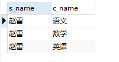

### 复杂查询

#### 环境

> student表
>
> 
>
> teacher表
>
> 
>
> course表
>
> 
>
> score表
>
> 

#### 连接查询

> sql
>
> ```sql
> select s_name,c_name from score sc
> inner join student s on s.s_id=sc.s_id
> inner join course c on c.c_id=sc.c_id
> where s.s_id=01
> ```
>
> 
>
> mybatis（Map获取结果集）
>
> ```java
> List<Map<String,Object>> getSelectCourse(int id);
> ```
>
> ```xml
>     <select id="getSelectCourse" resultMap="SelectCourse">
>             select s_name,c_name from score sc
>             inner join student s on s.s_id=sc.s_id
>             inner join course c on c.c_id=sc.c_id
>             where s.s_id=#{id}
>     </select>
>     <resultMap id="SelectCourse" type="map">
>         <result property="sname" column="s_name"/>
>         <result property="cname" column="c_name"/>
>     </resultMap>
> ```
>
> ```java
>     @Test
>     public void getSelectCourseTest(){
>         SqlSession s = MybatisUntil.getSqlSession();
>         StudentMapper mapper = s.getMapper(StudentMapper.class);
>         List<Map<String, Object>> res = mapper.getSelectCourse(01);
>         res.forEach(System.out::println);
>         s.close();
>     }
> ```
>
> 
>
> mybatis（pojo获取结果，1对多模型）
>
> 
>
> 
>
> ```java
> List<Student> getSelectCourse2(int id);
> ```
>
> ```xml
>     <select id="getSelectCourse2" resultMap="SelectCourse2">
>             select s_name,c_name from score sc
>             inner join student s on s.s_id=sc.s_id
>             inner join course c on c.c_id=sc.c_id
>             where s.s_id=#{id}
>     </select>
>     <resultMap id="SelectCourse2" type="com.zlp.pojo.Student">
>         <result property="name" column="s_name"/>
> <!--        <association property="course" javaType="com.zlp.pojo.Course">
>             <result property="name" column="c_name"/>
>         </association>-->
>         <collection property="courses" javaType="list" ofType="com.zlp.pojo.Course">
>             <result property="name" column="c_name"/>
>         </collection>
>     </resultMap>
> ```
>
> ```java
>     @Test
>     public void getSelectCourseTest2(){
>         SqlSession s = MybatisUntil.getSqlSession();
>         StudentMapper mapper = s.getMapper(StudentMapper.class);
>         List<Student> res = mapper.getSelectCourse2(01);
>         // 结果集大小
>         System.out.println(res.size());
>         res.forEach(System.out::println);
>         s.close();
>     }
> ```
>
> ```
> 结果
> 1
> Student(id=null, name=赵雷, age=0, sex=null, courses=[Course(id=null, name=语文, tid=null), Course(id=null, name=数学, tid=null), Course(id=null, name=英语, tid=null)])
> ```
>

#### 嵌套查询

> sql
>
> ```sql
> select * from student where s_id in (select s_id from score where c_id=1 and score>60)
> ```
>
> 
>
> mybatis
>
> ```java
> List<Student> getSelectCourse3();
> ```
>
> ```xml
>     <select id="getSelectCourse3" resultMap="SelectStudent">
>         select * from student where s_id in (select s_id from score where c_id=1 and score>60)
>     </select>
>     <resultMap id="SelectStudent" type="com.zlp.pojo.Student">
>         <result property="name" column="s_name"/>
>         <result property="id" column="s_id"/>
>         <result property="sex" column="s_sex"/>
>         <result property="birth" column="s_birth"/>
>     </resultMap>
> ```
>
> ```java
>     @Test
>     public void getSelectCourse3(){
>         SqlSession s = MybatisUntil.getSqlSession();
>         StudentMapper mapper = s.getMapper(StudentMapper.class);
>         List<Student> res = mapper.getSelectCourse3();
>         res.forEach(System.out::println);
>         s.close();
>     }
> ```
>
> 

#### Mybais关联嵌套查询

> 形式：使用两个select嵌套查询的形式来表现出连接查询的效果
>
> sql
>
> ```sql
> select * from student s left join score sc on s.s_id=sc.s_id
> where c_id=01
> ```
>
> 
>
> mybatis
>
> ```java
> @Data
> public class Student1 {
>     private String id;
>     private String name;
>     private String birth;
>     private String sex;
>     private Score score;
> }
> 
> @Data
> public class Score {
>     private String c_id;
>     private String s_id;
>     private int score;
> 
> }
> ```
>
> ```java
> List<Student1> getStudent();
> ```
>
> ```xml
>     <select id="getStudent" resultMap="Student">
>         select * from student
>     </select>
> 
> 	<select id="getScore" resultType="com.zlp.pojo.Score">
>         select c_id,s_id,score from score where s_id=#{sid} and c_id=01
>     </select>
> 
>     <resultMap id="Student" type="com.zlp.pojo.Student1">
>         <result property="id" column="id"/>
>         <result property="name" column="s_name"/>
>         <result property="birth" column="s_birth" />
>         <result property="sex" column="s_sex"/>
>         <association property="score" javaType="com.zlp.pojo.Score" select="getScore" column="s_id">
>             <id property="cid" column="c_id"/>
>             <result property="sid" column="s_id"/>
>             <result property="score" column="score"/>
>         </association>
>     </resultMap>
> ```
>
> ```java
> @Test
> public void getStudentTest(){
>     SqlSession s = MybatisUntil.getSqlSession();
>     StudentMapper mapper = s.getMapper(StudentMapper.class);
>     List<Student1> res = mapper.getStudent();
>     res.forEach(System.out::println);
>     s.close();
> }
> ```
>
> 

> 可以看出mybatis关联查询实际上进行了两边查询，第一遍查询所有student表，第二遍依次拿student结果集中的id去执行第二个查询语句
>
> 关联查询限制：
>
> 1. association标签的关联查询结果只能为一条记录，本质上是将结果集作为一个对象看待，不能出现多条记录
> 2. 关联查询必须传递`column="s_id"`属性
> 3. 关联查询的映射变量名不用和`column="s_id"`属性值相同，mybatis会自动映射

#### 复杂结果集映射示例

> sql
>
> ```sql
> select s.s_id,s_name,s_birth,s_sex,c.c_id,c_name,score,t.t_id,t_name from student s
> left join score sc on s.s_id=sc.s_id
> left join course c on sc.c_id=c.c_id
> left join teacher t on t.t_id = c.t_id
> order by s_id
> ```
>
> 
>
> mybatis
>
> ```java
> @Data
> public class Student {
>     private String id;
>     private String name;
>     private String birth;
>     private String sex;
>     private List<Course> courses;
> }
> 
> @Data
> public class Course {
>     private String id;
>     private String name;
>     private int score;
>     private Teacher teacher;
> }
> 
> @Data
> public class Teacher {
>     private String id;
>     private String name;
> }
> ```
>
> ```java
> List<Student> getAllInfo();
> ```
>
> ```xml
>     <select id="getAllInfo" resultMap="AllInfo">
>         select s.s_id,s_name,s_birth,s_sex,c.c_id,c_name,score,t.t_id,t_name from student s
>         left join score sc on s.s_id=sc.s_id
>         left join course c on sc.c_id=c.c_id
>         left join teacher t on t.t_id = c.t_id
>         order by s_id
>     </select>
>     <resultMap id="AllInfo" type="com.zlp.pojo.Student">
>         <result property="id" column="s_id"/>
>         <result property="name" column="s_name"/>
>         <result property="birth" column="s_birth" />
>         <result property="sex" column="s_sex"/>
>         <collection property="courses" ofType="com.zlp.pojo.Course">
>             <result property="id" column="c_id"/>
>             <result property="name" column="c_name"/>
>             <result property="score" column="score" />
>             <association property="teacher" javaType="com.zlp.pojo.Teacher">
>                 <result property="id" column="t_id"/>
>                 <result property="name" column="t_name"/>
>             </association>
>         </collection>
> ```
>
> ```java
>     @Test
>     public void getAllInfoTest(){
>         SqlSession s = MybatisUntil.getSqlSession();
>         StudentMapper mapper = s.getMapper(StudentMapper.class);
>         List<Student> res = mapper.getAllInfo();
>         res.forEach(System.out::println);
>         s.close();
>     }
> ```
>
> ```
> 结果
> Student(id=01, name=赵雷, birth=1990-01-01, sex=男, courses=[Course(id=01, name=语文, score=80, teacher=Teacher(id=02, name=李四)), Course(id=02, name=数学, score=90, teacher=Teacher(id=01, name=张三)), Course(id=03, name=英语, score=99, teacher=Teacher(id=03, name=王五))])
> Student(id=02, name=钱电, birth=1990-12-21, sex=男, courses=[Course(id=01, name=语文, score=70, teacher=Teacher(id=02, name=李四)), Course(id=02, name=数学, score=60, teacher=Teacher(id=01, name=张三)), Course(id=03, name=英语, score=80, teacher=Teacher(id=03, name=王五))])
> Student(id=03, name=孙风, birth=1990-05-20, sex=男, courses=[Course(id=01, name=语文, score=80, teacher=Teacher(id=02, name=李四)), Course(id=02, name=数学, score=80, teacher=Teacher(id=01, name=张三)), Course(id=03, name=英语, score=80, teacher=Teacher(id=03, name=王五))])
> Student(id=04, name=李云, birth=1990-08-06, sex=男, courses=[Course(id=01, name=语文, score=50, teacher=Teacher(id=02, name=李四)), Course(id=02, name=数学, score=30, teacher=Teacher(id=01, name=张三)), Course(id=03, name=英语, score=20, teacher=Teacher(id=03, name=王五))])
> Student(id=05, name=周梅, birth=1991-12-01, sex=女, courses=[Course(id=01, name=语文, score=76, teacher=Teacher(id=02, name=李四)), Course(id=02, name=数学, score=87, teacher=Teacher(id=01, name=张三))])
> Student(id=06, name=吴兰, birth=1992-03-01, sex=女, courses=[Course(id=01, name=语文, score=31, teacher=Teacher(id=02, name=李四)), Course(id=03, name=英语, score=34, teacher=Teacher(id=03, name=王五))])
> Student(id=07, name=郑竹, birth=1989-07-01, sex=女, courses=[Course(id=02, name=数学, score=89, teacher=Teacher(id=01, name=张三)), Course(id=03, name=英语, score=98, teacher=Teacher(id=03, name=王五))])
> Student(id=08, name=王菊, birth=1990-01-20, sex=女, courses=[])
> Student(id=09, name=赵雷, birth=1990-01-21, sex=女, courses=[])
> Student(id=10, name=赵雷, birth=1990-01-22, sex=男, courses=[])
> ```

#### 总结

> 使用Mybatis进行复杂查询的关键点在于结果集的映射，不在于sql编写
>
> 若sql使用连接查询，结果集中包含所有需要的字段，那么只需要进行结果集映射
>
> 若一个sql查询的结果集合中缺少字段，那么可以使用关联查询的方式添加额外的结果集合
>
> `使用原生sql查询的效率要比关联查询高`