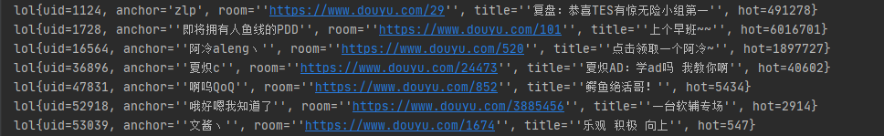
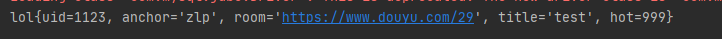
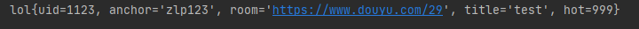

### 注解实现CRUD

#### 将接口注册为映射器

> ```xml
> <mappers>
>     <mapper class="com.zlp.dao.User"/>
> </mappers>
> ```

#### 查询

> 1. 在方法上添加注释，在注释中编辑SQL
>
>    ```java
>    public interface User {
>        @Select("select * from lol")
>        public List<lol> getAll();
>    }
>    ```
>
> 2. service接口（service层代码不变）
>
>    ```java
>    public interface  Query {
>        public void queryAll();
>    }
>    ```
>
> 3. service实现类调用（service层代码不变，同样使用SqlSession类获取映射器调用映射器方法）
>
>    ```java
>        public void queryAll() {
>            SqlSession s = MybatisUntil.getSqlSession();
>            User mapper = s.getMapper(User.class);
>            List<lol> results = mapper.getAll();
>            results.forEach(System.out::println);
>            s.close();
>        }
>    ```
>
> 4. 测试（代码不变）
>
>    ```java
>    @Test
>    public void getALLTest(){
>        Query query = new QueryImpl();
>        query.queryAll();
>    }
>    ```
>
>    

#### 增加

> 1. 添加注释
>
>    ```java
>        @Insert("insert into lol(uid,anchor,room,title,hot) values(#{uid},#{anchor},#{room},#{title},#{hot})")
>        public int insertOne(lol l);
>    ```
>
> 2. 测试
>    

#### 修改

> 1. 添加注释
>
>    ```java
>    @Update("update lol set anchor=#{anchor} where uid=#{uid}")
>    public int update(lol l);
>    ```
>
> 2. 测试
>
>    ```java
>        @Test
>        public void updateTest(){
>            Query query = new QueryImpl();
>            lol l = new lol();
>            l.setUid(1123);
>            l.setAnchor("zlp123");
>            query.update(l);
>        }
>    ```
>
>    
>
>    
>    

#### 删除

> 1. 添加注释
>
>    ```java
>    @Delete("delete from lol where uid=#{uid}")
>    public int deleteById(@Param("uid") int uid);
>    ```
>
> 2. 测试
>    
>
> `@Param("uid")`注解将形参映射到uid命名，映射器执行解析sql动作时将根据这个标识名去获取参数，实现参数映射效果

#### 总结

> 使用注解来映射简单语句会使代码显得更加简洁，但对于稍微复杂一点的语句，Java 注解不仅力不从心，还会让你本就复杂的 SQL 语句更加混乱不堪。 因此，如果你需要做一些很复杂的操作，最好用 XML 来映射语句。

