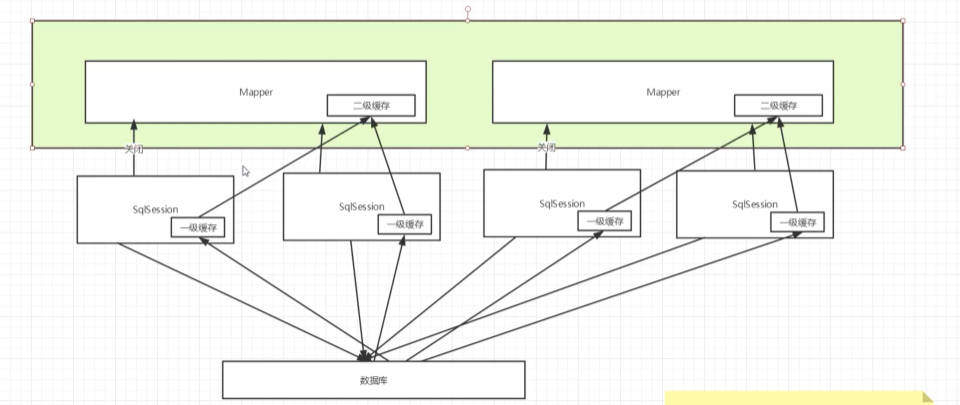

### 缓存使用

#### 一级缓存测试

##### 缓存生效

> ```xml
>     <select id="getStudentById" resultType="Student">
>         select * from student where s_id=#{id}
>     </select>
> ```
>
> ```java
> @Test
> public void getStudentByIdTest(){
>     SqlSession s = MybatisUnitl.getSqlSession();
>     StudentMapper mapper = s.getMapper(StudentMapper.class);
>     Student res1 = mapper.getStudentById("01");
>     System.out.println(res1);
>     System.out.println("===============");
> 
>     Student res2= mapper.getStudentById("01");
>     System.out.println(res2);
>     System.out.println(res1==res2);
> }
> ```
>
> 
>
> 1. 创建连接
> 2. 执行mapper.getStudentById("01");进行查询得到结果res1
> 3. 第二次mapper.getStudentById("01");得到结果res2，并没有进行数据库查询
> 4. 判断两个对象完全相同，内存地址一致

##### 对照清除缓存

> ```java
>     @Test
>     public void getStudentByIdTest(){
>         SqlSession s = MybatisUnitl.getSqlSession();
>         StudentMapper mapper = s.getMapper(StudentMapper.class);
>         Student res1 = mapper.getStudentById("01");
>         System.out.println(res1);
>         System.out.println("===============");
>         // 清除缓存
>         s.clearCache();
>         Student res2= mapper.getStudentById("01");
>         System.out.println(res2);
>         System.out.println(res1==res2);
>         s.close();
>     }
> ```
>
> 
>
> 可以发现缓存清除后进行两次查询操作，且两次查询结果对象不一致

##### 所有 insert、update 和 delete 语句会刷新缓存

> ```xml
>     <insert id="insertStudent" parameterType="Student">
>         insert into student(s_id,s_name,s_birth,s_sex) values(#{s_id},#{s_name},#{s_birth},#{s_sex})
>     </insert>
> ```
>
> ```java
>     @Test
>     public void getStudentByIdTest(){
>         SqlSession s = MybatisUnitl.getSqlSession();
>         StudentMapper mapper = s.getMapper(StudentMapper.class);
>         Student res1 = mapper.getStudentById("01");
>         System.out.println(res1);
>         System.out.println("===============");
>         // 执行插入动作
>         mapper.insertStudent(new Student(11,"zlp","1998-11-16","男"));
>         Student res2= mapper.getStudentById("01");
>         System.out.println(res2);
>         System.out.println(res1==res2);
>         s.close();
>     }
> ```
>
> 
>
> 插入操作前后缓存进行了更新，原来的缓存被清除了

##### 一级缓存作用域：Sqlsession

> ```java
>     @Test
>     public void getStudentByIdTest(){
>         SqlSession s = MybatisUnitl.getSqlSession();
>         StudentMapper mapper = s.getMapper(StudentMapper.class);
>         Student res1 = mapper.getStudentById("01");
>         System.out.println(res1);
>         System.out.println("===============");
>         s.close();
>         s = MybatisUnitl.getSqlSession();
>         mapper = s.getMapper(StudentMapper.class);
>         Student res2= mapper.getStudentById("01");
>         System.out.println(res2);
>         System.out.println(res1==res2);
>         s.close();
>     }
> ```
>
> 
>
> SqlSession被释放后缓存立即清除，下一次从连接池中取出原来的连接后依然需要重新进行查询

#### 二级缓存测试

##### 生效缓存生效

> 开启二级缓存
>
> 1. 配置文件设置标签全局开启允许二级缓存（显示设置，提示使用二级缓存）
>    
> 2. mapper配置文件添加cache标签
>    
>
> ```java
>     @Test
>     public void getStudentByIdTest(){
>         SqlSession s = MybatisUnitl.getSqlSession();
>         StudentMapper mapper = s.getMapper(StudentMapper.class);
>         Student res1 = mapper.getStudentById("01");
>         System.out.println(res1);
>         System.out.println("===============");
>         Student res2= mapper.getStudentById("01");
>         System.out.println(res2);
>         System.out.println(res1==res2);
>         s.close();
>     }
> ```
>
> 

##### Sqlsession释放后缓存依然生效

> ```java
>     @Test
>     public void getStudentByIdTest(){
>         SqlSession s = MybatisUnitl.getSqlSession();
>         StudentMapper mapper = s.getMapper(StudentMapper.class);
>         Student res1 = mapper.getStudentById("01");
>         System.out.println(res1);
>         System.out.println("===============");
>         s.close();
>         s = MybatisUnitl.getSqlSession();
>         mapper = s.getMapper(StudentMapper.class);
>         Student res2= mapper.getStudentById("01");
>         System.out.println(res2);
>         System.out.println(res1==res2);
>         s.close();
>     }
> ```
>
> 
>
> 结果依然进行一次，但是两次对象的内存地址不一致了，因为会话关闭后缓存被保存到二级缓存中，地址发生了改变。
>
> 观察结果可以看到第二次调用mapper并没有再次获取一个数据库会话，而是直接获取了结果，这说明二级缓存具有较高的优先级

##### 所有 insert、update 和 delete 语句会刷新缓存

> ```java
>     @Test
>     public void getStudentByIdTest(){
>         SqlSession s = MybatisUnitl.getSqlSession();
>         StudentMapper mapper = s.getMapper(StudentMapper.class);
>         Student res1 = mapper.getStudentById("01");
>         System.out.println(res1);
>         System.out.println("===============");
>         // 执行插入动作
>         mapper.insertStudent(new Student(11,"zlp","1998-11-16","男"));
>         Student res2= mapper.getStudentById("01");
>         System.out.println(res2);
>         System.out.println(res1==res2);
>         s.close();
>     }
> ```
>
> 

#### 注意点

> 默认缓存配置
>
> 
>
> LRU策略要求pojo对象可序列化
>
> 
>
> cache其他配置
>
> ```xml
> <cache
>   eviction="FIFO"
>   flushInterval="60000"
>   size="512"
>   readOnly="true"/>
> ```
>
> 配置创建了一个 FIFO 缓存，每隔 60 秒刷新，最多可以存储结果对象或列表的 512 个引用，而且返回的对象被认为是只读的，因此对它们进行修改可能会在不同线程中的调用者产生冲突。
>
> **二级缓存是事务性的。这意味着，当 SqlSession 完成并提交时，或是完成并回滚，但没有执行 flushCache=true 的 insert/delete/update 语句时，缓存会获得更新。**
>
> 

#### 缓存执行流程

> 缓存流程
>
> 1. 数据库查询，结果保存到SqlSession缓存中
> 2. SqlSession关闭，缓存转移到mapper映射器中
>
> 
>
> 查询流程
>
> 1. 查询二级缓存是否存在
> 2. 查询一次缓存是否存在
> 3. 进行数据库查询

#### 自定义缓存-ehcache

> EhCache 是一个纯Java的进程内缓存框架，具有快速、精干等特点，是Hibernate中默认的CacheProvider。Ehcache是一种广泛使用的开源Java分布式缓存。主要面向通用缓存,Java EE和轻量级容器。它具有内存和磁盘存储，缓存加载器,缓存扩展,缓存异常处理程序,一个gzip缓存servlet过滤器,支持REST和SOAP api等特点。
>
> 可以内嵌到mybatis中
>
> 1. 导入依赖
>
>    ```xml
>            <dependency>
>                <groupId>org.mybatis.caches</groupId>
>                <artifactId>mybatis-ehcache</artifactId>
>                <version>1.1.0</version>
>            </dependency>
>    ```
>
> 2. 在mapper中配置
>
>    ```xml
>    <cache type="org.mybatis.caches.ehcache.EhcacheCache"/>
>    ```
>
> ehcache可以自定义缓存配置
>
> 
>
> 
>
> 自定义缓存会覆盖二级缓存

> 如今缓存大多数使用redis