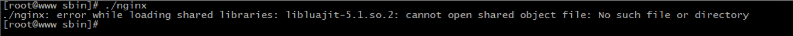
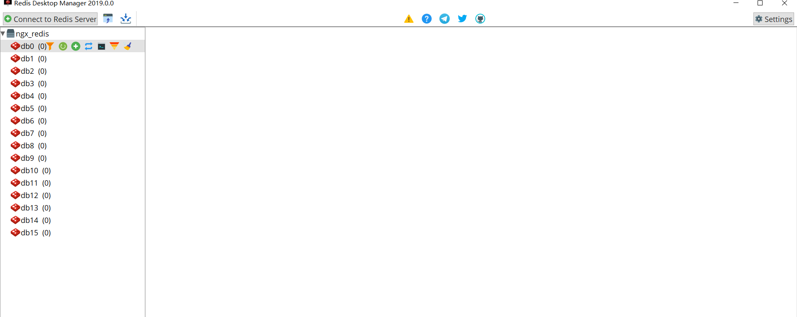
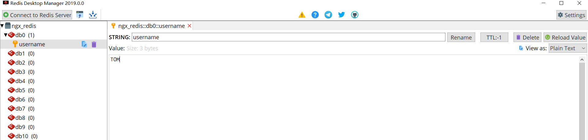

## ngx_lua模块概念

淘宝开发的ngx_lua模块通过将lua解释器集成进Nginx，可以采用lua脚本实现业务逻辑，由于lua的紧凑、快速以及内建协程，所以在保证高并发服务能力的同时极大地降低了业务逻辑实现成本。

## ngx_lua模块环境准备

### 方式一:lua-nginx-module

1. LuaJIT是采用C语言编写的Lua代表的解释器。

官网地址为:<http://luajit.org/>

在官网上找到对应的下载地址:http://luajit.org/download/LuaJIT-2.0.5.tar.gz

在centos上使用wget来下载: wget http://luajit.org/download/LuaJIT-2.0.5.tar.gz

将下载的资源进行解压: tar -zxf LuaJIT-2.0.5.tar.gz

进入解压的目录: cd LuaJIT-2.0.5

执行编译和安装: make && make install


2. 下载lua-nginx-module

下载地址:<https://github.com/openresty/lua-nginx-module/archive/v0.10.16rc4.tar.gz>

在centos上使用wget来下载: wget https://github.com/openresty/lua-nginx-module/archive/v0.10.16rc4.tar.gz

将下载的资源进行解压: tar -zxf lua-nginx-module-0.10.16rc4.tar.gz

更改目录名:mv lua-nginx-module-0.10.16rc4 lua-nginx-module

导入环境变量，告诉Nginx去哪里找luajit

```
export LUAJIT_LIB=/usr/local/lib
export LUAJIT_INC=/usr/local/include/luajit-2.0
```

进入Nginx的目录执行如下命令:

```
./configure --prefix=/usr/local/nginx --add-module=../lua-nginx-module
make && make install
```

注意事项:

（1）如果启动Nginx出现如下错误:



解决方案:

设置软链接，使用如下命令

```
 ln -s /usr/local/lib/libluajit-5.1.so.2 /lib64/libluajit-5.1.so.2
```

（2）如果启动Nginx出现以下错误信息


分析原因:因为lua-nginx-module是来自openrestry,错误中提示的resty.core是openrestry的核心模块，对其下的很多函数进行了优化等工作。以前的版本默认不会把该模块编译进去，所以需要使用的话，我们得手动安装，或者禁用就可以。但是最新的lua-nginx-module模块已经强制性安装了该模块，所以此处因为缺少resty模块导致的报错信息。

解决方案有两个:一种是下载对应的模块，另一种则是禁用掉restry模块，禁用的方式为:

```
http{
	lua_load_resty_core off;
}
```

3. 测试

在nginx.conf下配置如下内容:

```
location /lua{
    default_type 'text/html';
    content_by_lua 'ngx.say("<h1>HELLO,LUA</h1>")';
}
```

配置成功后，启动nginx,通过浏览器进行访问，如果获取到如下结果，则证明安装成功。


### 方式二:OpenRestry

#### 概述

​	前面我们提到过，OpenResty是由淘宝工程师开发的，所以其官方网站(<http://openresty.org/>)我们读起来是非常的方便。OpenResty是一个基于Nginx与 Lua 的高性能 Web 平台，其内部集成了大量精良的 Lua 库、第三方模块以及大多数的依赖项。用于方便地搭建能够处理超高并发、扩展性极高的动态 Web 应用、Web 服务和动态网关。所以本身OpenResty内部就已经集成了Nginx和Lua，所以我们使用起来会更加方便。

#### 安装

```
(1) 下载OpenResty：https://openresty.org/download/openresty-1.15.8.2.tar.gz
(2)使用wget下载: wget https://openresty.org/download/openresty-1.15.8.2.tar.gz
(3)解压缩: tar -zxf openresty-1.15.8.2.tar.gz
(4)进入OpenResty目录: cd openresty-1.15.8.2
(5) 执行命令:./configure
(6) 执行命令:make && make install
(7)进入OpenResty的目录，找到nginx：cd /usr/local/openresty/nginx/
(8)在conf目录下的nginx.conf添加如下内容
location /lua{
    default_type 'text/html';
    content_by_lua 'ngx.say("<h1>HELLO,OpenRestry</h1>")';
}
(9)在sbin目录下启动nginx
(10)通过浏览器访问测试
```


## ngx_lua的使用

使用Lua编写Nginx脚本的基本构建块是指令。指令用于指定何时运行用户Lua代码以及如何使用结果。下图显示了执行指令的顺序。


先来解释下*的作用

```
*：无 ， 即 xxx_by_lua ,指令后面跟的是 lua指令
*:_file，即 xxx_by_lua_file 指令后面跟的是 lua文件
*:_block,即 xxx_by_lua_block 在0.9.17版后替换init_by_lua_file
```

### init_by_lua*

```
该指令在每次Nginx重新加载配置时执行，可以用来完成一些耗时模块的加载，或者初始化一些全局配置。
```

### init_worker_by_lua*

```
该指令用于启动一些定时任务，如心跳检查、定时拉取服务器配置等。
```

### set_by_lua*

```
该指令只要用来做变量赋值，这个指令一次只能返回一个值，并将结果赋值给Nginx中指定的变量。
```

### rewrite_by_lua*

```
该指令用于执行内部URL重写或者外部重定向，典型的如伪静态化URL重写，本阶段在rewrite处理阶段的最后默认执行。
```

### access_by_lua*

```
该指令用于访问控制。例如，如果只允许内网IP访问。
```

### content_by_lua*

```
该指令是应用最多的指令，大部分任务是在这个阶段完成的，其他的过程往往为这个阶段准备数据，正式处理基本都在本阶段。
```

### header_filter_by_lua*

```
该指令用于设置应答消息的头部信息。
```

### body_filter_by_lua*

```
该指令是对响应数据进行过滤，如截断、替换。
```

### log_by_lua*

```
该指令用于在log请求处理阶段，用Lua代码处理日志，但并不替换原有log处理。
```

### balancer_by_lua*

```
该指令主要的作用是用来实现上游服务器的负载均衡器算法
```

### ssl_certificate_by_*

```
该指令作用在Nginx和下游服务开始一个SSL握手操作时将允许本配置项的Lua代码。
```

### 需求:

```
http://192.168.200.133?name=张三&gender=1
Nginx接收到请求后，根据gender传入的值，如果gender传入的是1，则在页面上展示
张三先生,如果gender传入的是0，则在页面上展示张三女士,如果未传或者传入的不是1和2则在页面上展示张三。
```

实现代码

```
location /getByGender {
	default_type 'text/html';
	set_by_lua $name "
		local uri_args = ngx.req.get_uri_args()
		gender = uri_args['gender']
		name = uri_args['name']
		if gender=='1' then
			return name..'先生'
		elseif gender=='0' then
			return name..'女士'
		else
			return name
		end
	";
	header_filter_by_lua "
		ngx.header.aaa='bbb'
	";
	return 200 $name;
}
```


## ngx_lua操作Redis

Redis在系统中经常作为数据缓存、内存数据库使用，在大型系统中扮演着非常重要的作用。在Nginx核心系统中，Redis是常备组件。Nginx支持3种方法访问Redis,分别是HttpRedis模块、HttpRedis2Module、lua-resty-redis库。这三种方式中HttpRedis模块提供的指令少，功能单一，适合做简单缓存，HttpRedis2Module模块比HttpRedis模块操作更灵活，功能更强大。而Lua-resty-redis库是OpenResty提供的一个操作Redis的接口库，可根据自己的业务情况做一些逻辑处理，适合做复杂的业务逻辑。所以本次课程将主要以Lua-resty-redis来进行讲解。

### lua-resty-redis环境准备

步骤一:准备一个Redis环境

```
连接地址
host= 192.168.200.111
port=6379
```



步骤二:准备对应的API

```
lua-resty-redis提供了访问Redis的详细API，包括创建对接、连接、操作、数据处理等。这些API基本上与Redis的操作一一对应。
（1）redis = require "resty.redis"
（2）new
	语法: redis,err = redis:new(),创建一个Redis对象。
（3）connect
	语法:ok,err=redis:connect(host,port[,options_table]),设置连接Redis的连接信息。
	ok:连接成功返回 1，连接失败返回nil
	err:返回对应的错误信息
（4）set_timeout
	语法: redis:set_timeout(time) ，设置请求操作Redis的超时时间。
（5）close
	语法: ok,err = redis:close(),关闭当前连接，成功返回1，失败返回nil和错误信息
（6）redis命令对应的方法
	在lua-resty-redis中，所有的Redis命令都有自己的方法，方法名字和命令名字相同，只是全部为小写。

```

步骤三:效果实现

```
location / {
    default_type "text/html";
    content_by_lua_block{
        local redis = require "resty.redis" -- 引入Redis
        local redisObj = redis:new()  --创建Redis对象
        redisObj:set_timeout(1000) --设置超时数据为1s
        local ok,err = redisObj:connect("192.168.200.1",6379) --设置redis连接信息
        if not ok then --判断是否连接成功
         ngx.say("failed to connection redis",err)
         return
        end
        ok,err = redisObj:set("username","TOM")--存入数据
        if not ok then --判断是否存入成功
         ngx.say("failed to set username",err)
         return
        end
        local res,err = redisObj:get("username") --从redis中获取数据
        ngx.say(res)	--将数据写会消息体中
        redisObj:close()
    }
}
```

步骤四:运行测试效果





## ngx_lua操作Mysql

MySQL是一个使用广泛的关系型数据库。在ngx_lua中，MySQL有两种访问模式,分别是使

（1）用ngx_lua模块和lua-resty-mysql模块：这两个模块是安装OpenResty时默认安装的。

（2）使用drizzle_nginx_module(HttpDrizzleModule)模块：需要单独安装，这个库现不在OpenResty中。

### lua-resty-mysql

lua-resty-mysql是OpenResty开发的模块，使用灵活、功能强大，适合复杂的业务场景，同时支持存储过程的访问。

#### 使用lua-resty-mysql实现数据库的查询

步骤一:

准备MYSQL

```
host: 192.168.200.111
port: 3306
username:root
password:123456
```

创建一个数据库表及表中的数据。

```
create database nginx_db;

use nginx_db;

create table users(
   id int primary key auto_increment,
   username varchar(30),
   birthday date,
   salary double
);

insert into users(id,username,birthday,salary) values(null,"TOM","1988-11-11",10000.0);
insert into users(id,username,birthday,salary) values(null,"JERRY","1989-11-11",20000.0);
insert into users(id,username,birthday,salary) values(null,"ROWS","1990-11-11",30000.0);
insert into users(id,username,birthday,salary) values(null,"LUCY","1991-11-11",40000.0);
insert into users(id,username,birthday,salary) values(null,"JACK","1992-11-11",50000.0);
```

数据库连接四要素:

```
driverClass=com.mysql.jdbc.Driver
url=jdbc:mysql://192.168.200.111:3306/nginx_db
username=root
password=123456
```

步骤二:API学习

```
（1）引入"resty.mysql"模块
	local mysql = require "resty.mysql"
（2）new
	创建一个MySQL连接对象，遇到错误时，db为nil，err为错误描述信息
	语法: db,err = mysql:new()
（3）connect
	尝试连接到一个MySQL服务器
	语法:ok,err=db:connect(options),options是一个参数的Lua表结构，里面包含数据库连接的相关信息
    host:服务器主机名或IP地址
    port:服务器监听端口，默认为3306
    user:登录的用户名
    password:登录密码
    database:使用的数据库名
（4）set_timeout
	设置子请求的超时时间(ms)，包括connect方法
	语法:db:set_timeout(time)
（5）close
	关闭当前MySQL连接并返回状态。如果成功，则返回1；如果出现任何错误，则将返回nil和错误描述。
	语法:db:close()
（6）send_query
	异步向远程MySQL发送一个查询。如果成功则返回成功发送的字节数；如果错误，则返回nil和错误描述
	语法:bytes,err=db:send_query(sql)
（7）read_result
	从MySQL服务器返回结果中读取一行数据。res返回一个描述OK包或结果集包的Lua表,语法:
	res, err, errcode, sqlstate = db:read_result() 
	res, err, errcode, sqlstate = db:read_result(rows) :rows指定返回结果集的最大值，默认为4
	如果是查询，则返回一个容纳多行的数组。每行是一个数据列的key-value对，如

    {
      {id=1,username="TOM",birthday="1988-11-11",salary=10000.0},
      {id=2,username="JERRY",birthday="1989-11-11",salary=20000.0}
    }
	如果是增删改，则返回类上如下数据
    {
    	insert_id = 0,
    	server_status=2,
    	warning_count=1,
    	affected_rows=2,
    	message=nil
    }
	返回值:
		res:操作的结果集
		err:错误信息
		errcode:MySQL的错误码，比如1064
		sqlstate:返回由5个字符组成的标准SQL错误码，比如42000

```

步骤三:效果实现

```
location /{
    content_by_lua_block{
        local mysql = require "resty.mysql"
        local db = mysql:new()
        local ok,err = db:connect{
            host="192.168.200.111",
            port=3306,
            user="root",
            password="123456",
            database="nginx_db"
        }
        db:set_timeout(1000)

        db:send_query("select * from users where id =1")
        local res,err,errcode,sqlstate = db:read_result()
        	ngx.say(res[1].id..","..res[1].username..","..res[1].birthday..","..res[1].salary)
    	db:close()
    }

}
```


问题:

```
1.如何获取返回数据的内容
2.如何实现查询多条数据
3.如何实现数据库的增删改操作
```


#### 使用lua-cjson处理查询结果

通过上述的案例学习，read_result()得到的结果res都是table类型，要想在页面上展示，就必须知道table的具体数据结构才能进行遍历获取。处理起来比较麻烦，接下来我们介绍一种简单方式cjson，使用它就可以将table类型的数据转换成json字符串，把json字符串展示在页面上即可。具体如何使用?

步骤一：引入cjson

```
local cjson = require "cjson"
```

步骤二：调用cjson的encode方法进行类型转换

```
cjson.encode(res) 
```

步骤三:使用

```
location /{
    content_by_lua_block{

        local mysql = require "resty.mysql"
        local cjson = require "cjson"

        local db = mysql:new()

        local ok,err = db:connect{
            host="192.168.200.111",
            port=3306,
            user="root",
            password="123456",
            database="nginx_db"
        }
        db:set_timeout(1000)

        --db:send_query("select * from users where id = 2")
        db:send_query("select * from users")
        local res,err,errcode,sqlstate = db:read_result()
        ngx.say(cjson.encode(res))
         for i,v in ipairs(res) do
       ngx.say(v.id..","..v.username..","..v.birthday..","..v.salary)
        end
    	db:close()
    }

}
```


#### lua-resty-mysql实现数据库的增删改

优化send_query和read_result

本方法是send_query和read_result组合的快捷方法。

语法:

```
res, err, errcode, sqlstate = db:query(sql[,rows])
```

有了该API，上面的代码我们就可以进行对应的优化，如下:

```
location /{
    content_by_lua_block{

        local mysql = require "resty.mysql"

        local db = mysql:new()

        local ok,err = db:connect{
        host="192.168.200.1",
        port=3306,
        user="root",
        password="123456",
        database="nginx_db",
        max_packet_size=1024,
        compact_arrays=false
        }
        db:set_timeout(1000)
        local res,err,errcode,sqlstate = db:query("select * from users")
        --local res,err,errcode,sqlstate = db:query("insert into users(id,username,birthday,salary) values(null,'zhangsan','2020-11-11',32222.0)")
        --local res,err,errcode,sqlstate = db:query("update users set username='lisi' where id = 6")
        --local res,err,errcode,sqlstate = db:query("delete from users where id = 6")
        db:close()
    }

}
```


### 综合小案例

使用ngx_lua模块完成Redis缓存预热。

分析: 

（1）先得有一张表(users)

（2）浏览器输入如下地址

```
http://191.168.200.133?username=TOM
```

（3）从表中查询出符合条件的记录，此时获取的结果为table类型

（4）使用cjson将table数据转换成json字符串

（5）将查询的结果数据存入Redis中

```
init_by_lua_block{

	redis = require "resty.redis"
    mysql = require "resty.mysql"
    cjson = require "cjson"
}
location /{
			default_type "text/html";
			content_by_lua_block{
				
				--获取请求的参数username
				local param = ngx.req.get_uri_args()["username"]
				--建立mysql数据库的连接
				local db = mysql:new()
				local ok,err = db:connect{
					host="192.168.200.111",
					port=3306,
					user="root",
					password="123456",
					database="nginx_db"
				}
				if not ok then
				 ngx.say("failed connect to mysql:",err)
				 return
				end
				--设置连接超时时间
				db:set_timeout(1000)
				--查询数据
				local sql = "";
				if not param then
					sql="select * from users"
				else
					sql="select * from users where username=".."'"..param.."'"
				end
				local res,err,errcode,sqlstate=db:query(sql)
				if not res then
				 ngx.say("failed to query from mysql:",err)
				 return
				end
				--连接redis
				local rd = redis:new()
				ok,err = rd:connect("192.168.200.111",6379)
				if not ok then
				 ngx.say("failed to connect to redis:",err)
				 return
				end
				rd:set_timeout(1000)
				--循环遍历数据
				for i,v in ipairs(res) do
				 rd:set("user_"..v.username,cjson.encode(v))
				end
				ngx.say("success")
				rd:close()
				db:close()
			}
			
		}
```

