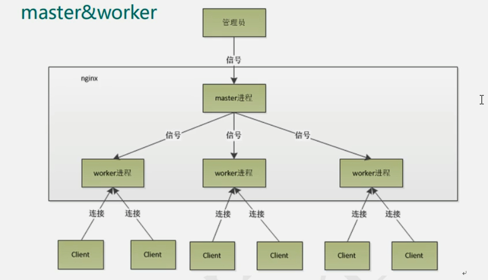
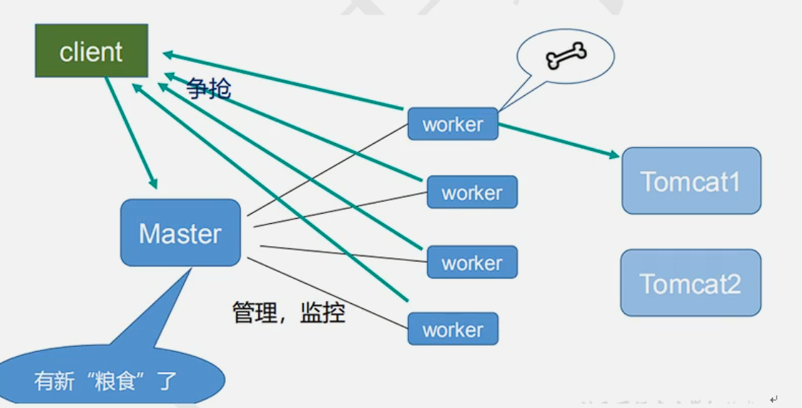
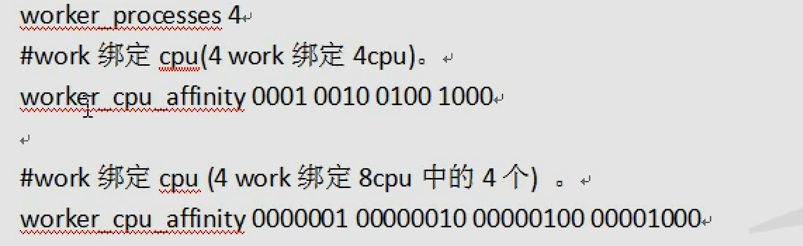
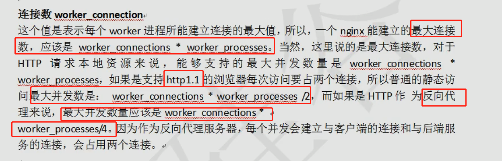

### Nginx架构






### 信号

根据管理员给master进程传递信号，可以做到对nginx的控制

#### 信号种类

| 信号     | 作用                                                       |
| -------- | ---------------------------------------------------------- |
| TERM/INT | 立即关闭整个服务                                           |
| QUIT     | "优雅"地关闭整个服务                                       |
| HUP      | 重读配置文件并使用服务对新配置项生效                       |
| USR1     | 重新打开日志文件，可以用来进行日志切割                     |
| USR2     | 平滑升级到最新版的nginx                                    |
| WINCH    | 所有子进程不在接收处理新连接，相当于给work进程发送QUIT指令 |

格式：调用命令为`kill -signal PID`

#### 示例

```
kill -TERM 13871 // 关闭所有ngnix进程，立即关闭
kill -QUIT 13871 // 关闭所有ngnix进程，处理完请求后关闭
kill -HUP 13871 // 执行后worker进程会重新创建，worker进程PID会改变
```

#### USR2信号

发送USR2信号给master进程，告诉master进程要平滑升级，这个时候，会重新开启对应的master进程和work进程，整个系统中将会有`两个master进程`，并且新的master进程的PID会被记录在`/usr/local/nginx/logs/nginx.pid`而之前的旧的master进程PID会被记录在`/usr/local/nginx/logs/nginx.pid.oldbin`文件中，接着再次发送QUIT信号给旧的master进程，让其处理完请求后再进行关闭


### 一master对多worker的好处

1. 可以使用nginx -s reload热部署：正在执行任务的worker不会立即重启，后续在重启，空闲的worker会重新加载配置文件，

2. 每个worker独立进程，不需要加锁，进程之间的故障不会互相影响

   


### worker相关配置

#### 设置worker数量




#### 设置worker连接数

一个请求占用的连接数

- 不使用反向代理的情况下，一个请求占用两个worker连接数
- 使用反向代理的情况下，一个请求占用四个worker连接数

