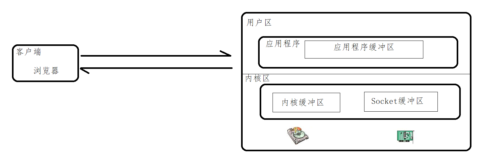
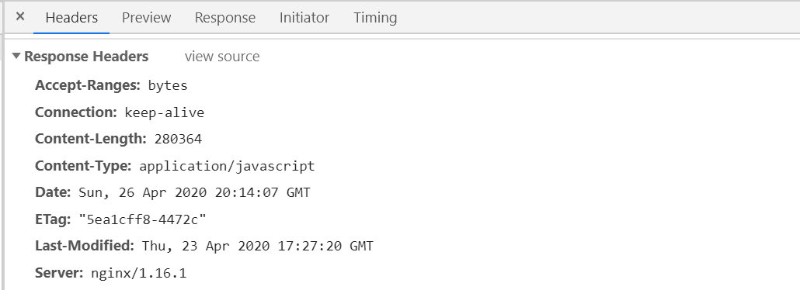

### Nginx处理静态资源

Nginx处理静态资源的内容，我们需要考虑下面这几个问题：

```
（1）静态资源的配置指令
（2）静态资源的配置优化
（3）静态资源的压缩配置指令
（4）静态资源的缓存处理
（5）静态资源的访问控制，包括跨域问题和防盗链问题
```

### 静态资源配置优化

Nginx对静态资源如何进行优化配置。这里从三个属性配置进行优化：

- `sendfile on`：用来开启高效的文件传输模式。

  | 语法   | sendfile on \|off;          |
  | ------ | ------------------------- |
  | 默认值 | sendfile off;               |
  | 位置   | http、server、location... |

  请求静态资源的过程：客户端通过网络接口向服务端发送请求，操作系统将这些客户端的请求传递给服务器端应用程序，服务器端应用程序会处理这些请求，请求处理完成以后，操作系统还需要将处理得到的结果通过网络适配器传递回去。

  如：

  ```
  server {
  	listen 80;
  	server_name localhost；
  	location / {
  		root html;
  		index index.html;
  	}
  }
  在html目录下有一个welcome.html页面，访问地址
  http://192.168.200.133/welcome.html
  ```

  

  

  

- `tcp_nopush on`：该指令必须在sendfile打开的状态下才会生效，主要是用来提升网络包的传输'效率'

  | 语法   | tcp_nopush on\|off;    |
  | ------ | ---------------------- |
  | 默认值 | tcp_nopush off;         |
  | 位置   | http、server、location |

- `tcp_nodeplay on`：该指令必须在keep-alive连接开启的情况下才生效，来提高网络包传输的'实时性'

  | 语法   | tcp_nodelay on\|off;   |
  | ------ | ---------------------- |
  | 默认值 | tcp_nodelay on;        |
  | 位置   | http、server、location |

  


经过刚才的分析，"tcp_nopush"和”tcp_nodelay“看起来是"互斥的"，那么为什么要将这两个值都打开，这个大家需要知道的是在linux2.5.9以后的版本中两者是可以兼容的，三个指令都开启的好处是，sendfile可以开启高效的文件传输模式，tcp_nopush开启可以确保在发送到客户端之前数据包已经充分“填满”， 这大大减少了网络开销，并加快了文件发送的速度。 然后，当它到达最后一个可能因为没有“填满”而暂停的数据包时，Nginx会忽略tcp_nopush参数， 然后，tcp_nodelay强制套接字发送数据。由此可知，TCP_NOPUSH可以与TCP_NODELAY一起设置，它比单独配置TCP_NODELAY具有更强的性能。所以我们可以使用如下配置来优化Nginx静态资源的处理

```
sendfile on;
tcp_nopush on;
tcp_nodelay on;
```

### 静态资源压缩

在Nginx的配置文件中可以通过配置gzip来对静态资源进行压缩，相关的指令可以配置在http块、server块和location块中，Nginx可以通过

```
ngx_http_gzip_module模块
ngx_http_gzip_static_module模块
ngx_http_gunzip_module模块
```

对这些指令进行解析和处理。

接下来我们从以下内容进行学习

```
（1）Gzip各模块支持的配置指令
（2）Gzip压缩功能的配置
（3）Gzip和sendfile的冲突解决
（4）浏览器不支持Gzip的解决方案
```

#### Gzip模块配置指令

接下来所学习的指令都来自ngx_http_gzip_module模块，该模块会在nginx安装的时候内置到nginx的安装环境中，也就是说我们可以直接使用这些指令。

1. gzip指令：该指令用于开启或者关闭gzip功能

| 语法   | gzip on\|off;             |
| ------ | ------------------------- |
| 默认值 | gzip off;                 |
| 位置   | http、server、location... |

注意只有该指令为打开状态，下面的指令才有效果

```
http{
   gzip on;
}
```

2. gzip_types指令：该指令可以根据响应页的MIME类型选择性地开启Gzip压缩功能

| 语法   | gzip_types mime-type ...; |
| ------ | ------------------------- |
| 默认值 | gzip_types text/html;     |
| 位置   | http、server、location    |

所选择的值可以从mime.types文件中进行查找，也可以使用"*"代表所有。

```
http{
	gzip_types application/javascript;
}
```

3. gzip_comp_level指令：该指令用于设置Gzip压缩程度，级别从1-9,1表示要是程度最低，要是效率最高，9刚好相反，压缩程度最高，但是效率最低最费时间。

| 语法   | gzip_comp_level level; |
| ------ | ---------------------- |
| 默认值 | gzip_comp_level 1;     |
| 位置   | http、server、location |

```
http{
	gzip_comp_level 6;
}
```

4. gzip_vary指令：该指令用于设置使用Gzip进行压缩发送是否携带“Vary:Accept-Encoding”头域的响应头部。主要是告诉接收方，所发送的数据经过了Gzip压缩处理

| 语法   | gzip_vary on\|off;     |
| ------ | ---------------------- |
| 默认值 | gzip_vary off;         |
| 位置   | http、server、location |


5. gzip_buffers指令：该指令用于处理请求压缩的缓冲区数量和大小。

| 语法   | gzip_buffers number size;  |
| ------ | -------------------------- |
| 默认值 | gzip_buffers 32 4k\|16 8k; |
| 位置   | http、server、location     |

其中number:指定Nginx服务器向系统申请缓存空间个数，size指的是每个缓存空间的大小。主要实现的是申请number个每个大小为size的内存空间。这个值的设定一般会和服务器的操作系统有关，所以建议此项不设置，使用默认值即可。

```
gzip_buffers 4 16K;	  #缓存空间大小
```


6. gzip_disable指令：针对不同种类客户端发起的请求，可以选择性地开启和关闭Gzip功能。

| 语法   | gzip_disable regex ...; |
| ------ | ----------------------- |
| 默认值 | —                       |
| 位置   | http、server、location  |

regex:根据客户端的浏览器标志(user-agent)来设置，支持使用正则表达式。指定的浏览器标志不使用Gzip.该指令一般是用来排除一些明显不支持Gzip的浏览器。

```
gzip_disable "MSIE [1-6]\.";
```


7. gzip_http_version指令：针对不同的HTTP协议版本，可以选择性地开启和关闭Gzip功能。

| 语法   | gzip_http_version 1.0\|1.1; |
| ------ | --------------------------- |
| 默认值 | gzip_http_version 1.1;      |
| 位置   | http、server、location      |

该指令是指定使用Gzip的HTTP最低版本，该指令一般采用默认值即可。

8. gzip_min_length指令：该指令针对传输数据的大小，可以选择性地开启和关闭Gzip功能

| 语法   | gzip_min_length length; |
| ------ | ----------------------- |
| 默认值 | gzip_min_length 20;     |
| 位置   | http、server、location  |

```
nginx计量大小的单位：bytes[字节] / kb[千字节] / M[兆]
例如: 1024 / 10k|K / 10m|M
```

Gzip压缩功能对大数据的压缩效果明显，但是如果要压缩的数据比较小的化，可能出现越压缩数据量越大的情况，因此我们需要根据响应内容的大小来决定是否使用Gzip功能，响应页面的大小可以通过头信息中的`Content-Length`来获取。但是如何使用了Chunk编码动态压缩，该指令将被忽略。建议设置为1K或以上。

9. gzip_proxied指令：该指令设置是否对服务端返回的结果进行Gzip压缩。

| 语法   | gzip_proxied  off\|expired\|no-cache\|<br/>no-store\|private\|no_last_modified\|no_etag\|auth\|any; |
| ------ | ------------------------------------------------------------ |
| 默认值 | gzip_proxied off;                                            |
| 位置   | http、server、location                                       |

off - 关闭Nginx服务器对后台服务器返回结果的Gzip压缩
expired - 启用压缩，如果header头中包含 "Expires" 头信息
no-cache - 启用压缩，如果header头中包含 "Cache-Control:no-cache" 头信息
no-store - 启用压缩，如果header头中包含 "Cache-Control:no-store" 头信息
private - 启用压缩，如果header头中包含 "Cache-Control:private" 头信息
no_last_modified - 启用压缩,如果header头中不包含 "Last-Modified" 头信息
no_etag - 启用压缩 ,如果header头中不包含 "ETag" 头信息
auth - 启用压缩 , 如果header头中包含 "Authorization" 头信息
any - 无条件启用压缩

#### Gzip压缩功能的实例配置

```
gzip on;  			  #开启gzip功能
gzip_types *;		  #压缩源文件类型,根据具体的访问资源类型设定
gzip_comp_level 6;	  #gzip压缩级别
gzip_min_length 1024; #进行压缩响应页面的最小长度,content-length
gzip_buffers 4 16K;	  #缓存空间大小
gzip_http_version 1.1; #指定压缩响应所需要的最低HTTP请求版本
gzip_vary  on;		  #往头信息中添加压缩标识
gzip_disable "MSIE [1-6]\."; #对IE6以下的版本都不进行压缩
gzip_proxied  off； #nginx作为反向代理压缩服务端返回数据的条件
```

这些配置在很多地方可能都会用到，所以我们可以将这些内容抽取到一个配置文件中，然后通过include指令把配置文件再次加载到nginx.conf配置文件中，方法使用。

nginx_gzip.conf

```
gzip on;
gzip_types *;
gzip_comp_level 6;
gzip_min_length 1024;
gzip_buffers 4 16K;
gzip_http_version 1.1;
gzip_vary  on;
gzip_disable "MSIE [1-6]\.";
gzip_proxied  off;
```

nginx.conf

```
include nginx_gzip.conf
```

#### Gzip和sendfile共存问题

前面在讲解sendfile的时候，提到过，开启sendfile以后，在读取磁盘上的静态资源文件的时候，可以减少拷贝的次数，可以不经过用户进程将静态文件通过网络设备发送出去，但是Gzip要想对资源压缩，是需要经过用户进程进行操作的。所以如何解决两个设置的共存问题。

可以使用ngx_http_gzip_static_module模块的gzip_static指令来解决。

##### gzip_static指令

gzip_static: 检查与访问资源同名的.gz文件时，response中以gzip相关的header返回.gz文件的内容。

| 语法   | **gzip_static** on \| off \| always; |
| ------ | ------------------------------------ |
| 默认值 | gzip_static off;                     |
| 位置   | http、server、location               |

添加上述命令后，会报一个错误，`unknown directive "gzip_static"`主要的原因是Nginx默认是没有添加ngx_http_gzip_static_module模块。如何来添加?

##### 添加模块到Nginx的实现步骤

(1)查询当前Nginx的配置参数

```
nginx -V
```

(2)将nginx安装目录下sbin目录中的nginx二进制文件进行更名

```
cd /usr/local/nginx/sbin
mv nginx nginxold
```

(3) 进入Nginx的安装目录

```
cd /root/nginx/core/nginx-1.16.1
```

(4)执行make clean清空之前编译的内容

```
make clean
```

(5)使用configure来配置参数

```
./configure --with-http_gzip_static_module
```

(6)使用make命令进行编译

```
make
```

(7) 将objs目录下的nginx二进制执行文件移动到nginx安装目录下的sbin目录中

```
mv objs/nginx /usr/local/nginx/sbin
```

(8)执行更新命令

```
make upgrade
```

##### gzip_static测试使用

(1)直接访问`http://192.168.200.133/jquery.js`




(2)使用gzip命令进行压缩

```
cd /usr/local/nginx/html
gzip jquery.js
```

(3)再次访问`http://192.168.200.133/jquery.js`


### 客户端缓存设置

#### 浏览器缓存的执行流程

HTTP协议中和页面缓存相关的字段，我们先来认识下：

| header        | 说明                                        |
| ------------- | ------------------------------------------- |
| Expires       | 缓存过期的日期和时间                        |
| Cache-Control | 设置和缓存相关的配置信息                    |
| Last-Modified | 请求资源最后修改时间                        |
| ETag          | 请求变量的实体标签的当前值，比如文件的MD5值 |


（1）用户首次通过浏览器发送请求到服务端获取数据，客户端是没有对应的缓存，所以需要发送request请求来获取数据；

（2）服务端接收到请求后，获取服务端的数据及服务端缓存的允许后，返回200的成功状态码并且在响应头上附上对应资源以及缓存信息；

（3）当用户再次访问相同资源的时候，客户端会在浏览器的缓存目录中查找是否存在响应的缓存文件

（4）如果没有找到对应的缓存文件，则走(2)步

（5）如果有缓存文件，接下来对缓存文件是否过期进行判断，过期的判断标准是(Expires),

（6）如果没有过期，则直接从本地缓存中返回数据进行展示

（7）如果Expires过期，接下来需要判断缓存文件是否发生过变化

（8）判断的标准有两个，一个是ETag(Entity Tag),一个是Last-Modified

（9）判断结果是未发生变化，则服务端返回304，直接从缓存文件中获取数据

（10）如果判断是发生了变化，重新从服务端获取数据，并根据缓存协商(服务端所设置的是否需要进行缓存数据的设置)来进行数据缓存。

#### 浏览器缓存相关指令

Nginx需要进行缓存相关设置，就需要用到如下的指令

##### expires指令

expires:该指令用来控制页面缓存的作用。可以通过该指令控制HTTP应答中的“Expires"和”Cache-Control"

| 语法   | expires   [modified] time<br/>expires epoch\|max\|off; |
| ------ | ------------------------------------------------------ |
| 默认值 | expires off;                                           |
| 位置   | http、server、location                                 |

time:可以整数也可以是负数，指定过期时间，如果是负数，Cache-Control则为no-cache,如果为整数或0，则Cache-Control的值为max-age=time;

epoch: 指定Expires的值为'1 January,1970,00:00:01 GMT'(1970-01-01 00:00:00)，Cache-Control的值no-cache

max:指定Expires的值为'31 December2037 23:59:59GMT' (2037-12-31 23:59:59) ，Cache-Control的值为10年

off:默认不缓存。

##### add_header指令

add_header指令是用来添加指定的响应头和响应值。

| 语法   | add_header name value [always]; |
| ------ | ------------------------------- |
| 默认值 | —                               |
| 位置   | http、server、location...       |

Cache-Control作为响应头信息，可以设置如下值：

缓存响应指令：

```
Cache-control: must-revalidate
Cache-control: no-cache
Cache-control: no-store
Cache-control: no-transform
Cache-control: public
Cache-control: private
Cache-control: proxy-revalidate
Cache-Control: max-age=<seconds>
Cache-control: s-maxage=<seconds>
```

| 指令             | 说明                                           |
| ---------------- | ---------------------------------------------- |
| must-revalidate  | 可缓存但必须再向源服务器进行确认               |
| no-cache         | 缓存前必须确认其有效性                         |
| no-store         | 不缓存请求或响应的任何内容                     |
| no-transform     | 代理不可更改媒体类型                           |
| public           | 可向任意方提供响应的缓存                       |
| private          | 仅向特定用户返回响应                           |
| proxy-revalidate | 要求中间缓存服务器对缓存的响应有效性再进行确认 |
| max-age=<秒>     | 响应最大Age值                                  |
| s-maxage=<秒>    | 公共缓存服务器响应的最大Age值                  |

max-age=[秒]：


### 跨域问题

#### 同源策略

浏览器的同源策略：是一种约定，是浏览器最核心也是最基本的安全功能，如果浏览器少了同源策略，则浏览器的正常功能可能都会受到影响。

同源:  协议、域名(IP)、端口相同即为同源


#### 解决方案

使用add_header指令，该指令可以用来添加一些头信息

| 语法   | add_header name  value... |
| ------ | ------------------------- |
| 默认值 | —                         |
| 位置   | http、server、location    |

此处用来解决跨域问题，需要添加两个头信息，一个是`Access-Control-Allow-Origin`,`Access-Control-Allow-Methods`

Access-Control-Allow-Origin: 直译过来是允许跨域访问的源地址信息，可以配置多个(多个用逗号分隔)，也可以使用`*`代表所有源

Access-Control-Allow-Methods:直译过来是允许跨域访问的请求方式，值可以为 GET POST PUT DELETE...,可以全部设置，也可以根据需要设置，多个用逗号分隔

具体配置方式

```
location /getUser{
    add_header Access-Control-Allow-Origin *;
    add_header Access-Control-Allow-Methods GET,POST,PUT,DELETE;
    default_type application/json;
    return 200 '{"id":1,"name":"TOM","age":18}';
}
```


### 静态资源防盗链

Nginx防盗链的具体实现:

valid_referers:nginx会通就过查看referer自动和valid_referers后面的内容进行匹配，如果匹配到了就将$invalid_referer变量置0，如果没有匹配到，则将\$invalid_referer变量置为1，匹配的过程中不区分大小写。

| 语法   | valid_referers none\|blocked\|server_names\|string... |
| ------ | ----------------------------------------------------- |
| 默认值 | —                                                     |
| 位置   | server、location                                      |

none: 如果Header中的Referer为空，允许访问

blocked:在Header中的Referer不为空，但是该值被防火墙或代理进行伪装过，如不带"http://" 、"https://"等协议头的资源允许访问。

server_names:指定具体的域名或者IP

string: 可以支持正则表达式和*的字符串。如果是正则表达式，需要以`~`开头表示，例如

```
location ~*\.(png|jpg|gif){
           valid_referers none blocked www.baidu.com 192.168.200.222 *.example.com example.*  www.example.org  ~\.google\.;
           if ($invalid_referer){
                return 403;
           }
           root /usr/local/nginx/html;

}
```


遇到的问题:图片有很多，该如何批量进行防盗链？

#### 针对目录进行防盗链

配置如下：

```
location /images {
           valid_referers none blocked www.baidu.com 192.168.200.222 *.example.com example.*  www.example.org  ~\.google\.;
           if ($invalid_referer){
                return 403;
           }
           root /usr/local/nginx/html;

}
```

这样我们可以对一个目录下的所有资源进行翻到了操作。

遇到的问题：Referer的限制比较粗，比如随意加一个Referer，上面的方式是无法进行限制的。那么这个问题改如何解决？

此处我们需要用到Nginx的第三方模块`ngx_http_accesskey_module`，第三方模块如何实现盗链，如果在Nginx中使用第三方模块的功能，这些我们在后面的Nginx的模块篇再进行详细的讲解。