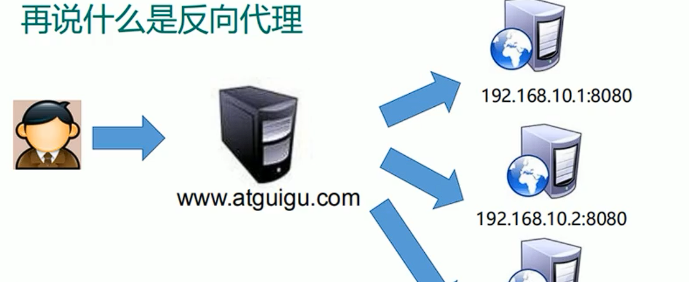
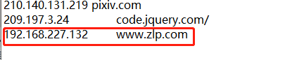
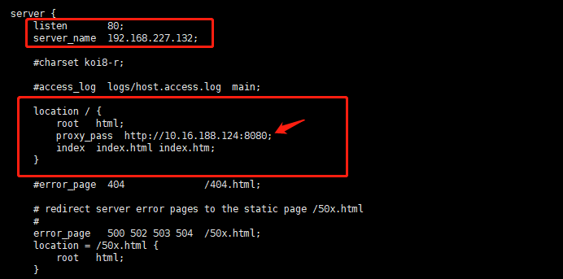
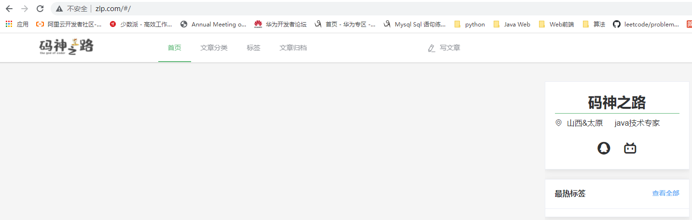
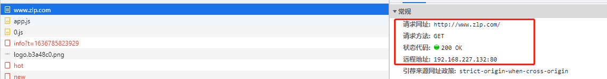
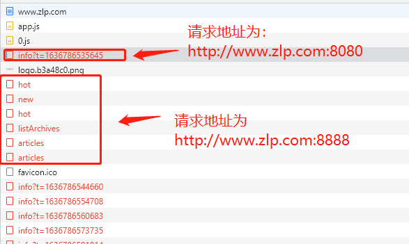
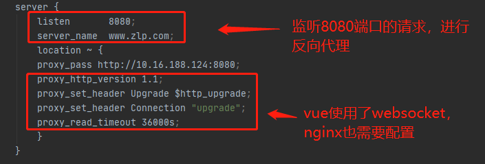
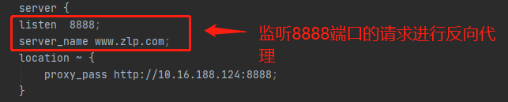

### Nginx的正向代理

Nginx可以做正向代理服务


### Nginx的反向代理

反向代理：处于服务器端的代理，叫做反向代理，作用是将请求合理的分配的多服务器后端的某一台服务器上，对外展示总是一台服务器，也称作代理服务器




### 反向代理语法

Nginx反向代理模块的指令是由`ngx_http_proxy_module`模块进行解析，该模块在安装Nginx的时候已经自己加装到Nginx中了，接下来我们把反向代理中的常用指令一一介绍下：

```
proxy_pass
proxy_set_header
proxy_redirect
```

#### proxy_pass

该指令用来设置被代理服务器地址，可以是主机名称、IP地址加端口号形式。

| 语法   | proxy_pass URL; |
| ------ | --------------- |
| 默认值 | —               |
| 位置   | location        |

URL:为要设置的被代理服务器地址，包含传输协议(`http`,`https://`)、主机名称或IP地址加端口号、URI等要素。

举例：

```
proxy_pass http://www.baidu.com;

location /server{}
proxy_pass http://192.168.200.146;
    http://192.168.200.146/server/index.html
proxy_pass http://192.168.200.146/;
    http://192.168.200.146/index.html
```

大家在编写proxy_pass的时候，后面的值要不要加"/"?

接下来通过例子来说明刚才我们提到的问题：

```
server {
	listen 80;
	server_name localhost;
	location /{
		#proxy_pass http://192.168.200.146;
		proxy_pass http://192.168.200.146/;
	}
}
当客户端访问 http://localhost/index.html,效果是一样的
server{
	listen 80;
	server_name localhost;
	location /server{
		#proxy_pass http://192.168.200.146;
		proxy_pass http://192.168.200.146/;
	}
}
当客户端访问 http://localhost/server/index.html
这个时候，第一个proxy_pass就变成了http://localhost/server/index.html
第二个proxy_pass就变成了http://localhost/index.html效果就不一样了。
```

> 编写proxy_pass的时候，后面的值不加"/"，则会将location中的路径拼接到代理地址后
>
> 若加了斜杠则不拼接

#### proxy_set_header

该指令可以更改Nginx服务器接收到的客户端请求的请求头信息，然后将新的请求头发送给代理的服务器

| 语法   | proxy_set_header field value;                                |
| ------ | ------------------------------------------------------------ |
| 默认值 | proxy_set_header Host $proxy_host;<br/>proxy_set_header Connection close; |
| 位置   | http、server、location                                       |

需要注意的是，如果想要看到结果，必须在被代理的服务器上来获取添加的头信息。

被代理服务器： [192.168.200.146]

```
server {
        listen  8080;
        server_name localhost;
        default_type text/plain;
        return 200 $http_username;
}
```

代理服务器: [192.168.200.133]

```
server {
        listen  8080;
        server_name localhost;
        location /server {
                proxy_pass http://192.168.200.146:8080/;
                proxy_set_header username TOM;
        }
    }

```

访问测试

#### proxy_redirect

该指令是用来重置头信息中的"Location"和"Refresh"的值。

| 语法   | proxy_redirect redirect replacement;<br/>proxy_redirect default;<br/>proxy_redirect off; |
| ------ | ------------------------------------------------------------ |
| 默认值 | proxy_redirect default;                                      |
| 位置   | http、server、location                                       |

》为什么要用该指令?

服务端[192.168.200.146]

```
server {
    listen  8081;
    server_name localhost;
    if (!-f $request_filename){
    	return 302 http://192.168.200.146;
    }
}

```

代理服务端[192.168.200.133]

```
server {
	listen  8081;
	server_name localhost;
	location / {
		proxy_pass http://192.168.200.146:8081/;
		proxy_redirect http://192.168.200.146 http://192.168.200.133;
	}
}
```

》该指令的几组选项

proxy_redirect redirect replacement;

```
redirect:目标,Location的值
replacement:要替换的值
```

proxy_redirect default;

```
default;
将location块的uri变量作为replacement,
将proxy_pass变量作为redirect进行替换
```

proxy_redirect off;

```
关闭proxy_redirect的功能
```


### 配置示例 

效果：在浏览器输入www.zlp.com跳转到windows本地的vue应用的首页


请求过程：

1. 本地浏览器发送请求——>
2. 虚拟机的80端口，nginx转发——>
3. windows本地的8080端口被vue应用处理——>
4. vue返回给nginx——>
5. nginx响应给浏览器


流程

1. windows中配置hosts文件，将虚拟机ip映射为www.zlp.com域名
   
2. 配置nginx反向代理
   
3. 启动，nginx、vue应用
   （防火墙要开放对应的应用访问端口，vue要使用0.0.0.0地址启动，保证虚拟机和本机的连通性）
4. windows浏览器中访问www.zlp.com


效果展示




数据包形式后台地址为nginx所在的虚拟机地址。并没有暴露vue应用所在的地址




### 配置示例二

在上个代理配置中可以发现有些请求并没有响应成功




#### 使用多server同时监听不同端口

每个个server都可以看作是一个虚拟机器，通过配置server中的listen（端口）、server_name（ID）可以作为一个server的标识。每个server可以实现一类路径的反向代理

第一类请求的server配置



第二类请求的server配置



> 对于请求中的跨域问题，要是spring boot中设置了跨域，则nginx中不需要设置，需要注意的是spring boot中的允许域应该为浏览器端ip，不是nginx的ip


### Nginx配置SSL

##### nginx添加SSL的支持

（1）完成 `--with-http_ssl_module`模块的增量添加

```
》将原有/usr/local/nginx/sbin/nginx进行备份
》拷贝nginx之前的配置信息
》在nginx的安装源码进行配置指定对应模块  ./configure --with-http_ssl_module
》通过make模板进行编译
》将objs下面的nginx移动到/usr/local/nginx/sbin下
》在源码目录下执行  make upgrade进行升级，这个可以实现不停机添加新模块的功能
```

##### Nginx的SSL相关指令

因为刚才我们介绍过该模块的指令都是通过ngx_http_ssl_module模块来解析的。

》ssl:该指令用来在指定的服务器开启HTTPS,可以使用 listen 443 ssl,后面这种方式更通用些。

| 语法   | ssl on \| off; |
| ------ | -------------- |
| 默认值 | ssl off;       |
| 位置   | http、server   |

```
server{
	listen 443 ssl;
}
```

》ssl_certificate:为当前这个虚拟主机指定一个带有PEM格式证书的证书。

| 语法   | ssl_certificate file; |
| ------ | --------------------- |
| 默认值 | —                     |
| 位置   | http、server          |

》ssl_certificate_key:该指令用来指定PEM secret key文件的路径

| 语法   | ssl_ceritificate_key file; |
| ------ | -------------------------- |
| 默认值 | —                          |
| 位置   | http、server               |

》ssl_session_cache:该指令用来配置用于SSL会话的缓存

| 语法   | ssl_sesion_cache off\|none\|[builtin[:size]] [shared:name:size] |
| ------ | ------------------------------------------------------------ |
| 默认值 | ssl_session_cache none;                                      |
| 位置   | http、server                                                 |

off:禁用会话缓存，客户端不得重复使用会话

none:禁止使用会话缓存，客户端可以重复使用，但是并没有在缓存中存储会话参数

builtin:内置OpenSSL缓存，仅在一个工作进程中使用。

shared:所有工作进程之间共享缓存，缓存的相关信息用name和size来指定

》ssl_session_timeout：开启SSL会话功能后，设置客户端能够反复使用储存在缓存中的会话参数时间。

| 语法   | ssl_session_timeout time; |
| ------ | ------------------------- |
| 默认值 | ssl_session_timeout 5m;   |
| 位置   | http、server              |

》ssl_ciphers:指出允许的密码，密码指定为OpenSSL支持的格式

| 语法   | ssl_ciphers ciphers;          |
| ------ | ----------------------------- |
| 默认值 | ssl_ciphers HIGH:!aNULL:!MD5; |
| 位置   | http、server                  |

可以使用`openssl ciphers`查看openssl支持的格式。

》ssl_prefer_server_ciphers：该指令指定是否服务器密码优先客户端密码

| 语法   | ssl_perfer_server_ciphers on\|off; |
| ------ | ---------------------------------- |
| 默认值 | ssl_perfer_server_ciphers off;     |
| 位置   | http、server                       |

##### 生成证书

方式一：使用阿里云/腾讯云等第三方服务进行购买。

方式二:使用openssl生成证书

先要确认当前系统是否有安装openssl

```
openssl version
```

安装下面的命令进行生成

```
mkdir /root/cert
cd /root/cert
openssl genrsa -des3 -out server.key 1024
openssl req -new -key server.key -out server.csr
cp server.key server.key.org
openssl rsa -in server.key.org -out server.key
openssl x509 -req -days 365 -in server.csr -signkey server.key -out server.crt
```

##### 开启SSL实例

```
server {
    listen       443 ssl;
    server_name  localhost;

    ssl_certificate      server.cert;
    ssl_certificate_key  server.key;

    ssl_session_cache    shared:SSL:1m;
    ssl_session_timeout  5m;

    ssl_ciphers  HIGH:!aNULL:!MD5;
    ssl_prefer_server_ciphers  on;

    location / {
        root   html;
        index  index.html index.htm;
    }
}
```

（4）验证

### 反向代理系统调优

反向代理值Buffer和Cache

Buffer翻译过来是"缓冲"，Cache翻译过来是"缓存"。


总结下：

```
相同点:
两种方式都是用来提供IO吞吐效率，都是用来提升Nginx代理的性能。
不同点:
缓冲主要用来解决不同设备之间数据传递速度不一致导致的性能低的问题，缓冲中的数据一旦此次操作完成后，就可以删除。
缓存主要是备份，将被代理服务器的数据缓存一份到代理服务器，这样的话，客户端再次获取相同数据的时候，就只需要从代理服务器上获取，效率较高，缓存中的数据可以重复使用，只有满足特定条件才会删除.
```

（1）Proxy Buffer相关指令

》proxy_buffering :该指令用来开启或者关闭代理服务器的缓冲区；

| 语法   | proxy_buffering on\|off; |
| ------ | ------------------------ |
| 默认值 | proxy_buffering on;      |
| 位置   | http、server、location   |

》proxy_buffers:该指令用来指定单个连接从代理服务器读取响应的缓存区的个数和大小。

| 语法   | proxy_buffers number size;                |
| ------ | ----------------------------------------- |
| 默认值 | proxy_buffers 8 4k \| 8K;(与系统平台有关) |
| 位置   | http、server、location                    |

number:缓冲区的个数

size:每个缓冲区的大小，缓冲区的总大小就是number*size

》proxy_buffer_size:该指令用来设置从被代理服务器获取的第一部分响应数据的大小。保持与proxy_buffers中的size一致即可，当然也可以更小。

| 语法   | proxy_buffer_size size;                     |
| ------ | ------------------------------------------- |
| 默认值 | proxy_buffer_size 4k \| 8k;(与系统平台有关) |
| 位置   | http、server、location                      |

》proxy_busy_buffers_size：该指令用来限制同时处于BUSY状态的缓冲总大小。

| 语法   | proxy_busy_buffers_size size;    |
| ------ | -------------------------------- |
| 默认值 | proxy_busy_buffers_size 8k\|16K; |
| 位置   | http、server、location           |

》proxy_temp_path:当缓冲区存满后，仍未被Nginx服务器完全接受，响应数据就会被临时存放在磁盘文件上，该指令设置文件路径

| 语法   | proxy_temp_path  path;      |
| ------ | --------------------------- |
| 默认值 | proxy_temp_path proxy_temp; |
| 位置   | http、server、location      |

注意path最多设置三层。  

》proxy_temp_file_write_size：该指令用来设置磁盘上缓冲文件的大小。

| 语法   | proxy_temp_file_write_size size;    |
| ------ | ----------------------------------- |
| 默认值 | proxy_temp_file_write_size 8K\|16K; |
| 位置   | http、server、location              |

通用网站的配置

```
proxy_buffering on;
proxy_buffer_size 4 32k;
proxy_busy_buffers_size 64k;
proxy_temp_file_write_size 64k;
```

根据项目的具体内容进行相应的调节。