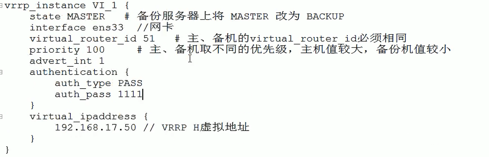

### Nginx高可用

使用Nginx做反向代理时，所有请求都需要通过nginx转发，所以nginx的可靠性必须得到保证


### Nginx主备模式

主服务down后会自动使用被nginx进行转发，对外提供虚拟IP作为访问接口，内部使用互备形式进行可靠性服务


### 原理

使用VRRP技术，将两台服务器的网络接口对外抽象成一台，外部使用虚拟IP访问nginx，内部将虚拟IP映射到主设备的IP地址上并使用脚本检测nginx的存活性，若主nginx宕机了则将虚拟ip映射到备份ip地址实现切换。

主备机之间的发现基于网络设备间网络邻居的发现原理，在同一网段的设备可以通过交互报文发现邻居


### 配置

准备

- 两台虚拟机，192.168.17.129、192.168.17.131

- 在两台服务器上安装nginx

- 在两台服务器上安装keepalived

  ```
  yum install keepalived -y
  ```

配置文件

主nginx的keepalived.conf配置文件（目录下：/etc/keepalived/）




主nginx的nginx_check.sh文件，用来检测nginx是否存活


备nginx的keepalived.conf配置文件，处理优先级，网卡信息其他基本不需要修改，nginx_check.sh脚本文件内容也相同


启动

- nginx

  ```
  ./nginx
  ```

- keepalived

  ```
  systemctl start keepalived.service
  ```

  


### 配置文件解析

#### 全局部分

要求router_id的值时可以访问到的主机名，在/etc/hosts文件中可以设置


#### 脚本部分

- 脚本所在路径
- 脚本执行间隔
- 脚本执行成功设置设备权重下降，从而触发主备切换


#### 虚拟设备信息部分


### 脚本文件解析

