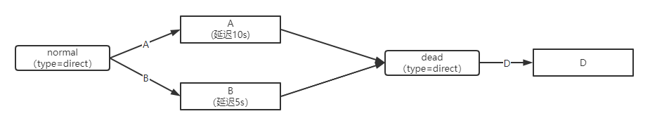
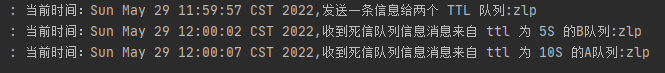
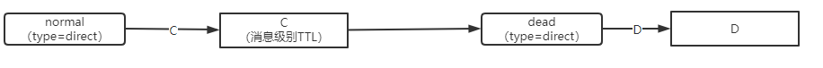
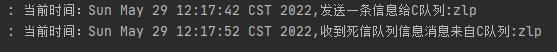
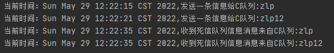
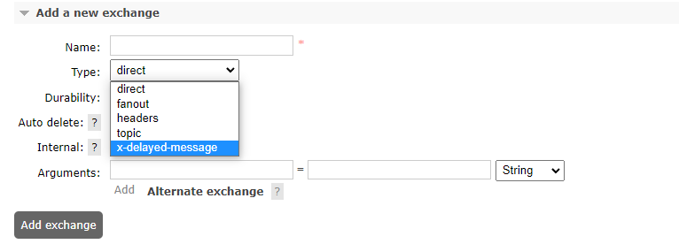
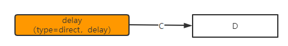
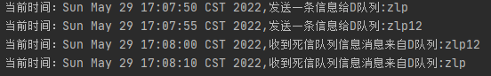

### 延迟队列

​		延时队列，队列内部是有序的，最重要的特性就体现在它的延时属性上，延时队列中的元素是希望在指定时间到了以后或之前取出和处理，`简单来说，延时队列就是用来存放需要在指定时间被处理的元素的队列`。

1. 订单在十分钟之内未支付则自动取消 
2. 新创建的店铺，如果在十天内都没有上传过商品，则自动发送消息提醒。 
3. 用户注册成功后，如果三天内没有登陆则进行短信提醒。 
4. 用户发起退款，如果三天内没有得到处理则通知相关运营人员。 
5. 预定会议后，需要在预定的时间点前十分钟通知各个与会人员参加会议


根据死信队列的特点，可以很容易的将其设置为延迟队列，其中消息过期使用消息级别的TTL即可控制每个消息的不同TTL。或者创建多组队列，对每个队列设置不同的TTL，到期时进入同一个死信队列。


### SpringBoot案例

#### 依赖

```xml
        <dependency>
            <groupId>org.springframework.boot</groupId>
            <artifactId>spring-boot-starter-amqp</artifactId>
        </dependency>
```

#### 配置文件

```properties
spring.rabbitmq.host=175.24.202.196
spring.rabbitmq.port=5672
spring.rabbitmq.username=root
spring.rabbitmq.password=root
```

#### 延迟队列--基于队列TTL



1、创建交换机、队列、绑定

```java
@Configuration
public class DeadExchangeConfig{
    // 普通交换机
    @Bean
    public DirectExchange normalExchange(){
        return new DirectExchange("normal",false,true);
    }

    // 死信交换机
    @Bean
    public DirectExchange deadExchange(){
        return new DirectExchange("dead");
    }

    // 队列A
    @Bean
    public Queue queueA(){
        Map<String,Object> map = new HashMap<>(3);
        map.put("x-dead-letter-exchange","dead");
        map.put("x-dead-letter-routing-key","D");
        map.put("x-message-ttl",10000);
        return new Queue("A",false,false,true,map);
    }

    // 队列B
    @Bean
    public Queue queueB(){
        Map<String,Object> map = new HashMap<>(3);
        map.put("x-dead-letter-exchange","dead");
        map.put("x-dead-letter-routing-key","D");
        map.put("x-message-ttl",5000);
        return new Queue("B",false,false,true,map);
    }

    // 死信队列D
    @Bean
    public Queue queueD(){
        return new Queue("D",false,false,true);
    }

    // 绑定队列A-普通交换机
    @Bean
    public Binding A2normal(){
        return BindingBuilder.bind(queueA()).to(normalExchange()).with("A");
    }

    // 绑定队列B-普通交换机
    @Bean
    public Binding B2normal(){
        return BindingBuilder.bind(queueB()).to(normalExchange()).with("B");
    }

    // 绑定队列D-死信交换机
    @Bean
    public Binding D2normal(){
        return BindingBuilder.bind(queueD()).to(deadExchange()).with("D");
    }

}
```

2、生成者

```java
@Slf4j
@RestController
@RequestMapping("send")
public class SendMsgController {
    @Autowired
    private RabbitTemplate rabbitTemplate;

    @GetMapping("/msg/{body}")
    public void sendMsg(@PathVariable("body") String body){
        log.info("当前时间：{},发送一条信息给两个 TTL 队列:{}", new Date(), body);
        rabbitTemplate.convertAndSend("normal","A","消息来自 ttl 为 10S 的A队列:" + body);
        rabbitTemplate.convertAndSend("normal","B","消息来自 ttl 为 5S 的B队列:" + body);
    }
}
```

3、消费者

```java
@Slf4j
@Component
public class Worker {
    // 消费死信队列
    @RabbitListener(queues = "D")
    public void receiveD(Message message, Channel channel){
        String msg = new String(message.getBody());
        log.info("当前时间：{},收到死信队列信息{}", new Date().toString(), msg);
    }
}

```

测试


结果




#### 延迟队列--基于消息TTL



1、创建队列、绑定

```java
    // 队列C
    @Bean
    public Queue queueC(){
        Map<String,Object> map = new HashMap<>(3);
        map.put("x-dead-letter-exchange","dead");
        map.put("x-dead-letter-routing-key","D");
        return new Queue("C",false,false,true,map);
    }    
	// 绑定队列C-普通交换机
    @Bean
    public Binding C2normal(){
        return BindingBuilder.bind(queueC()).to(normalExchange()).with("C");
    }
```

2、生成者

```java
    @GetMapping("/msg2C/{body}/{ttl}")
    public void sendMsg2C(@PathVariable("body") String body,@PathVariable("ttl") String ttl){
        log.info("当前时间：{},发送一条信息给两个 TTL 队列:{}", new Date(), body);
        rabbitTemplate.convertAndSend("normal","C","消息来自 ttl 为 10S 的A队列:" + body,correlationData->{
            correlationData.getMessageProperties().setExpiration(ttl);
            return correlationData;
        });
    }
```

3、消费者

不变


测试1：


结果：正常



测试2：


结果：`出现问题，基于消息属性的TTL消息没有按照时间正常死亡， RabbitMQ 只会检查第一个消息是否过期，如果过期则丢到死信队列， 如果第一个消息的延时时长很长，而第二个消息的延时时长很短，第二个消息并不会优先得到执行`。




#### 延迟队列--基于插件

使用插件避免消息TTL中存在的无法正常死亡的问题。

在官网上下载 https://www.rabbitmq.com/community-plugins.html，下载 rabbitmq_delayed_message_exchange 插件，然后解压放置到 RabbitMQ 的插件目录。

 进入 RabbitMQ 的安装目录下的 plgins 目录，执行下面命令让该插件生效，然后重启 

RabbitMQ /usr/lib/rabbitmq/lib/rabbitmq_server-3.8.8/plugins 

rabbitmq-plugins enable rabbitmq_delayed_message_exchange


在交换机类型处展示`x-delayed-message`，即安装成功。

这是一种新的交换类型，该类型消息支持延迟投递机制 消息传递后并 不会立即投递到目标队列中，而是存储在 mnesia(一个分布式数据系统)表中，当达到投递时间时，才投递到目标队列中






1、创建延迟交换机、绑定延迟队列

```java
    // 延迟交换机
	@Bean
    public CustomExchange delayExchange(){
        Map<String,Object> map = new HashMap();
        map.put("x-delayed-type", "direct");
        return new CustomExchange("delay_dead","x-delayed-message",false,true,map);
    }

	// 延迟队列
    @Bean
    public Queue queueD(){
        return new Queue("D",false,false,true);
    }

	// 绑定队列-交换机
	@Bean
    public Binding D2normal(){
        return BindingBuilder.bind(queueD()).to(delayExchange()).with("D").noargs();
    }
```

2、生成者

```java
    @GetMapping("/msg2C/{body}/{ttl}")
    public void sendMsg2C(@PathVariable("body") String body,@PathVariable("ttl") Integer ttl){
        log.info("当前时间：{},发送一条信息给D队列:{}", new Date(), body);
        rabbitTemplate.convertAndSend("delay_dead","D","消息来自D队列:" + body,correlationData->{
            // 通过delay参数控制交换机发生消息给队列的时机
            correlationData.getMessageProperties().setDelay(ttl);
            return correlationData;
        });
    }
```

测试：


结果：正常，每个消息根据对应的延迟时间正常投递给队列




总结：使用插件延迟队列实现原理，在交换机节点对消息进行延迟发送，不是在队列节点控制消息的TTL。


> 当然，延时队列还有很多其它选择，比如利用 Java 的 DelayQueue，利用 Redis 的 zset，利用 Quartz 或者利用 kafka 的时间轮，这些方式各有特点,看需要适用的场景