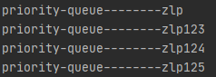

### 优先级队列

普通消息队列中的消息投递都是按照FIFO方式，有些场景下需要对一些消息进行优先投递，就需要使用到优先级队列。

实现点：

1. 创建队列时设置优先级参数，开启后改队列会将消息按照消息的优先级进行排序
2. 发送消息时设置消息优先级


示例

1、生成者

```java
public class PriorityQueue {
    public static void main(String[] args) throws Exception{
        init();
        sendMessage();
    }

    public static void init() throws Exception{
        try(Channel channel = MQConnectFactory.getChannel()){

            /**
             * 创建普通交换机
             */
            channel.exchangeDeclare("priority-exchange", BuiltinExchangeType.DIRECT,false,true,null);

            // 开启优先级参数
            Map<String,Object> map = new HashMap<>();
            map.put("x-max-priority",10);
            channel.queueDeclare("priority-queue",false,false,false,map);
            /**
             * 普通交换机-普通队列
             */
            channel.queueBind("priority-queue","priority-exchange","priority");
        }
    }
    public static void sendMessage() throws Exception{
        try (final Channel channel = MQConnectFactory.getChannel()){
            AMQP.BasicProperties build = new AMQP.BasicProperties.Builder().priority(4).build();
            channel.basicPublish("priority-exchange","priority",null,"zlp".getBytes());
            channel.basicPublish("priority-exchange","priority",null,"zlp123".getBytes());
            channel.basicPublish("priority-exchange","priority",null,"zlp124".getBytes());
            channel.basicPublish("priority-exchange","priority",build,"zlp125".getBytes());
        }
    }
}
```


2、消费者

```java
public class Work1 {
    public static void main(String[] args) throws Exception{
        receiveMessage("priority-queue");
    }
    public static void receiveMessage(String queueName) throws Exception{
        Channel channel = MQConnectFactory.getChannel();
        DeliverCallback deliverCallback = (tag, msg)->{
            System.out.println(queueName+"--------"+new String(msg.getBody()));
            channel.basicAck(msg.getEnvelope().getDeliveryTag(),false);
        };
        channel.basicConsume(queueName,false,deliverCallback,(tag,msg)->{
            System.out.println("fail");
        });
    }
}
```

非优先级下的消费顺序



设置优先级下的消费顺序


### 惰性队列

​		惰性队列会尽可能的将消息存入磁盘中，而在消 费者消费到相应的消息时才会被加载到内存中，它的一个重要的设计目标是能够支持更长的队列，即支持 更多的消息存储。当消费者由于各种各样的原因(比如消费者下线、宕机亦或者是由于维护而关闭等)而致 使长时间内不能消费消息造成堆积时，惰性队列就很有必要了。

​		默认情况下，当生产者将消息发送到 RabbitMQ 的时候，队列中的消息会尽可能的存储在内存之中， 这样可以更加快速的将消息发送给消费者。即使是持久化的消息，在被写入磁盘的同时也会在内存中驻留 一份备份。当 RabbitMQ 需要释放内存的时候，会将内存中的消息换页至磁盘中，这个操作会耗费较长的 时间，也会阻塞队列的操作，进而无法接收新的消息。


创建惰性队列的方式


