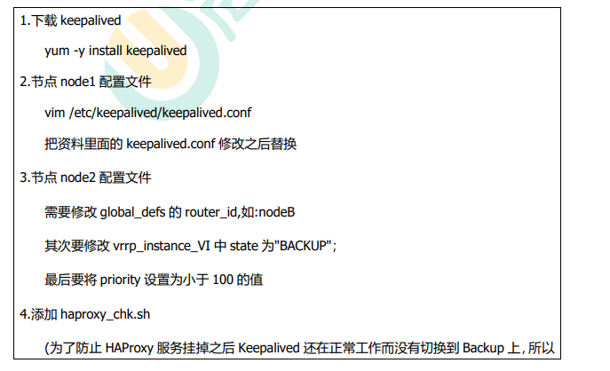

### RabbitMq集群

​		普通模式：默认模式，多个节点组成的普通集群，消息随机发送到其中一个节点的队列上，其他节点仅保留元数据，各个节点仅有相同的元数据，`即队列结构、交换器结构、交换器与队列绑定关系、vhost`。消费者消费消息时，会从各个节点拉取消息，如果保存消息的节点故障，则无法消费消息，如果做了消息持久化，那么得等该节点恢复，然后才可被消费；如果没有持久化的话，就会产生消息丢失的现象。
​		镜像模式：它是在普通模式的基础上，把需要的队列做成镜像队列，存在于多个节点来实现高可用(HA)。该模式解决了上述问题，`Broker会主动地将消息实体在各镜像节点间同步，在consumer取数据时无需临时拉取`。该模式带来的副作用也很明显，除了降低系统性能外，如果镜像队列数量过多，加之大量的消息进入，集群内部的网络带宽将会被大量消耗。通常地，对可靠性要求较高的场景建议采用镜像模式。


普通集群搭建

1、创建3个RabbitMQ容器

```shell
#rabbitmqCluster01 主节点
docker run -d --hostname rabbitmq01 --name rabbitmqCluster01 -v `pwd`/rabbitmq01:/var/lib/rabbitmq -p 15672:15672 -p 5672:5672 -e RABBITMQ_ERLANG_COOKIE='rabbitmqCookie' rabbitmq:3.7-management

#rabbitmqCluster02 从节点
docker run -d --hostname rabbitmq02 --name rabbitmqCluster02 -v `pwd`/rabbitmq02:/var/lib/rabbitmq -p 7002:15672 -p 5673:5672 -e RABBITMQ_ERLANG_COOKIE='rabbitmqCookie'  --link rabbitmqCluster01:rabbitmq01 rabbitmq:3.7-management

#rabbitmqCluster03 从节点
docker run -d --hostname rabbitmq03 --name rabbitmqCluster03 -v `pwd`/rabbitmq03:/var/lib/rabbitmq -p 8002:15672 -p 5674:5672 -e RABBITMQ_ERLANG_COOKIE='rabbitmqCookie'  --link rabbitmqCluster01:rabbitmq01 --link rabbitmqCluster02:rabbitmq02  rabbitmq:3.7-management
```

> -d 后台运行容器；
>
> –name 指定容器名；
>
> -p 指定服务运行的端口（5672：应用访问端口；15672：控制台Web端口号），控制台端口用于管理rabbitmq，应用访问端口号为rabbitclient等应用访问。；
>
> -v 映射目录或文件，pwd 当前目录；
>
> –hostname 主机名（RabbitMQ的一个重要注意事项是它根据所谓的 “节点名称” 存储数据，默认为主机名）；
>
> -e 指定环境变量；（RABBITMQ_DEFAULT_VHOST：默认虚拟机名；RABBITMQ_DEFAULT_USER：默认的用户名；RABBITMQ_DEFAULT_PASS：默认用户名的密码，RABBITMQ_ERLANG_COOKIE 节点认证作用，部署集成时 需要同步该值）
>
> –link 用于容器的链接

2、加入集群

```shell
# 进入 rabbitmqCluster02 节点和 rabbitmqCluster03 节点，在两个节点分别执行一下加入集群的命令

rabbitmq-server -detached

rabbitmqctl stop_app

rabbitmqctl reset
#rabbitmq01为rabbitmqCluster01容器中的hostname
rabbitmqctl join_cluster --ram rabbit@rabbitmq01

rabbitmqctl start_app
```


> 普通集群测试验证：
>
> 在一个节点上创建交换机、队列，可以观察到这些信息被同步到了其他的节点上。
>
> 在队列上发布1条消息，在其他节点上的这个队列上也能获取，但是消息只是存储在1个节点上，其他节点再去存储消息的节点上拉取。
>
> 在发布消息时候，未进行消息持久化，让存储消息的节点宕机重启后，发现消息丢失了。
>
> 在发布消息时候，如果指定消息持久化，让存储消息的节点宕机重启后，发现消息不会丢失。

### 镜像模式


```shell
$ rabbitmqctl set_policy [-p Vhost] [--priority <priority>] [--apply-to <apply-to>]  Name Pattern Definition
```

> 参数说明：
>
> -p Vhost： 可选参数，针对指定 vhost 下的 queue 进行设置
>
> Name: policy 的名称
>
> Pattern: queue 的匹配模式(正则表达式)
>
> Definition：镜像定义，包括三个部分 ha-mode, ha-params, ha-sync-mode
>
> ha-mode：指明镜像队列的模式，有效值为 all/exactly/nodes
>
> - all：表示在集群中所有的节点上进行镜像
> - exactly：表示在指定个数的节点上进行镜像，节点的个数由 ha-params 指定
> - nodes：表示在指定的节点上进行镜像，节点名称通过 ha-params 指定
>
> ha-params：作为参数，为 ha-mode 的补充
> ha-sync-mode：进行队列中消息的同步方式，有效值为 automatic 和 manual

示例

```shell
#^hello 匹配hello开头的队列
rabbitmqctl set_policy ha-all "^hello" '{"ha-mode":"all","ha-sync-mode":"automatic"}'
```

### 高可用负载均衡

Haproxy+Keepalive实现高可用负载均衡

Haproxy：将请求平均的分发给集群中的节点实现不同节点负载均衡

Keepalive：实现双节点热备，节点之间通过心跳消息来确认存活情况


#### Haproxy配置

创建两个Haproxy节点，每个节点对下分发3个rabbitmq节点


#### Keepalive配置

将两个Haproxy节点配置为双机热备，对外虚拟为一个设备，拥有一个vip（虚拟ip）



