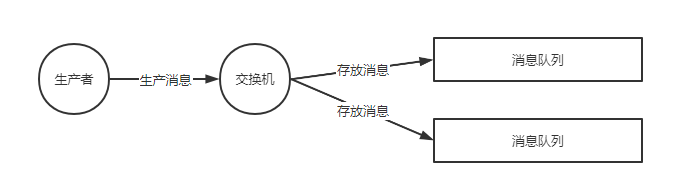
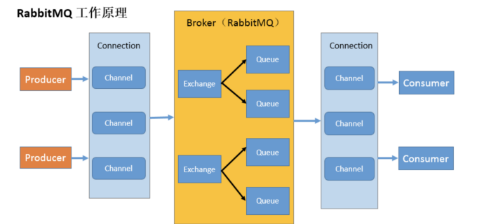
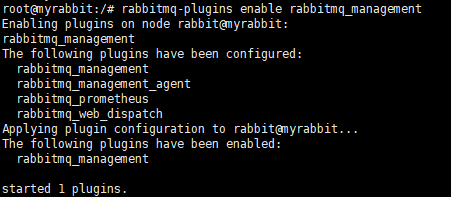
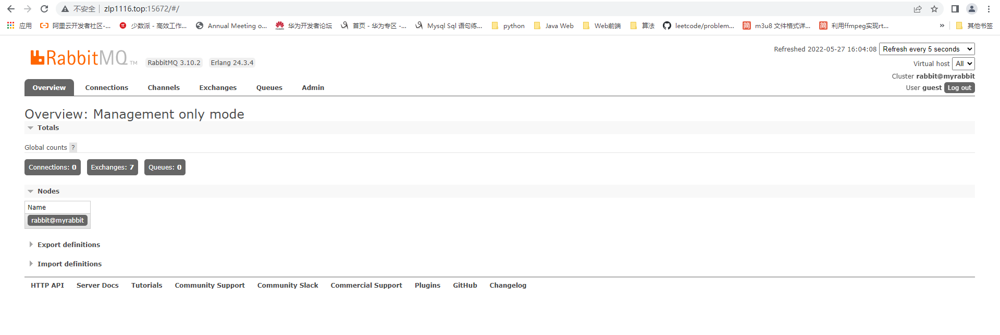

### 一、RabbitMQ介绍

RabbitMQ 是采用 Erlang 语言实现 AMQP(Advanced Message Queuing Protocol，高级消息队列协议）的消息中间件，它最初起源于金融系统，用于在分布式系统中存储转发消息。

它接受并转发消息。你可以把它当做一个快递站点，当你要发送一个包 裹时，你把你的包裹放到快递站，快递员最终会把你的快递送到收件人那里，按照这种逻辑 RabbitMQ 是 一个快递站，一个快递员帮你传递快件。RabbitMQ 与快递站的主要区别在于，它不处理快件而是`接收， 存储和转发消息数据`。

### 二、RabbitMQ特点

- **可靠性：** RabbitMQ使用一些机制来保证消息的可靠性，如持久化、传输确认及发布确认等。
- **灵活的路由：** 在消息进入队列之前，通过交换器来路由消息。对于典型的路由功能，RabbitMQ 己经提供了一些内置的交换器来实现。针对更复杂的路由功能，可以将多个交换器绑定在一起，也可以通过插件机制来实现自己的交换器。这个后面会在我们讲 RabbitMQ 核心概念的时候详细介绍到。
- **扩展性：** 多个RabbitMQ节点可以组成一个集群，也可以根据实际业务情况动态地扩展集群中节点。
- **高可用性：** 队列可以在集群中的机器上设置镜像，使得在部分节点出现问题的情况下队列仍然可用。
- **支持多种协议：** RabbitMQ 除了原生支持 AMQP 协议，还支持 STOMP、MQTT 等多种消息中间件协议。
- **多语言客户端：** RabbitMQ几乎支持所有常用语言，比如 Java、Python、Ruby、PHP、C#、JavaScript等。
- **易用的管理界面：** RabbitMQ提供了一个易用的用户界面，使得用户可以监控和管理消息、集群中的节点等。在安装 RabbitMQ 的时候会介绍到，安装好 RabbitMQ 就自带管理界面。
- **插件机制：** RabbitMQ 提供了许多插件，以实现从多方面进行扩展，当然也可以编写自己的插件。感觉这个有点类似 Dubbo 的 SPI机制


### 三、RabbitMQ核心概念

#### 3.1 生成者

消息生成者

消息一般由 2 部分组成：**消息头**（或者说是标签 Label）和 **消息体**。

消息体也可以称为 payLoad ,消息体是不透明的，而消息头则由一系列的可选属性组成，这些属性包括 routing-key（路由键）、priority（相对于其他消息的优先权）、delivery-mode（指出该消息可能需要持久性存储）等。`生产者把消息交由 RabbitMQ 后，RabbitMQ 会根据消息头把消息发送给感兴趣的 Consumer(消费者)`。

#### 3.2 消费者

消息的消费者，

#### 3.3 交换机

在 RabbitMQ 中，消息并不是直接被投递到 **Queue(消息队列)** 中的，中间还必须经过 **Exchange(交换器)** 这一层，**Exchange(交换器)** 会把我们的消息分配到对应的 **Queue(消息队列)** 中。如果匹配不到相应的消息队列则抛弃或返回给生成者。



**RabbitMQ 的 Exchange(交换器) 有4种类型，不同的类型对应着不同的路由策略**：**direct(默认)**，**fanout**, **topic**, 和 **headers**，不同类型的Exchange转发消息的策略有所区别。这个会在介绍 **Exchange Types(交换器类型)** 的时候介绍到。

交换机中维护一个路由表，通过`RoutingKey-消息队列`的形式将一个消息队列绑定一个RoutingKey交换机在接收到消息时会查看消息头中的routing-key在表中找到对应的队列将其放入。在direct模式下RoutingKey无效不使用。


#### 3.4 队列

**Queue(消息队列)** 用来保存消息直到发送给消费者。它是消息的容器，也是消息的终点。一个消息可投入一个或多个队列。消息一直在队列里面，等待消费者连接到这个队列将其取走。

**多个消费者可以订阅同一个队列**，这时队列中的消息会被平均分摊（Round-Robin，即轮询）给多个消费者进行处理，而不是每个消费者都收到所有的消息并处理，这样避免消息被重复消费。


#### 3.5 Broker

对于 RabbitMQ 来说，一个 RabbitMQ Broker 可以简单地看作一个 RabbitMQ 服务节点，或者RabbitMQ服务实例。大多数情况下也可以将一个 RabbitMQ Broker 看作一台 RabbitMQ 服务器。


### 四、交换机类型

#### 4.1 fanout

fanout 类型的Exchange路由规则非常简单，它会把所有发送到该Exchange的消息路由到所有与它绑定的Queue中，不需要做任何判断操作，所以 fanout 类型是所有的交换机类型里面速度最快的。`fanout 类型常用来广播消息`。


#### 4.2 direct

direct 类型的Exchange路由规则也很简单，它会把消息路由到那些 Bindingkey 与 RoutingKey 完全匹配的 Queue 中


以上图为例，如果发送消息的时候设置路由键为“warning”,那么消息会路由到 Queue1 和 Queue2。如果在发送消息的时候设置路由键为"Info”或者"debug”，消息只会路由到Queue2。如果以其他的路由键发送消息，则消息不会路由到这两个队列中。

direct 类型常用在处理有优先级的任务，根据任务的优先级把消息发送到对应的队列，这样可以指派更多的资源去处理高优先级的队列


#### 4.3 topic

前面讲到direct类型的交换器路由规则是完全匹配 BindingKey 和 RoutingKey ，但是这种严格的匹配方式在很多情况下不能满足实际业务的需求。topic类型的交换器在匹配规则上进行了扩展，它与 direct 类型的交换器相似，也是将消息路由到 BindingKey 和 RoutingKey 相匹配的队列中，但这里的匹配规则有些不同，它约定：

- RoutingKey 为一个点号“．”分隔的字符串（被点号“．”分隔开的每一段独立的字符串称为一个单词），如 “com.rabbitmq.client”、“java.util.concurrent”、“com.hidden.client”;
- BindingKey 和 RoutingKey 一样也是点号“．”分隔的字符串；
- BindingKey 中可以存在两种特殊字符串“*”和“#”，用于做模糊匹配，其中“*”用于匹配一个单词，“#”用于匹配多个单词(可以是零个)。


- 路由键为 “com.rabbitmq.client” 的消息会同时路由到 Queue1 和 Queue2;
- 路由键为 “com.hidden.client” 的消息只会路由到 Queue2 中；
- 路由键为 “com.hidden.demo” 的消息只会路由到 Queue2 中；
- 路由键为 “java.rabbitmq.demo” 的消息只会路由到 Queue1 中；
- 路由键为 “java.util.concurrent” 的消息将会被丢弃或者返回给生产者（需要设置 mandatory 参数），因为它没有匹配任何路由键


#### 4.4 header

headers 类型的交换器不依赖于路由键的匹配规则来路由消息，而是根据发送的消息内容中的 headers 属性进行匹配。在绑定队列和交换器时指定一组键值对，当发送消息到交换器时，RabbitMQ会获取到该消息的 headers（也是一个键值对的形式)，对比其中的键值对是否`完全匹配`队列和交换器绑定时指定的键值对，如果完全匹配则消息会路由到该队列，否则不会路由到该队列。headers 类型的交换器性能会很差，而且也不实用，基本上不会看到它的存在。


### 5、常见名词介绍



- Broker：接收和分发消息的应用一个broker可以看作是一个rabbitMQ服务器，RabbitMQ Server 就是 Message Broker 
- Virtual host：出于多租户和安全因素设计的，把 AMQP 的基本组件划分到一个虚拟的分组中，类似 于网络中的 namespace 概念。当多个不同的用户使用同一个 RabbitMQ server 提供的服务时，可以划分出 多个 vhost，每个用户在自己的 vhost 创建 exchange／queue 等 
- Connection：publisher／consumer 和 broker 之间的 TCP 连接 Channel：如果每一次访问 RabbitMQ 都建立一个 Connection，在消息量大的时候建立 TCP  Connection 的开销将是巨大的，效率也较低。
- Channel 是在 connection 内部建立的逻辑连接，如果应用程 序支持多线程，通常每个 thread 创建单独的 channel 进行通讯，AMQP method 包含了 channel id 帮助客 户端和 message broker 识别 channel，所以 channel 之间是完全隔离的。Channel 作为轻量级的 Connection 极大减少了操作系统建立 TCP connection 的开销  
- Exchange：message 到达 broker 的第一站，根据分发规则，匹配查询表中的 routing key，分发 消息到 queue 中去。常用的类型有：direct (point-to-point), topic (publish-subscribe) and fanout  (multicast) 
- Queue：消息最终被送到这里等待 consumer 取走 Binding：exchange 和 queue 之间的虚拟连接，binding 中可以包含 routing key，
- Binding 信息被保 存到 exchange 中的查询表中，用于 message 的分发依据


### 6、RabbitMQ的安装

#### 6.1 docker方式安装

1、拉取镜像

```shell
$ docker pull rabbitmq
```

2、创建并启动容器

```shell
$ docker run -id --hostname myrabbit --name rabbitmq1 -p 15672:15672 -p 5672:5672 rabbitmq
```

3、进入容器，启动rabbitmq后台管理插件

```shell
$ docker exec -it
$ rabbitmq-plugins enable rabbitmq_management
```



4、开放服务器15672、5672端口

5、访问后台管理页面

账号密码：guest



#### 6.2常规方式安装

https://javaguide.cn/high-performance/message-queue/rabbitmq-intro.html#%E4%BA%8C-%E5%AE%89%E8%A3%85-rabbitmq

