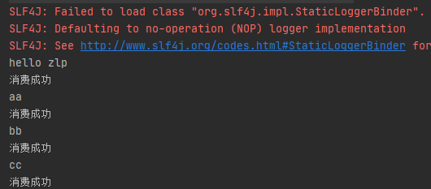

### RabbitMQ基础示例

1、引入依赖

```xml
    <dependencies>
        <dependency>
            <groupId>com.rabbitmq</groupId>
            <artifactId>amqp-client</artifactId>
            <version>5.14.2</version>
        </dependency>
        <dependency>
            <groupId>commons-io</groupId>
            <artifactId>commons-io</artifactId>
            <version>2.6</version>
        </dependency>
    </dependencies>

```

2、连接工厂

```java
package com.zlp.rabbitmq.demo1;
import com.rabbitmq.client.Channel;
import com.rabbitmq.client.Connection;
import com.rabbitmq.client.ConnectionFactory;
import java.io.IOException;
import java.util.concurrent.TimeoutException;

public class MQConnectFactory {
    public static Channel getConnect() throws IOException, TimeoutException {
        ConnectionFactory factory = new ConnectionFactory();
        factory.setHost("175.24.202.196");
        factory.setUsername("guest");
        factory.setPassword("guest");
        Connection connection = factory.newConnection();
        Channel channel = connection.createChannel();
        return channel;
    }
}

```

3、消费者代码

```java
package com.zlp.rabbitmq.demo1;
import com.rabbitmq.client.CancelCallback;
import com.rabbitmq.client.Channel;
import com.rabbitmq.client.DeliverCallback;

public class Consumer {
    public final static String QUEUE_NAME="hello";

    public static void main(String[] args) throws Exception{
        Channel connect = MQConnectFactory.getConnect();
        DeliverCallback deliverCallback = (consumerTag, message)->{
            System.out.println(new String(message.getBody()));
            System.out.println("消费成功");
        };
        CancelCallback cancelCallback = (consumerTag)->{
            System.out.println("消费失败");
        };
        /**
         * 消费者消费消息
         * 1.消费哪个队列
         * 2.消费成功之后是否要自动应答 true 代表自动应答 false 手动应答
         * 3.消费成功回调函数
         * 4.消费者未成功消费的回调
         */
        connect.basicConsume(QUEUE_NAME,false,deliverCallback,cancelCallback);
    }
}

```

4、生成者代码

```java
package com.zlp.rabbitmq.demo1;
import com.rabbitmq.client.Channel;
import com.zlp.rabbitmq.MQConnectFactory;
import java.util.Scanner;

public class Product {
    public final static String QUEUE_NAME="hello";

    public static void main(String[] args) throws Exception {
        Channel channel = MQConnectFactory.getChannel();
        /**
         * 生成一个队列
         * 1.队列名称
         * 2.队列里面的消息是否持久化 默认消息存储在内存中
         * 3.该队列是否只供一个消费者进行消费 是否进行共享 true 可以多个消费者消费
         * 4.是否自动删除 最后一个消费者端开连接以后 该队列是否自动删除 true 自动删除
         * 5.其他
         */
        channel.queueDeclare(QUEUE_NAME,false,false,false,null);
        Scanner sc = new Scanner(System.in);
        while (sc.hasNext()){
            /**
             * 发送一个消息
             * 1.发送到那个交换机，默认交换机为direct直连交换机
             * 2.routing-key
             * 3.其他的参数信息
             * 4.发送消息的消息体
             */
            channel.basicPublish("",QUEUE_NAME,null,sc.next().getBytes());
        }
    }
}

```




### 总结

生产者：要明确要发送到哪个交换机、指定routingkey、消息体

消费者：要明确消费哪个队列、消费成功的回调函数、失败的回调函数、应答方式

消息代理：message broke，管理交换机和队列