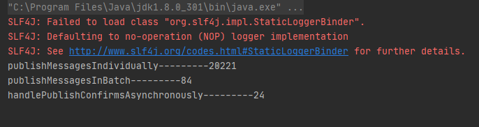

### 发布确认

​		生产者将`信道`（channel）设置成 confirm 模式，一旦信道进入 confirm 模式，`所有在该信道`上面发布的 消息都将会被指派一个唯一的 ID(从 1 开始)，一旦消息被投递到所有匹配的队列之后，broker 就会发送一个确认给生产者(包含消息的唯一 ID)，这就使得`生产者知道消息已经正确到达目的队列了`，如果消息和队列是可持久化的，那么确认消息会在将消息写入磁盘之后发出，`broker 回传 给生产者的确认消息中 delivery-tag 域包含了确认消息的序列号`，此外 broker 也`可以设置 basic.ack 的 multiple 域`，表示到这个序列号之前的所有消息都已经得到了处理。


单个确认发布

```java
    public static void publishMessagesIndividually() throws Exception{
        try(Channel channel = MQConnectFactory.getChannel()){
            channel.queueDeclare(QUEUE_NAME,false,false,false,null);
            // 开启发布确认
            channel.confirmSelect();
            Long start = System.currentTimeMillis();
            for (int i = 0; i < 1000; i++) {
                String msg = "h";
                long nextPublishSeqNo = channel.getNextPublishSeqNo();
                channel.basicPublish("",QUEUE_NAME,null,msg.getBytes());
                // 等待broker确认回执
                boolean b = channel.waitForConfirms();
                if (!b){
                    System.out.println("发布失败：" + nextPublishSeqNo);
                }

            }
            Long end = System.currentTimeMillis();
            System.out.println("publishMessagesIndividually---------" + (end-start));
        }
    }
```

批量确认发布

```java
    public static void publishMessagesInBatch() throws Exception{
        try(Channel channel = MQConnectFactory.getChannel()){
            channel.queueDeclare(QUEUE_NAME,false,false,false,null);
            // 开启发布确认
            channel.confirmSelect();
            int batchSize = 100;
            int cout = 0;
            Long start = System.currentTimeMillis();
            for (int i = 0; i < 1000; i++) {
                String msg = "h";
                long nextPublishSeqNo = channel.getNextPublishSeqNo();
                channel.basicPublish("",QUEUE_NAME,null,msg.getBytes());
                cout++;
                // 批量确认
                if (cout==batchSize){
                    // 等待broker确认回执
                    boolean b = channel.waitForConfirms();
                    if (!b){
                        System.out.println("发布失败：" + nextPublishSeqNo);
                    }
                }
            }
            channel.waitForConfirms();
            Long end = System.currentTimeMillis();
            System.out.println("publishMessagesInBatch---------" + (end-start));
        }
    }
```

异步发布确认

```java
    public static void handlePublishConfirmsAsynchronously() throws Exception{
        try(Channel channel = MQConnectFactory.getChannel()){
            channel.queueDeclare(QUEUE_NAME,false,false,false,null);
            // 开启发布确认
            channel.confirmSelect();
            Long start = System.currentTimeMillis();
            ConcurrentSkipListMap<Long, String> concurrentSkipListMap = new ConcurrentSkipListMap<>();
            // 发布成功回调函数
            ConfirmCallback ackCallback = (deliveryTag, multiple)->{
                if (multiple){
                    // 批量删除哈希表中的元素
                    ConcurrentNavigableMap<Long, String> confirmed = concurrentSkipListMap.headMap(deliveryTag);
                    confirmed.clear();
                }
                // 单个删除元素
                concurrentSkipListMap.remove(deliveryTag);
            };
            // 发布失败回调函数
            ConfirmCallback nakCallback = (deliveryTag, multiple)->{
                String msg = concurrentSkipListMap.get(deliveryTag);
                System.out.println("发送失败----" + msg);
            };

            // 添加发布确认监听器
            channel.addConfirmListener(ackCallback,nakCallback);
            for (int i = 0; i < 1000; i++) {
                String msg = "h";
                concurrentSkipListMap.put(channel.getNextPublishSeqNo(),msg);
                channel.basicPublish("",QUEUE_NAME,null,msg.getBytes());
            }
            Long end = System.currentTimeMillis();
            System.out.println("handlePublishConfirmsAsynchronously---------" + (end-start));
        }
    }
```

耗时对比

