### 默认交换机

​		默认交换机（default exchange）实际上是一个由消息代理预先声明好的没有名字（名字为空字符串）的直连交换机（direct exchange）。它有一个特殊的属性使得它对于简单应用特别有用处：`那就是每个新建队列（queue）都会自动绑定到默认交换机上，绑定的路由键（routing key）名称与队列名称相同`。

### 直连交换机

​		直连型交换机（direct exchange）是根据消息携带的路由键（routing key）将消息投递给对应队列的。直连交换机用来处理消息的单播路由（unicast routing）（尽管它也可以处理多播路由）。不同队列可以并相同路由键达到多播的效果。

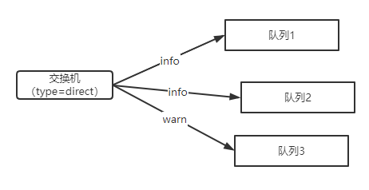

```java
public class Direct {
    public static void main(String[] args) throws Exception{
        init();
        sendMessage();
    }

    public static void init() throws Exception{
        try(Channel channel = MQConnectFactory.getChannel()){
            /**
             * 创建交换机
             * 参数：
             * 1、交换机名
             * 2、交换机类型
             * 3、是否持久化
             * 4、是否自动删除
             * 5、其他参数
             */
            channel.exchangeDeclare("direct-test", BuiltinExchangeType.DIRECT,false,false,null);
            /**
             * 创建队列
             * 参数：
             * 1、队列名
             * 2、是否持久化队列
             * 3、是否集群
             * 4、是否自动删除
             * 5、其他参数
             */
            channel.queueDeclare("info-queue",false,false,false,null);
            channel.queueDeclare("warn-queue",false,false,false,null);
            channel.queueDeclare("total-queue",false,false,false,null);
            /**
             * 绑定交换机和队列
             * 参数：
             * 1、队列名
             * 2、交换机名
             * 3、路由键
             */
            channel.queueBind("info-queue","direct-test","info");
            channel.queueBind("warn-queue","direct-test","warn");
            channel.queueBind("total-queue","direct-test","info");
            channel.queueBind("total-queue","direct-test","warn");
        }
    }
    // 发消息
    public static void sendMessage() throws Exception{
        try (final Channel channel = MQConnectFactory.getChannel()){
            channel.basicPublish("direct-test","info",null,"info".getBytes());
            channel.basicPublish("direct-test","warn",null,"warn".getBytes());
        }
    }
```

测试结果

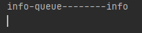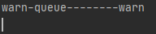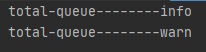


### 扇形交换机

扇型交换机（funout exchange）将消息路由给绑定到它身上的所有队列，而不理会绑定的路由键。如果N个队列绑定到某个扇型交换机上，当有消息发送给此扇型交换机时，交换机会将消息的拷贝分别发送给这所有的N个队列。`扇型用来交换机处理消息的广播路由`（broadcast routing）

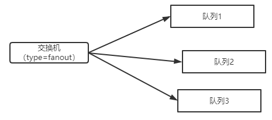


```java
public class fanout {
    public static void main(String[] args) throws Exception{
        init();
        sendMessage();
    }

    public static void init() throws Exception{
        try(Channel channel = MQConnectFactory.getChannel()){
            // 创建交换机
            channel.exchangeDeclare("fanout-test", BuiltinExchangeType.FANOUT,false,false,null);

            // 创建队列
            channel.queueDeclare("info-queue",false,false,false,null);
            channel.queueDeclare("warn-queue",false,false,false,null);
            channel.queueDeclare("total-queue",false,false,false,null);
           
            // 绑定队列和交换机，这里的路由键参数无效
            channel.queueBind("info-queue","fanout-test","info");
            channel.queueBind("warn-queue","fanout-test","warn");
            channel.queueBind("total-queue","fanout-test","info");
            channel.queueBind("total-queue","fanout-test","warn");
        }
    }
    // 发送消息到扇形交换机
    public static void sendMessage() throws Exception{
        try (final Channel channel = MQConnectFactory.getChannel()){
            channel.basicPublish("fanout-test","info",null,"info".getBytes());
            channel.basicPublish("fanout-test","warn",null,"warn".getBytes());
        }
    }
}
```

测试结果

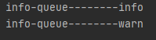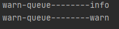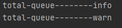

### 主题交换机

主题交换机（topic exchanges）通过对消息的路由键和队列到交换机的绑定模式之间的匹配，将消息路由给一个或多个队列。主题交换机经常用来实现各种分发/订阅模式及其变种。主题交换机通常用来实现消息的多播路由（multicast routing）。

前面讲到direct类型的交换器路由规则是完全匹配 BindingKey 和 RoutingKey ，但是这种严格的匹配方式在很多情况下不能满足实际业务的需求。topic类型的交换器在匹配规则上进行了扩展，它与 direct 类型的交换器相似，也是将消息路由到 BindingKey 和 RoutingKey 相匹配的队列中，但这里的匹配规则有些不同，它约定：

- RoutingKey 为一个点号“．”分隔的字符串（被点号“．”分隔开的每一段独立的字符串称为一个单词），如 “com.rabbitmq.client”、“java.util.concurrent”、“com.hidden.client”;
- BindingKey 和 RoutingKey 一样也是点号“．”分隔的字符串；
- BindingKey 中可以存在两种特殊字符串“\*”和“#”，用于做模糊匹配，其中“*”用于匹配一个单词，“#”用于匹配多个单词(可以是零个)。

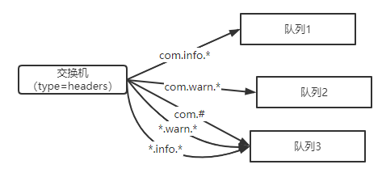

```java
public class Topic {
    public static void main(String[] args) throws Exception{
        init();
        sendMessage();
    }

    public static void init() throws Exception{
        try(Channel channel = MQConnectFactory.getChannel()){
            // 创建主题交换机
            channel.exchangeDeclare("topic-test", BuiltinExchangeType.TOPIC,false,false,null);
            // 创建队列
            channel.queueDeclare("info-queue",false,false,false,null);
            channel.queueDeclare("warn-queue",false,false,false,null);
            channel.queueDeclare("total-queue",false,false,false,null);
            // 绑定
            channel.queueBind("info-queue","topic-test","com.info.*");
            channel.queueBind("warn-queue","topic-test","com.warn.*");
            channel.queueBind("total-queue","topic-test","com.#");
            channel.queueBind("total-queue","topic-test","*.info.*");
            channel.queueBind("total-queue","topic-test","*.warn.*");
        }
    }
    // 发送消息
    public static void sendMessage() throws Exception{
        try (final Channel channel = MQConnectFactory.getChannel()){
            channel.basicPublish("topic-test","com.info.12",null,"com.info.12".getBytes());
            channel.basicPublish("topic-test","com.info.23",null,"com.info.23".getBytes());
            channel.basicPublish("topic-test","com.warn.12",null,"com.warn.12".getBytes());
            channel.basicPublish("topic-test","com.warn.23",null,"com.warn.23".getBytes());
            channel.basicPublish("topic-test","zlp.info.12",null,"zlp.info.12".getBytes());
            channel.basicPublish("topic-test","zlp.warn.12",null,"zlp.warn.12".getBytes());

        }
    }
}

```

测试结果

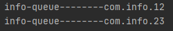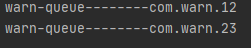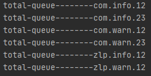


### 头交换机

有时消息的路由操作会涉及到多个属性，此时使用消息头就比用路由键更容易表达，头交换机（headers exchange）就是为此而生的。头交换机使用多个消息属性来代替路由键建立路由规则。通过判断消息头的值能否与指定的绑定相匹配来确立路由规则。

我们可以绑定一个队列到头交换机上，并给他们之间的绑定使用多个用于匹配的头（header）。这个案例中，消息代理得从应用开发者那儿取到更多一段信息，换句话说，它需要考虑某条消息（message）是需要部分匹配还是全部匹配。上边说的“更多一段消息”`就是"x-match"参数。当"x-match"设置为“any”时，消息头的任意一个值被匹配就可以满足条件，而当"x-match"设置为“all”的时候，就需要消息头的所有值都匹配成功`。

头交换机可以视为直连交换机的另一种表现形式。头交换机能够像直连交换机一样工作，不同之处在于头交换机的路由规则是建立在头属性值之上，而不是路由键。路由键必须是一个字符串，而头属性值则没有这个约束，它们甚至可以是整数或者哈希值（字典）等。

```java
public class header {
    public static void main(String[] args) throws Exception{
        init();
        sendMessage();
    }

    public static void init() throws Exception{
        try(Channel channel = MQConnectFactory.getChannel()){
            // 创建交换机
            channel.exchangeDeclare("header-test", BuiltinExchangeType.HEADERS,false,false,null);

            // 创建队列
            channel.queueDeclare("info-queue",false,false,false,null);
            channel.queueDeclare("warn-queue",false,false,false,null);
            // 绑定交换机和队列，设置路由参数参数
            Map<String,Object> head1 = new HashMap<>();
            head1.put("x-match","all");// all表示所有key-value相等才匹配
            head1.put("name","zlp");
            head1.put("age","18");
            channel.queueBind("info-queue","header-test","",head1);
            Map<String,Object> head2 = new HashMap<>();
            head2.put("x-match","any");// any表示任意一项key-value相等就匹配
            head2.put("name","zlp");
            head2.put("age","18");
            channel.queueBind("warn-queue","header-test","",head2);
        }
    }
    public static void sendMessage() throws Exception{
        try (final Channel channel = MQConnectFactory.getChannel()){
            // 发送消息1
            Map<String,Object> head1 = new HashMap<>();
            head1.put("name","zlp");
            head1.put("age","18");
            AMQP.BasicProperties build1 = new AMQP.BasicProperties().builder().headers(head1).build();
            channel.basicPublish("header-test","",build1,"any-test".getBytes());
            
            // 发送消息2
            Map<String,Object> head2 = new HashMap<>();
            head2.put("name","zlp");
            head2.put("age","19");
            AMQP.BasicProperties build2 = new AMQP.BasicProperties().builder().headers(head2).build();
            channel.basicPublish("header-test","",build2,"all-test".getBytes());

        }
    }
}
```

测试结果

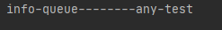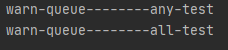